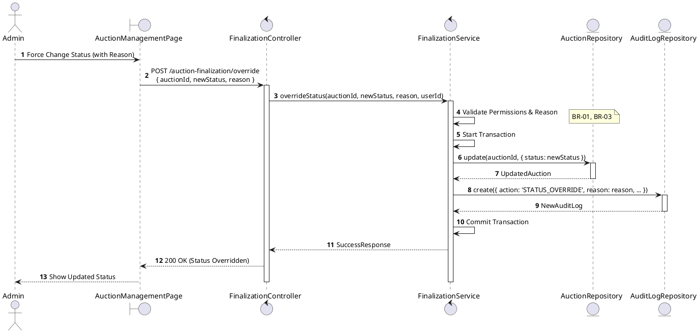
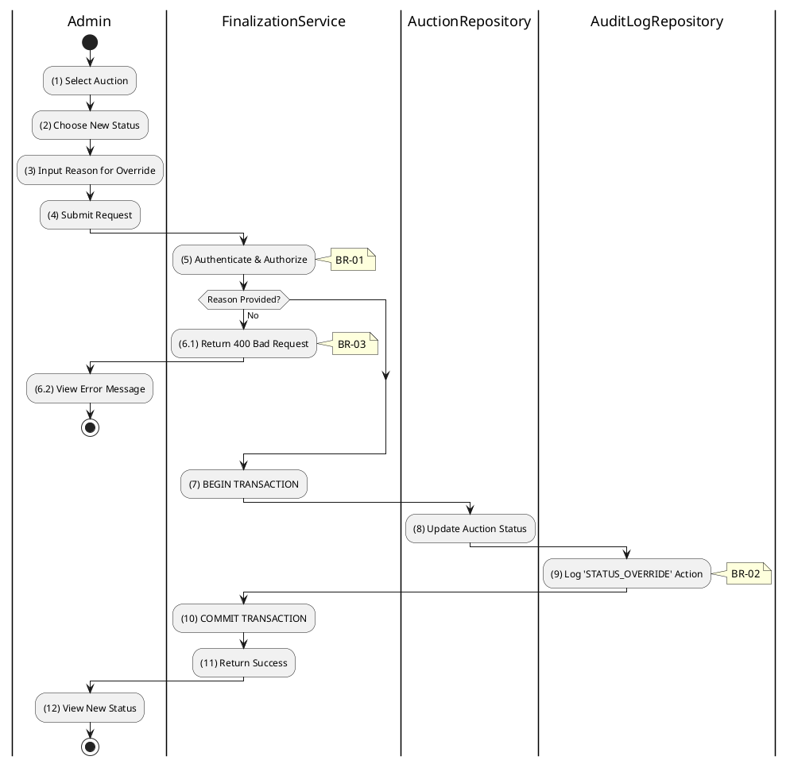

# 3.6.3 Override Auction Status

## 1. Use Case Description

| Field              | Description                                                                                                                                                                                                              |
| ------------------ | ------------------------------------------------------------------------------------------------------------------------------------------------------------------------------------------------------------------------ |
| **Name**           | Override Auction Status                                                                                                                                                                                                  |
| **Description**    | This use case allows the Admin to override an Auction's status in the system. This is a "break-glass" feature for correcting errors (e.g., accidentally setting an auction live too early, or reverting a cancellation). |
| **Actor**          | Admin, Super Admin                                                                                                                                                                                                       |
| **Trigger**        | When the Admin selects "Override Status" in the management dashboard, selects a new status, and submits `POST /auction-finalization/override`.                                                                           |
| **Pre-condition**  | • Admin's device must be connected to the internet. • Admin is signed in with their account and has `admin` or `super_admin` role.                                                                                    |
| **Post-condition** | The Auction's status is updated to the manually specified value and an `STATUS_OVERRIDE` audit log entry is created in the system.                                                                                       |

## 2. Sequence Flow (MVC)

## 3. Activities Flow (Swimlanes)

## 4. Business Rules

| Activity    | BR Code   | Description                                                                                                                                                                                                                                                                                                                                                                                                                                                                                                                                                                                                                                                                                                                                                                                                                                                                                                                                                                                                 |
| :---------- | :-------- | :---------------------------------------------------------------------------------------------------------------------------------------------------------------------------------------------------------------------------------------------------------------------------------------------------------------------------------------------------------------------------------------------------------------------------------------------------------------------------------------------------------------------------------------------------------------------------------------------------------------------------------------------------------------------------------------------------------------------------------------------------------------------------------------------------------------------------------------------------------------------------------------------------------------------------------------------------------------------------------------------------------- |
| **(1)-(2)** | **BR-01** | **Displaying Rules:** ❖ The system displays an “OverrideStatusModal” via `Display_Modal()`. ❖ It renders a dropdown for selecting the [NewStatus]. ❖ A mandatory [Reason] text area is displayed for the Admin to justify the override.                                                                                                                                                                                                                                                                                                                                                                                                                                                                                                                                                                                                                                                                                                                                                    |
| **(3)**     | **BR-02** | **Validation Rules (Front-end):** ❖ As the Admin enters the reason, the system performs `ValidateInput(reason)`. ❖ If the input is not valid: ⮚ If the [reason] is empty, the system disables the [Submit] button and displays **MSG 1** (Mandatory Field).                                                                                                                                                                                                                                                                                                                                                                                                                                                                                                                                                                                                                                                                                                                                |
| **(4)**     | **BR-03** | **Validation Rules (Confirmation):** ❖ When the Admin submits the form, the system triggers a confirmation modal via `Display_Modal('ConfirmationBox')`. ❖ It displays **MSG 11** ("Confirm status override? This is an administrative action."), awaiting explicit confirmation.                                                                                                                                                                                                                                                                                                                                                                                                                                                                                                                                                                                                                                                                                                             |
| **(5)**     | **BR-04** | **Authorization Rules (Back-end):** ❖ The system calls `FinalizationService.overrideStatus()` and verifies the user's role. ❖ If the input is not valid: ⮚ If the user is not an 'admin' or 'super_admin', the system returns a 403 Forbidden status.                                                                                                                                                                                                                                                                                                                                                                                                                                                                                                                                                                                                                                                                                                                                      |
| **(8)**     | **BR-05** | **Storing Rules (Back-end):** ❖ The system updates the “AUCTION” table by calling `AuctionRepository.update()`. ❖ It sets the [status] field to the selected [newStatus]. ❖ It ensures that the [status] is a valid enum value before saving.                                                                                                                                                                                                                                                                                                                                                                                                                                                                                                                                                                                                                                                                                                                                              |
| **(9)**     | **BR-06** | **Audit Rules (Back-end):** ❖ The system records the action via `AuditLogRepository.create()`. ❖ It inserts a new record into “AUCTION_AUDIT_LOG” containing:   - [action] = 'STATUS_OVERRIDE'   - [reason] = the input reason   - [previousStatus] = the old status   - [newStatus] = the new status   - [adminId] = the user ID.                                                                                                                                                                                                                                                                                                                                                                                                                                                                                                                                                                                                                                             |
| **(12)**    | **BR-07** | **Displaying Rules (Success):** ❖ The system refreshes the page via `Refresh_Page('AuctionDetails')`. ❖ It displays **MSG 7** ("Status override applied") to confirm the change. ❖ The Status Badge on the UI is updated immediately to reflect the new status.                                                                                                                                                                                                                                                                                                                                                                                                                                                                                                                                                                                                                                                                                                                            |
