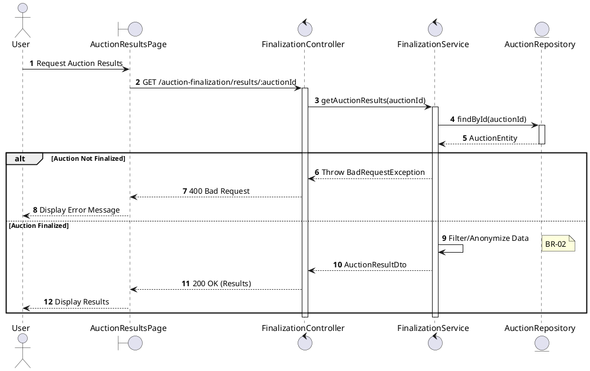
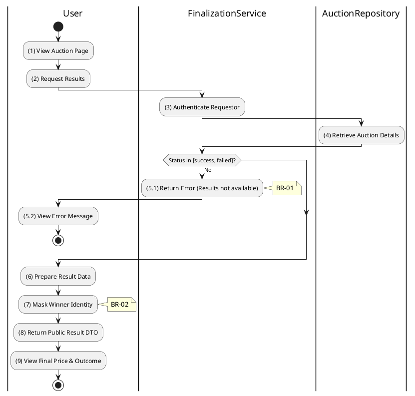

# 3.6.4 Get Auction Results

## 1. Use Case Description

| Field              | Description                                                                                                                                                                   |
| ------------------ | ----------------------------------------------------------------------------------------------------------------------------------------------------------------------------- |
| **Name**           | Get Auction Results                                                                                                                                                           |
| **Description**    | This use case allows the User to search for Auction Results in the system. This includes the final sale price, the winning bidder (anonymized), and the total number of bids. |
| **Actor**          | All Authenticated Users (Participants, Guests)                                                                                                                                |
| **Trigger**        | When the User navigates to a "Results" page or requests `GET /auction-finalization/results/:auctionId`.                                                                       |
| **Pre-condition**  | • User's device must be connected to the internet. • User is signed in with their account.                                                                                 |
| **Post-condition** | The Auction Results information will be retrieved and displayed to the User in the system.                                                                                    |

## 2. Sequence Flow (MVC)

## 3. Activities Flow (Swimlanes)

## 4. Business Rules

| Activity    | BR Code   | Description                                                                                                                                                                                                                                                                                                                                                                                                                                                                                                                                                                                                                                                                                                                                                                                                                                                                                                                                                                                                 |
| :---------- | :-------- | :---------------------------------------------------------------------------------------------------------------------------------------------------------------------------------------------------------------------------------------------------------------------------------------------------------------------------------------------------------------------------------------------------------------------------------------------------------------------------------------------------------------------------------------------------------------------------------------------------------------------------------------------------------------------------------------------------------------------------------------------------------------------------------------------------------------------------------------------------------------------------------------------------------------------------------------------------------------------------------------------------------- |
| **(1)-(2)** | **BR-01** | **Displaying Rules:** ❖ The system displays an “AuctionResultsPage” via `Display_View()`. ❖ It initially shows a loading skeleton while data is being fetched. ❖ The Results Container is rendered but remains hidden until the data is ready.                                                                                                                                                                                                                                                                                                                                                                                                                                                                                                                                                                                                                                                                                                                                             |
| **(3)**     | **BR-02** | **Authentication Rules:** ❖ The system performs access control via `AuthGuard.canActivate()`. ❖ It ensures the user has a valid JWT token. ❖ Guests may be allowed access if the view is public; otherwise, only authenticated users can proceed.                                                                                                                                                                                                                                                                                                                                                                                                                                                                                                                                                                                                                                                                                                                                              |
| **(4)**     | **BR-03** | **Querying Rules:** ❖ The system calls `FinalizationService.getAuctionResults(auctionId)` to retrieve the data. ❖ It queries the “AUCTION” table by ID. ❖ The query includes the related “AUCTION_BID” to identify the Winning Bid.                                                                                                                                                                                                                                                                                                                                                                                                                                                                                                                                                                                                                                                                                                                                                            |
| **(5.1)**   | **BR-04** | **State Locking Rules (Back-end):** ❖ The system verifies the auction state via `AuctionService.isFinalized(auction)`. ❖ If the input is not valid: ⮚ If the [status] is not 'success' or 'failed', the system returns a 400 Bad Request. ⮚ The system displays **MSG 26** (Results not available) to the user.                                                                                                                                                                                                                                                                                                                                                                                                                                                                                                                                                                                                                                                                           |
| **(7)**     | **BR-05** | **Privacy Rules (Back-end):** ❖ The system applies privacy masking via `FinalizationService.anonymizeWinner(user)`. ❖ It masks the [fullName] (e.g., "Bidder ***123") and [email] (e.g., "b***@email.com"). ❖ Only the masked data is returned in the DTO to protect user privacy.                                                                                                                                                                                                                                                                                                                                                                                                                                                                                                                                                                                                                                                                                                         |
| **(9)**     | **BR-06** | **Displaying Rules (Data):** ❖ The system renders the results card using `Display_Results_Card(results)`. ❖ It displays the [FinalPrice] and the masked [Winner] identity. ❖ It shows the total count of bids as [TotalBids]. ❖ An [Outcome] badge (Success/Failed) is displayed to indicate the auction result.                                                                                                                                                                                                                                                                                                                                                                                                                                                                                                                                                                                                                                                                        |
