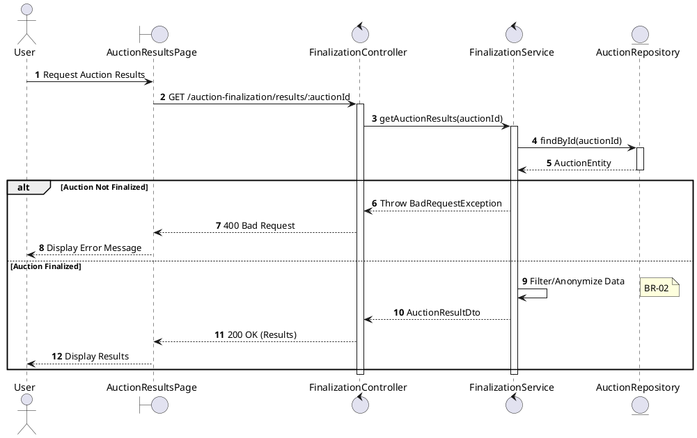
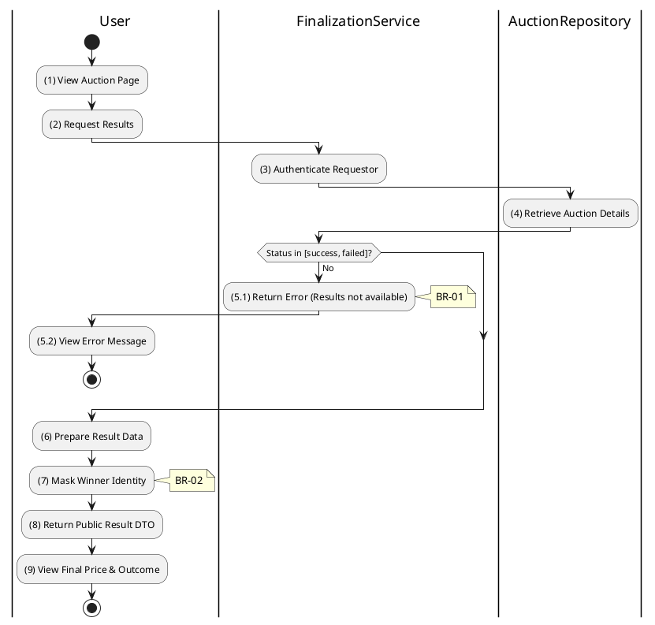

# 3.6.4 Get Auction Results

## 1. Use Case Description

| Field              | Description                                                                                                                                                                   |
| ------------------ | ----------------------------------------------------------------------------------------------------------------------------------------------------------------------------- |
| **Name**           | Get Auction Results                                                                                                                                                           |
| **Description**    | This use case allows the User to search for Auction Results in the system. This includes the final sale price, the winning bidder (anonymized), and the total number of bids. |
| **Actor**          | All Authenticated Users (Participants, Guests)                                                                                                                                |
| **Trigger**        | When the User navigates to a "Results" page or requests `GET /auction-finalization/results/:auctionId`.                                                                       |
| **Pre-condition**  | • User's device must be connected to the internet. • User is signed in with their account.                                                                                 |
| **Post-condition** | The Auction Results information will be retrieved and displayed to the User in the system.                                                                                    |

## 2. Sequence Flow (MVC)

## 3. Activities Flow (Swimlanes)

## 4. Business Rules

| Activity    | BR Code   | Description                                                                                                                                                                                                                                                                            |
| :---------- | :-------- | :------------------------------------------------------------------------------------------------------------------------------------------------------------------------------------------------------------------------------------------------------------------------------------- |
| **(1)-(2)** | **BR-01** | **Displaying Rule (Auction Results Page):** When user navigates to auction results, system displays `AuctionResultsPage`. System shows loading state while fetching results.                                                                                                     |
| **(3)**     | **BR-02** | **Validation Rule (Authentication - Back-end):** System verifies user is authenticated. Results page accessible to all authenticated users.                                                                                                                                      |
| **(4)**     | **BR-03** | **Querying Rule:** System retrieves data from the 'AUCTION' table in the database (Refer to 'AUCTION' table in 'DB Sheet' file) based on the auction ID to get auction details. If auction not found: $\rightarrow$ System displays MSG 20 ("Auction not found") on the View. |
| **(5.1)**   | **BR-04** | **Validation Rule (Status Check - Back-end):** System checks if `status` is in terminal states: `success` or `failed`. If not finalized: $\rightarrow$ System displays MSG 26 ("Results not yet available") on the View.                                                      |
| **(7)**     | **BR-05** | **Processing Rule (Privacy - Anonymization):** System masks winning bidder identity in public results. Display format: "Bidder \*\*\*123" instead of full name/email. Protects participant privacy.                                                                           |
| **(9)**     | **BR-06** | **Displaying Rule (Results Display):** System displays auction results showing: - Final sale price (or "No winning bid" if `failed`) - Outcome status badge (Success/Failed) - Winner identifier (masked) - Total number of bids placed.                                |
