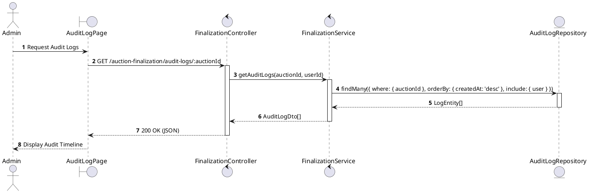
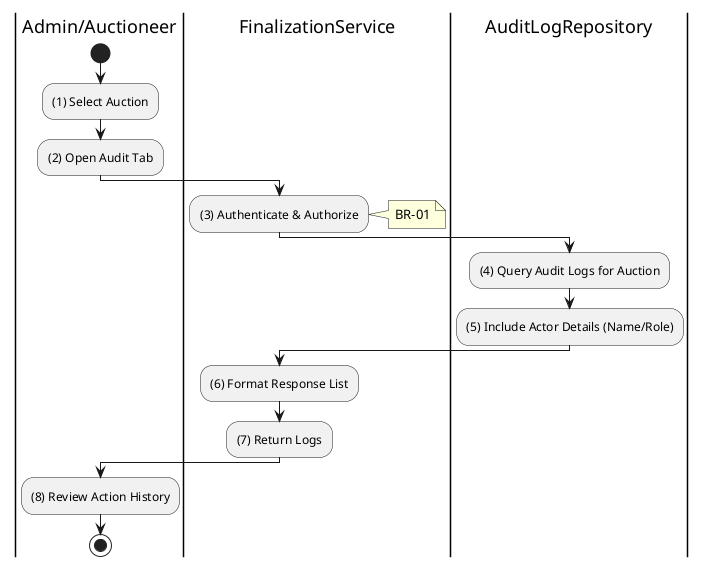

# 3.6.5 Get Audit Logs

## 1. Use Case Description

| Field              | Description                                                                                                                                                                                                               |
| ------------------ | ------------------------------------------------------------------------------------------------------------------------------------------------------------------------------------------------------------------------- |
| **Name**           | Get Audit Logs                                                                                                                                                                                                            |
| **Description**    | This use case allows the Admin to search for Audit Logs in the system. This includes status overrides, bid denials, registration approvals/rejections, and finalization events, ensuring accountability and traceability. |
| **Actor**          | Admin, Auctioneer                                                                                                                                                                                                         |
| **Trigger**        | When the Admin navigates to the "Audit Log" tab of an auction, triggering `GET /auction-finalization/audit-logs/:auctionId`.                                                                                              |
| **Pre-condition**  | • Admin's device must be connected to the internet. • Admin is signed in with their account and has `admin` or `auctioneer` role.                                                                                      |
| **Post-condition** | The Audit Logs information will be retrieved and displayed to the Admin in the system, sorted by timestamp (newest first).                                                                                                |

## 2. Sequence Flow (MVC)

<h2>3. Activities Flow (Swimlanes)</h2>

## 4. Business Rules

| Activity    | BR Code   | Description                                                                                                                                                                                                                                                                                                                                                                                                                                                                                                                                                                                                                                                                                                                                                                                                                                                                                                                                                                  |
| :---------- | :-------- | :---------------------------------------------------------------------------------------------------------------------------------------------------------------------------------------------------------------------------------------------------------------------------------------------------------------------------------------------------------------------------------------------------------------------------------------------------------------------------------------------------------------------------------------------------------------------------------------------------------------------------------------------------------------------------------------------------------------------------------------------------------------------------------------------------------------------------------------------------------------------------------------------------------------------------------------------------------------------------------------------------------- |
| **(1)-(2)** | **BR-01** | **Displaying Rules:** ❖ The system renders an “AuditLogPage” via `Display_View()`. ❖ It displays a container for the timeline. ❖ A loading spinner is shown while the data is being fetched.                                                                                                                                                                                                                                                                                                                                                                                                                                                                                                                                                                                                                                                                                                                                                                                                   |
| **(3)**     | **BR-02** | **Authorization Rules (Back-end):** ❖ The system calls `FinalizationService.getAuditLogs()` and checks the requestor's role. ❖ If the input is not valid: ⮚ If the user is not an 'admin' or 'auctioneer', the system returns a 403 Forbidden status.                                                                                                                                                                                                                                                                                                                                                                                                                                                                                                                                                                                                                                                                                                                                          |
| **(4)-(5)** | **BR-03** | **Querying Rules:** ❖ The system executes `AuditLogRepository.findMany(query)` to retrieve the logs. ❖ It selects records from the “AUCTION_AUDIT_LOG” table where the [auctionId] matches. ❖ The query includes the related `User` to fetch Admin details. ❖ The results are ordered by [createdAt] in descending order.                                                                                                                                                                                                                                                                                                                                                                                                                                                                                                                                                                                                                                                                       |
| **(4)**     | **BR-04** | **Immutability Rules:** ❖ The database constraint ensures that Audit Logs are Append-Only. ❖ There are no update or delete endpoints exposed for this resource, ensuring the integrity of the audit trail.                                                                                                                                                                                                                                                                                                                                                                                                                                                                                                                                                                                                                                                                                                                                                                                            |
| **(8)**     | **BR-05** | **Displaying Rules (Timeline):** ❖ The system renders the timeline using `Display_Timeline('AuditLogs', logs)`. ❖ It lists the events formatted as: "[Date] - [ActorName]: [Action] ([Reason])". ❖ Metadata, such as state transitions (OldStatus -> NewStatus), is also displayed for context.                                                                                                                                                                                                                                                                                                                                                                                                                                                                                                                                                                                                                                                                                                    |
