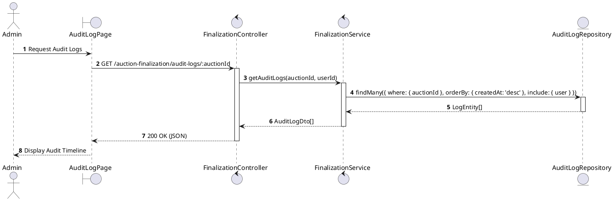
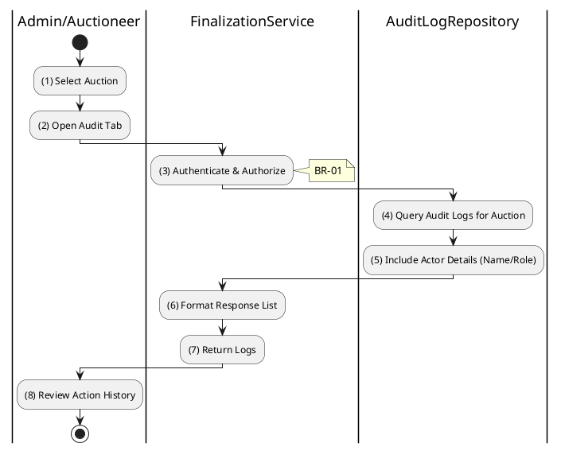

# 3.6.5 Get Audit Logs

## 1. Use Case Description

| Field              | Description                                                                                                                                                                                                               |
| ------------------ | ------------------------------------------------------------------------------------------------------------------------------------------------------------------------------------------------------------------------- |
| **Name**           | Get Audit Logs                                                                                                                                                                                                            |
| **Description**    | This use case allows the Admin to search for Audit Logs in the system. This includes status overrides, bid denials, registration approvals/rejections, and finalization events, ensuring accountability and traceability. |
| **Actor**          | Admin, Auctioneer                                                                                                                                                                                                         |
| **Trigger**        | When the Admin navigates to the "Audit Log" tab of an auction, triggering `GET /auction-finalization/audit-logs/:auctionId`.                                                                                              |
| **Pre-condition**  | • Admin's device must be connected to the internet. • Admin is signed in with their account and has `admin` or `auctioneer` role.                                                                                      |
| **Post-condition** | The Audit Logs information will be retrieved and displayed to the Admin in the system, sorted by timestamp (newest first).                                                                                                |

## 2. Sequence Flow (MVC)

<h2>3. Activities Flow (Swimlanes)</h2>

## 4. Business Rules

| Activity    | BR Code   | Description                                                                                                                                                                                                                                                                                                    |
| :---------- | :-------- | :------------------------------------------------------------------------------------------------------------------------------------------------------------------------------------------------------------------------------------------------------------------------------------------------------------- |
| **(1)-(2)** | **BR-01** | **Displaying Rule (Audit Log Page):** When Admin opens Audit tab for an auction, system displays `AuditLogPage`. System shows loading indicator while fetching logs.                                                                                                                                     |
| **(3)**     | **BR-02** | **Validation Rule (Authorization - Back-end):** System checks if requestor role is `admin` or `auctioneer` in `USERS` table. If unauthorized: $\rightarrow$ System displays MSG 5 ("Forbidden") on the View.                                                                                          |
| **(4)-(5)** | **BR-03** | **Querying Rule:** System retrieves data from the 'AUCTION_AUDIT_LOG' table in the database (Refer to 'AUCTION_AUDIT_LOG' table in 'DB Sheet' file) based on the auction ID. System orders results by creation date (newest first). System retrieves related User information to display admin names. |
| **(4)**     | **BR-04** | **Processing Rule (Immutability):** Audit logs are read-only records. No API endpoints exist to modify or delete log entries. Preserves data integrity for accountability.                                                                                                                            |
| **(8)**     | **BR-05** | **Displaying Rule (Audit Timeline):** System displays chronological list of audit entries showing: - Action type (STATUS_OVERRIDE, AUCTION_FINALIZED, etc.) - Actor name and role - Timestamp - Reason (if applicable).                                                                         |
