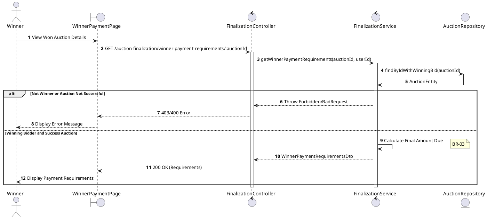
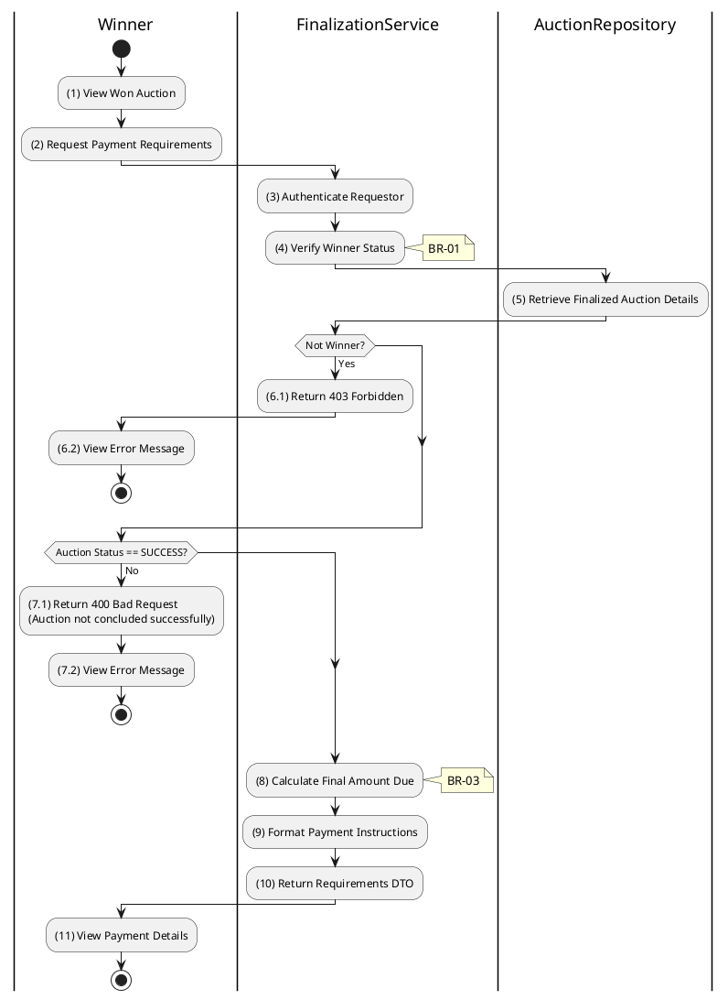

# 3.6.6 Get Winner Payment Requirements

## 1. Use Case Description

| Field              | Description                                                                                                                                                                       |
| ------------------ | --------------------------------------------------------------------------------------------------------------------------------------------------------------------------------- |
| **Name**           | Get Winner Payment Requirements                                                                                                                                                   |
| **Description**    | This use case allows the Winner to search for Payment Requirements in the system. This includes the final amount due, payment methods, and deadlines.                             |
| **Actor**          | Winner (Bidder)                                                                                                                                                                   |
| **Trigger**        | When the Winner navigates to the details page of an auction they won, triggering `GET /auction-finalization/winner-payment-requirements/:auctionId`.                              |
| **Pre-condition**  | • Winner's device must be connected to the internet. • Winner is signed in with their account and is the confirmed winning bidder for the auction.                             |
| **Post-condition** | The Payment Requirements information (payment amount, available payment methods, and payment instructions/deadlines) will be retrieved and displayed to the Winner in the system. |

## 2. Sequence Flow (MVC)

## 3. Activities Flow (Swimlanes)

## 4. Business Rules

| Activity    | BR Code   | Description                                                                                                                                                                                                                                                                                                                                                                                                                                                                                                                                                                                                                                                                                                                                                                                                                                                                     |
| :---------- | :-------- | :------------------------------------------------------------------------------------------------------------------------------------------------------------------------------------------------------------------------------------------------------------------------------------------------------------------------------------------------------------------------------------------------------------------------------------------------------------------------------------------------------------------------------------------------------------------------------------------------------------------------------------------------------------------------------------------------------------------------------------------------------------------------------------------------------------------------------------------------------------------------------ |
| **(1)-(2)** | **BR-01** | **Displaying Rules:** ❖ The system displays a “WinnerPaymentPage” screen via `Display_View()`. (Refer to “WinnerPaymentPage” view in “View Description” file). ❖ It displays a loading indicator while fetching the payment requirements. ❖ The system renders the dedicated Payment Requirements section.                                                                                                                                                                                                                                                                                                                                                                                                                                                                                                                                                |
| **(3)-(4)** | **BR-02** | **Authorization Rules (Back-end):** ❖ The system verifies the authenticated user’s identity by calling `FinalizationService.getWinnerPaymentRequirements()`. ❖ If the input is not valid: ⮚ The system checks if the user is the `winningBidderId` in the “AUCTION” table. ⮚ If the user is not the winner, the system returns a 403 Forbidden status and displays **MSG 5** (Not the winning bidder).                                                                                                                                                                                                                                                                                                                                                                                                                                                  |
| **(7.1)**   | **BR-03** | **State Locking Rules (Back-end):** ❖ The system checks the auction’s status using `AuctionService.isStatus('success')`. ❖ If the input is not valid: ⮚ If the [status] is not 'success', the system returns a 400 Bad Request. ⮚ It displays **MSG 26** (Payment requirements not available).                                                                                                                                                                                                                                                                                                                                                                                                                                                                                                                                                                       |
| **(8)**     | **BR-04** | **Calculation Rules (Back-end):** ❖ The system calculates the final amount due by invoking `FinalizationService.calculateFinalAmountDue()`. ❖ The formula used is: `finalAmount = [finalSalePrice] + [saleFee] - [depositAmountSnapshot]`.                                                                                                                                                                                                                                                                                                                                                                                                                                                                                                                                                                                                                       |
| **(9)**     | **BR-05** | **Calculation Rules (Back-end):** ❖ The system determines the payment deadline by calling `FinalizationService.calculatePaymentDeadline()`. ❖ The deadline is set to `[finalizedAt] + 7 Days` (configurable). ❖ If the current time (`NOW()`) exceeds this deadline, the registration is flagged as overdue.                                                                                                                                                                                                                                                                                                                                                                                                                                                                                                                                          |
| **(11)**    | **BR-06** | **Displaying Rules (Data):** ❖ The system displays the payment summary via `Display_Payment_Summary(requirements)`. ❖ It shows the [FinalAmountDue] and a detailed breakdown. ❖ The [PaymentDeadline] is presented, and a button to “Initiate Payment” is displayed.                                                                                                                                                                                                                                                                                                                                                                                                                                                                                                                                                                               |