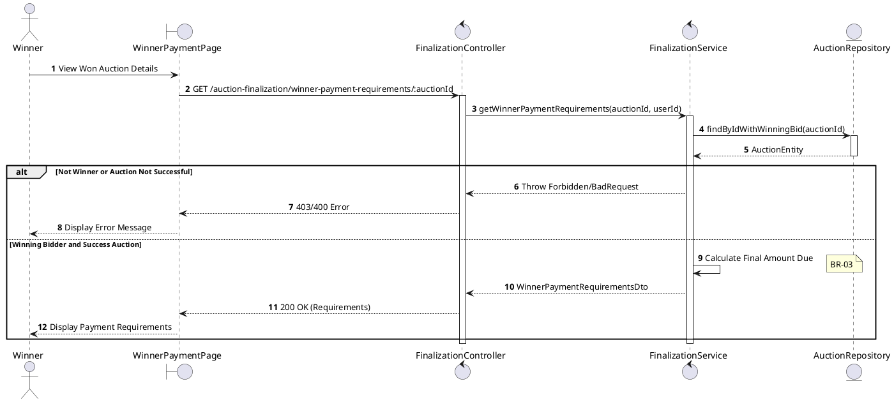
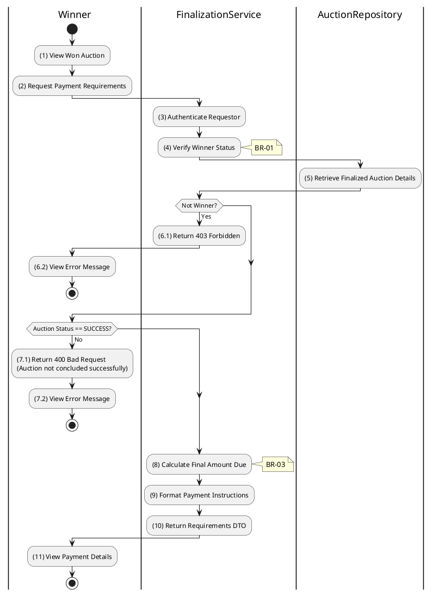

# 3.6.6 Get Winner Payment Requirements

## 1. Use Case Description

| Field              | Description                                                                                                                                                                       |
| ------------------ | --------------------------------------------------------------------------------------------------------------------------------------------------------------------------------- |
| **Name**           | Get Winner Payment Requirements                                                                                                                                                   |
| **Description**    | This use case allows the Winner to search for Payment Requirements in the system. This includes the final amount due, payment methods, and deadlines.                             |
| **Actor**          | Winner (Bidder)                                                                                                                                                                   |
| **Trigger**        | When the Winner navigates to the details page of an auction they won, triggering `GET /auction-finalization/winner-payment-requirements/:auctionId`.                              |
| **Pre-condition**  | • Winner's device must be connected to the internet. • Winner is signed in with their account and is the confirmed winning bidder for the auction.                             |
| **Post-condition** | The Payment Requirements information (payment amount, available payment methods, and payment instructions/deadlines) will be retrieved and displayed to the Winner in the system. |

## 2. Sequence Flow (MVC)

## 3. Activities Flow (Swimlanes)

## 4. Business Rules

| Activity    | BR Code   | Description                                                                                                                                                                                                                                              |
| :---------- | :-------- | :------------------------------------------------------------------------------------------------------------------------------------------------------------------------------------------------------------------------------------------------------- |
| **(1)-(2)** | **BR-01** | **Displaying Rule (Winner Payment Page):** When Winner views their won auction, system displays `WinnerPaymentPage`. System shows loading state while fetching payment requirements.                                                               |
| **(3)-(4)** | **BR-02** | **Validation Rule (Winner-Only Access - Back-end):** System verifies authenticated user is the `winningBidderId` in `AUCTION` table. If not the winner: $\rightarrow$ System displays MSG 5 ("Forbidden - Not the winning bidder") on the View. |
| **(7.1)**   | **BR-03** | **Validation Rule (Auction Status - Back-end):** System checks if auction `status = 'success'`. If not successful auction: $\rightarrow$ System displays MSG 26 ("Payment requirements not available") on the View.                             |
| **(8)**     | **BR-04** | **Processing Rule (Balance Calculation):** System calculates final amount due: $finalAmountDue = finalSalePrice + applicableFees - depositAmountSnapshot$ Ensures accurate billing excluding already-paid deposit.                              |
| **(9)**     | **BR-05** | **Processing Rule (Payment Deadline):** System calculates payment deadline based on configuration. Default: 7 days from `finalizedAt` timestamp.                                                                                                   |
| **(11)**    | **BR-06** | **Displaying Rule (Payment Requirements Display):** System displays payment details showing: - Final amount due - Breakdown (sale price, fees, deposit credit) - Payment deadline - Available payment methods (Stripe).                   |
