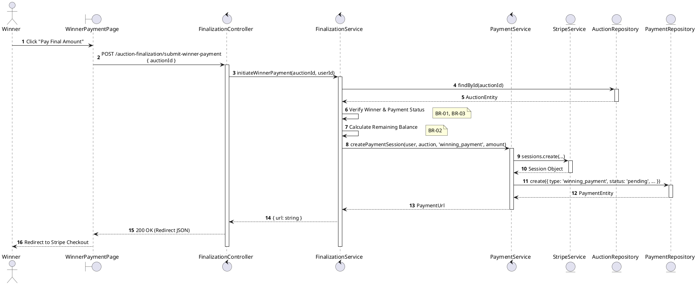
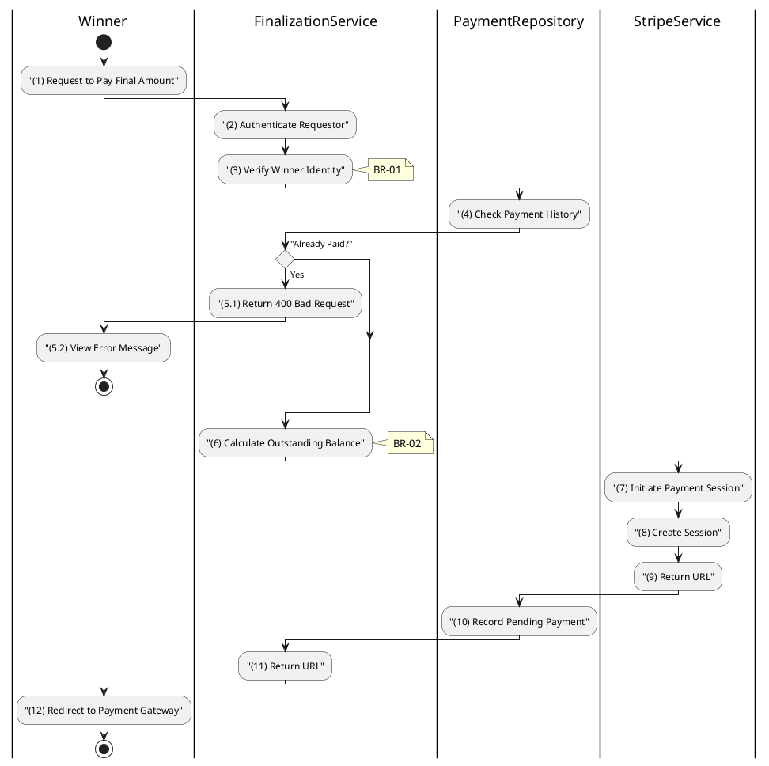

# 3.6.7 Initiate Winner Payment

## 1. Use Case Description

| Field              | Description                                                                                                                                                                |
| ------------------ | -------------------------------------------------------------------------------------------------------------------------------------------------------------------------- |
| **Name**           | Initiate Winner Payment                                                                                                                                                    |
| **Description**    | This use case allows the Winner to create a Payment Session in the system. This generates a payment session (via Stripe) for the calculated balance.                       |
| **Actor**          | Winner (Bidder)                                                                                                                                                            |
| **Trigger**        | When the Winner clicks "Pay Final Amount" on the auction result page, triggering `POST /auction-finalization/submit-winner-payment`.                                       |
| **Pre-condition**  | • Winner's device must be connected to the internet. • Winner is signed in with their account and is the confirmed winning bidder for the auction.                      |
| **Post-condition** | A Payment record of type `winning_payment` is created with status `pending`, a Stripe Checkout Session is created, and the Winner receives the checkout URL in the system. |

## 2. Sequence Flow (MVC)

## 3. Activities Flow (Swimlanes)

## 4. Business Rules

| Activity      | BR Code   | Description                                                                                                                                                                                                                                                                                                                                                                                                                                                                                                                                                                                                                                                                                                                                                                                                                                      |
| :------------ | :-------- | :-------------------------------------------------------------------------------------------------------------------------------------------------------------------------------------------------------------------------------------------------------------------------------------------------------------------------------------------------------------------------------------------------------------------------------------------------------------------------------------------------------------------------------------------------------------------------------------------------------------------------------------------------------------------------------------------------------------------------------------------------------------------------------------------------------------------------------------------------------------- |
| **(1)**       | **BR-01** | **Displaying Rules:** ❖ The system renders the “WinnerPaymentPage” screen via `Display_View()`. ❖ It displays a [Pay Final Amount] button, which is enabled only if the payment is not yet `completed` and the user is the confirmed winner.                                                                                                                                                                                                                                                                                                                                                                                                                                                                                                                                                                                                             ||
| **(1)**       | **BR-02** | **Validation Rules (Front-end):** ❖ When the Winner clicks “Pay Final Amount”, the system triggers a confirmation modal via `Display_Modal('ConfirmationBox')`. ❖ It presents **MSG 11** ("Proceed to payment for [Amount]?"), awaiting explicit confirmation before redirecting to the payment gateway.                                                                                                                                                                                                                                                                                                                                                                                                                                                                                                                                                            |
| **(2)-(3)**   | **BR-03** | **Authorization Rules (Back-end):** ❖ The system checks the authenticated user's role via `FinalizationService.initiateWinnerPayment()`. ❖ If the input is not valid: ⮚ It verifies that the authenticated user is indeed the `winningBidderId` in the “AUCTION” table. ⮚ If the user is not the winner, the system returns a 403 Forbidden status.                                                                                                                                                                                                                                                                                                                                                                                                                                                                                                |
| **(4)-(5.1)** | **BR-04** | **Idempotency Rules (Back-end):** ❖ The system calls `PaymentRepository.findWinningPayment(auctionId, userId)` to check for existing `PAYMENT` records. ❖ It looks for a record with [type] as 'winning_payment' and [status] as 'completed'. ❖ If such a payment is found, the system returns a 400 Bad Request, displaying **MSG 16** (Payment already completed) to prevent duplicate transactions.                                                                                                                                                                                                                                                                                                                                                                                                                                                   | 
| **(6)**       | **BR-05** | **Calculation Rules (Back-end):** ❖ The system calculates the outstanding balance by calling `FinalizationService.calculateOutstandingBalance()`. ❖ The formula used is: `balance = [finalSalePrice] + [saleFee] - [depositAmountSnapshot]`. ❖ The system ensures that the calculated balance is greater than 0 before proceeding.                                                                                                                                                                                                                                                                                                                                                                                                                                                                                      |
| **(7)-(9)**   | **BR-06** | **Payment Gateway Rules:** ❖ The system initiates a Stripe Checkout Session via `PaymentService.createPaymentSession(amount, type='winning_payment')`. ❖ It calls the Stripe API to create `checkout.sessions.create()` with the calculated amount. ❖ The system configures `success_url` and `cancel_url` for redirects after payment completion or cancellation.                                                                                                                                                                                                                                                                                                                                                                                                                                                                                      |
| **(10)**      | **BR-07** | **Storing Rules (Back-end):** ❖ The system creates a new record in the “PAYMENT” table via `PaymentRepository.create()`. ❖ It sets [type] to 'winning_payment', [status] to 'pending', and records the [sessionId] from Stripe and the calculated [amount].                                                                                                                                                                                                                                                                                                                                                                                                                                                                                                                                                                                      |
| **(12)**      | **BR-08** | **Displaying Rules (Redirect):** ❖ The system redirects the user to the Stripe hosted checkout page using `Redirect_External(stripeCheckoutUrl)` to complete the payment.                                                                                                                                                                                                                                                                                                                                                                                                                                                                                                                                                                                                                                                                           |
