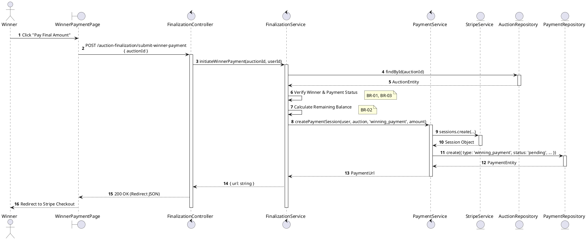
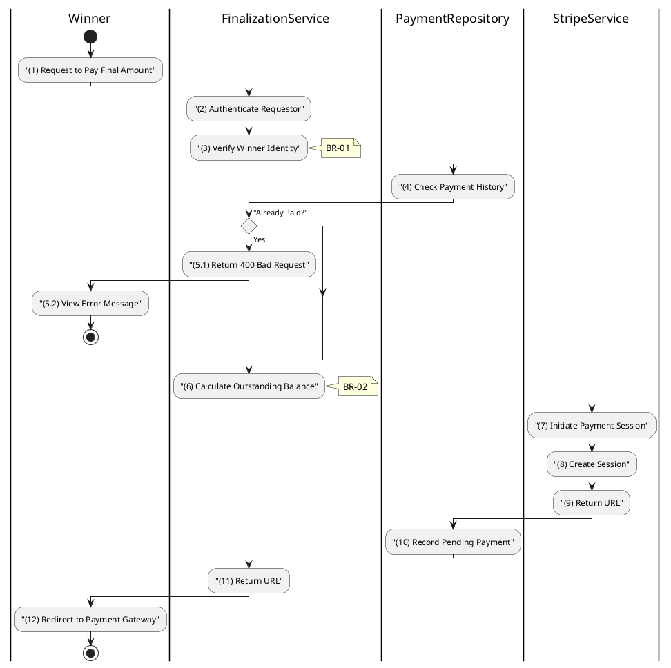

# 3.6.7 Initiate Winner Payment

## 1. Use Case Description

| Field              | Description                                                                                                                                                                |
| ------------------ | -------------------------------------------------------------------------------------------------------------------------------------------------------------------------- |
| **Name**           | Initiate Winner Payment                                                                                                                                                    |
| **Description**    | This use case allows the Winner to create a Payment Session in the system. This generates a payment session (via Stripe) for the calculated balance.                       |
| **Actor**          | Winner (Bidder)                                                                                                                                                            |
| **Trigger**        | When the Winner clicks "Pay Final Amount" on the auction result page, triggering `POST /auction-finalization/submit-winner-payment`.                                       |
| **Pre-condition**  | • Winner's device must be connected to the internet. • Winner is signed in with their account and is the confirmed winning bidder for the auction.                      |
| **Post-condition** | A Payment record of type `winning_payment` is created with status `pending`, a Stripe Checkout Session is created, and the Winner receives the checkout URL in the system. |

## 2. Sequence Flow (MVC)

## 3. Activities Flow (Swimlanes)

## 4. Business Rules

| Activity      | BR Code   | Description                                                                                                                                                                                                                                                                                                                    |
| :------------ | :-------- | :----------------------------------------------------------------------------------------------------------------------------------------------------------------------------------------------------------------------------------------------------------------------------------------------------------------------------- |
| **(1)**       | **BR-01** | **Displaying Rule (Winner Payment Page):** When Winner views payment requirements, system displays "Pay Final Amount" button. Button is enabled only if payment not yet completed.                                                                                                                                       |
| **(1)**       | **BR-02** | **Validation Rule (Confirmation - Front-end):** When Winner clicks "Pay Final Amount", system displays MSG 11 ("Proceed to payment for [amount]?"). System waits for confirmation before redirecting.                                                                                                                    |
| **(2)-(3)**   | **BR-03** | **Validation Rule (Winner-Only Access - Back-end):** System verifies authenticated user is the `winningBidderId` in `AUCTION` table. If not the winner: $\rightarrow$ System displays MSG 5 ("Forbidden") on the View.                                                                                                |
| **(4)-(5.1)** | **BR-04** | **Validation Rule (Duplicate Prevention - Back-end):** System retrieves data from the 'PAYMENT' table in the database (Refer to 'PAYMENT' table in 'DB Sheet' file) to check for existing completed winning payment. If already paid: $\rightarrow$ System displays MSG 16 ("Payment already completed") on the View. |
| **(6)**       | **BR-05** | **Processing Rule (Balance Calculation):** System calculates outstanding balance: $balance = finalSalePrice + fees - depositAmountSnapshot$ This is the amount to charge via Stripe.                                                                                                                                  |
| **(7)-(9)**   | **BR-06** | **Processing Rule (Stripe Session):** System creates Stripe Checkout Session with calculated amount. System includes success/cancel redirect URLs.                                                                                                                                                                       |
| **(10)**      | **BR-07** | **Storing Rule:** System creates record in `PAYMENT` table: - `type = 'winning_payment'` - `status = 'pending'` - `sessionId = [Stripe session ID]` - `amount = [calculated balance]`                                                                                                                           |
| **(12)**      | **BR-08** | **Displaying Rule (Redirect):** System redirects Winner to Stripe Checkout URL. Winner completes payment on Stripe's hosted page.                                                                                                                                                                                        |
