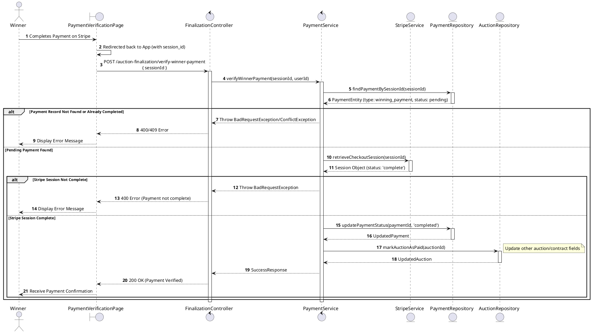
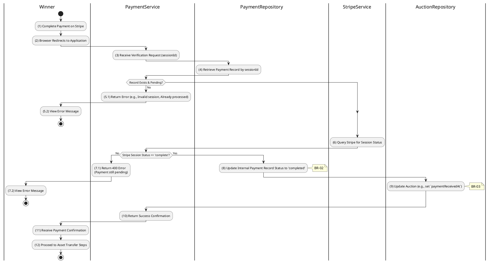

# 3.6.8 Verify Winner Payment

## 1. Use Case Description

| Field              | Description                                                                                                                                                                                                                                              |
| ------------------ | -------------------------------------------------------------------------------------------------------------------------------------------------------------------------------------------------------------------------------------------------------- |
| **Name**           | Verify Winner Payment                                                                                                                                                                                                                                    |
| **Description**    | This use case allows the System to update Payment status in the system. This involves checking the status with the payment gateway (Stripe) and, upon successful verification, updates the relevant payment records and marks the auction as fully paid. |
| **Actor**          | Winner, Admin                                                                                                                                                                                                                                            |
| **Trigger**        | When the Winner is redirected back from Stripe to the application (triggering a client-side call to `POST /auction-finalization/verify-winner-payment`) or a Stripe webhook notifies the backend.                                                        |
| **Pre-condition**  | • Winner's device must be connected to the internet.<br>• A `winning_payment` session was successfully initiated and Payment has been completed on Stripe.                                                                                               |
| **Post-condition** | The Payment record's status is updated to `completed` and the Winner is granted access to the asset transfer process in the system.                                                                                                                      |

## 2. Sequence Flow (MVC)



## 3. Activities Flow (Swimlanes)



## 4. Business Rules

| Activity      | BR Code   | Description                                                                                                                                                                                                                                                                                                                                                            |
| :------------ | :-------- | :--------------------------------------------------------------------------------------------------------------------------------------------------------------------------------------------------------------------------------------------------------------------------------------------------------------------------------------------------------------------- |
| **(1)-(2)**   | **BR-01** | **Displaying Rules:**<br>❖ The system renders a “PaymentVerificationPage” via `Display_View()` upon the user’s return from Stripe.<br>❖ It displays a loading indicator and a message: "Verifying your winner payment...".                                                                                                                                                                                                 |
| **(4)-(5.1)** | **BR-02** | **Verification Rules (Back-end):**<br>❖ The system calls `PaymentService.verifyWinnerPayment(sessionId, userId)` to verify the payment.<br>❖ It retrieves the `PAYMENT` record using the [sessionId].<br>❖ If the input is not valid:<br>⮚ If the record is not found or the [status] is not 'pending', the system returns a 400 Bad Request.                                                                                                    |
| **(6)**       | **BR-03** | **Payment Gateway Rules:**<br>❖ The system queries Stripe for the session status via `StripeService.retrieveCheckoutSession(sessionId)`.<br>❖ If the input is not valid:<br>⮚ If the Stripe status is not 'complete', the system returns a 400 Bad Request.                                                                                                                                       |
| **(6)**       | **BR-04** | **Financial Rules (Back-end):**<br>❖ The system performs a financial validation via `PaymentService.validateAmount(payment, stripeSession)`.<br>❖ It compares `Stripe.amount_total` with the expected `Payment.amount`.<br>❖ If there is a mismatch, the system logs a warning for manual intervention and returns a 400 Bad Request.                                                                                                            |
| **(8)**       | **BR-05** | **Storing Rules (Back-end):**<br>❖ Upon successful verification, the system updates the `PAYMENT` table by calling `PaymentRepository.updatePaymentStatus()`.<br>❖ It sets the [status] to 'completed' and records the `completedAt` timestamp.                                                                                                                                                                                               |
| **(9)**       | **BR-06** | **Auction Update Rules (Back-end):**<br>❖ The system updates the “AUCTION” table by calling `AuctionRepository.markAuctionAsPaid()`.<br>❖ It sets the [paymentReceivedAt] timestamp to the current time.<br>❖ This action triggers the subsequent asset transfer process.                                                                                                                                                                |
| **(11)-(12)** | **BR-07** | **Displaying Rules (Success):**<br>❖ The system redirects the user to the Asset Transfer Page via `Redirect('AssetTransferPage', { success: true })`.<br>❖ It displays **MSG 7** ("Payment verified successfully.") to the user.<br>❖ The system shows the next steps for asset transfer or collection.                                                                                                                                                                    |
```