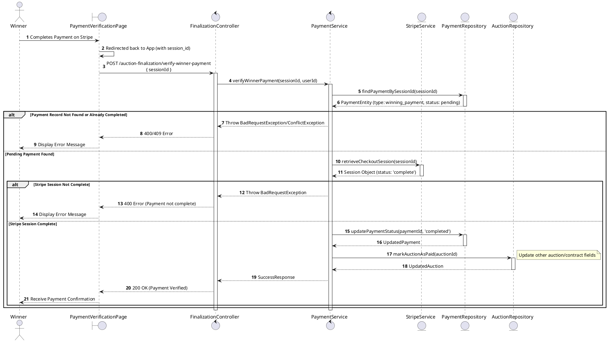
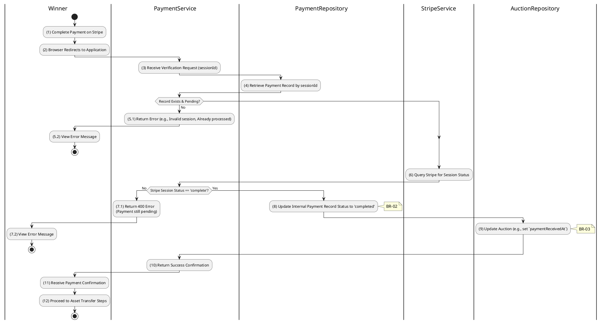

# 3.6.8 Verify Winner Payment

## 1. Use Case Description

| Field              | Description                                                                                                                                                                                                                                              |
| ------------------ | -------------------------------------------------------------------------------------------------------------------------------------------------------------------------------------------------------------------------------------------------------- |
| **Name**           | Verify Winner Payment                                                                                                                                                                                                                                    |
| **Description**    | This use case allows the System to update Payment status in the system. This involves checking the status with the payment gateway (Stripe) and, upon successful verification, updates the relevant payment records and marks the auction as fully paid. |
| **Actor**          | Winner, Admin                                                                                                                                                                                                                                            |
| **Trigger**        | When the Winner is redirected back from Stripe to the application (triggering a client-side call to `POST /auction-finalization/verify-winner-payment`) or a Stripe webhook notifies the backend.                                                        |
| **Pre-condition**  | • Winner's device must be connected to the internet.<br>• A `winning_payment` session was successfully initiated and Payment has been completed on Stripe.                                                                                               |
| **Post-condition** | The Payment record's status is updated to `completed` and the Winner is granted access to the asset transfer process in the system.                                                                                                                      |

## 2. Sequence Flow (MVC)



## 3. Activities Flow (Swimlanes)



## 4. Business Rules

| Activity      | BR Code   | Description                                                                                                                                                                                                                                                                                                                                                            |
| :------------ | :-------- | :--------------------------------------------------------------------------------------------------------------------------------------------------------------------------------------------------------------------------------------------------------------------------------------------------------------------------------------------------------------------- |
| **(1)-(2)**   | **BR-01** | **Displaying Rule (Payment Verification Page):**<br>When Winner is redirected back from Stripe, system displays `PaymentVerificationPage`.<br>System shows loading indicator while verifying payment.                                                                                                                                                                  |
| **(4)-(5.1)** | **BR-02** | **Validation Rule (Record Lookup - Back-end):**<br>System retrieves data from the 'PAYMENT' table in the database (Refer to 'PAYMENT' table in 'DB Sheet' file) based on the session ID to find payment record.<br>If record not found or already `completed`:<br>$\rightarrow$ System displays MSG 9 ("Payment verification failed") or returns success (idempotent). |
| **(6)**       | **BR-03** | **Validation Rule (Stripe Confirmation - Back-end):**<br>System queries Stripe API to confirm session status is `complete`.<br>If Stripe session not complete:<br>$\rightarrow$ System displays MSG 9 ("Payment not yet confirmed by gateway") on the View.                                                                                                            |
| **(6)**       | **BR-04** | **Validation Rule (Amount Matching - Back-end):**<br>System verifies `amount_total` from Stripe matches expected final payment amount.<br>If mismatch:<br>$\rightarrow$ System flags for manual intervention and logs discrepancy.                                                                                                                                     |
| **(8)**       | **BR-05** | **Storing Rule (Payment Status):**<br>System updates `PAYMENT` table:<br>- `status = 'completed'`<br>- `completedAt = now()`                                                                                                                                                                                                                                           |
| **(9)**       | **BR-06** | **Storing Rule (Auction Update):**<br>System updates `AUCTION` table:<br>- `paymentReceivedAt = now()`<br>Winner now eligible for asset transfer process.                                                                                                                                                                                                              |
| **(11)-(12)** | **BR-07** | **Displaying Rule (Success Confirmation):**<br>System displays MSG 7 ("Payment verified successfully") on the View.<br>System displays next steps for asset transfer/collection.<br>System shows payment receipt summary.                                                                                                                                              |

```

```
