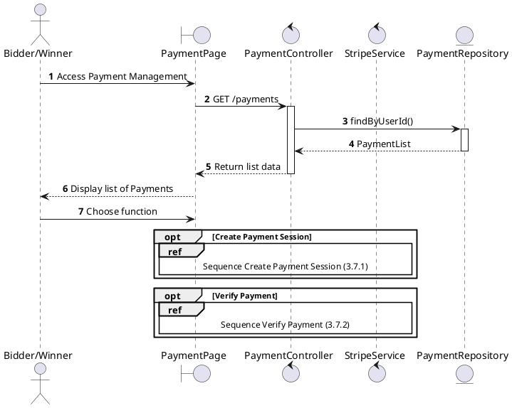
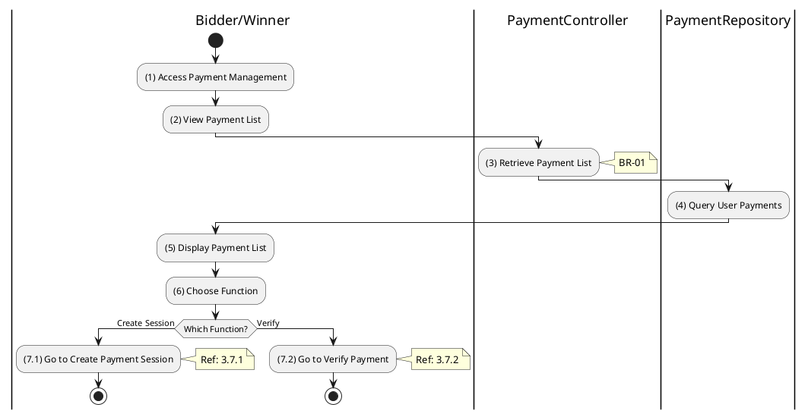

# Use Case 3.7.0: Manage Payment

## 1. Use Case Description

| Field              | Content                                                                                                                                   |
| :----------------- | :---------------------------------------------------------------------------------------------------------------------------------------- |
| **Name**           | Manage Payment                                                                                                                            |
| **Description**    | This use case allows the **Bidder** to choose one of the corresponding functions of CRUD to adjust **Payment** information in the system. |
| **Actor**          | **Bidder**, **Winner**, **System**                                                                                                        |
| **Trigger**        | When the **Bidder** clicks on the "**Payment**" button on the navigation sidebar.                                                         |
| **Pre-condition**  | 1. **Bidder**'s device must be connected to the internet. 2. **Bidder** is signed in with their account.                               |
| **Post-condition** | The **Payment** information is updated to the corresponding function that the **Bidder** executes.                                        |

---

## 2. Sequence Flow

---

## 3. Activities Flow (Swimlanes)

---

## 4. Business Rules

| Activity | BR Code   | Description                                                                                                                                         |
| :------- | :-------- | :-------------------------------------------------------------------------------------------------------------------------------------------------- |
| **(5)**  | **BR-01** | **Displaying Rule:** The system displays a "**Payment Management**" screen. (Refer to "**Payment Management**" view in "View Description" file). |
| **(6)**  | **BR-02** | **Choosing Rule:** **Bidder** can only choose one feature at a time to use.                                                                      |

---

## 5. Related Child Use Cases

| Use Case ID | Use Case Name          | Description                                 |
| :---------- | :--------------------- | :------------------------------------------ |
| 3.7.1       | Create Payment Session | Create a new Stripe payment session         |
| 3.7.2       | Verify Payment         | Verify payment status after Stripe redirect |
