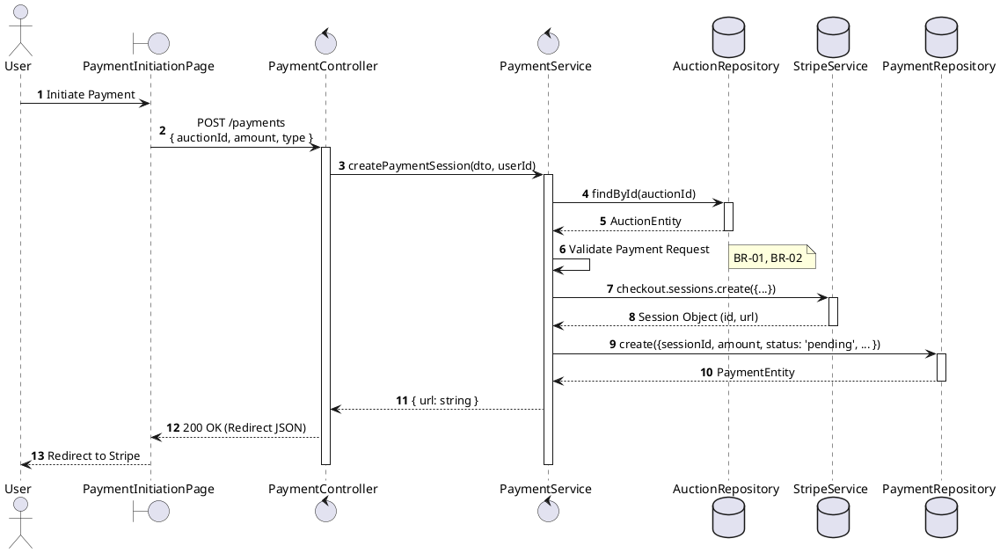
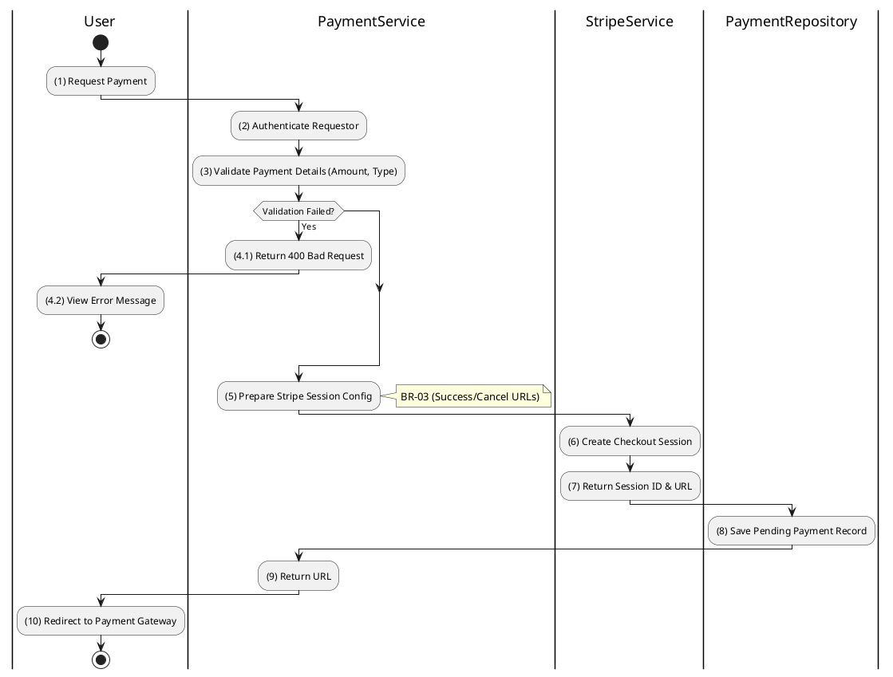

# 3.7.1 Create Payment Session

## 1. Use Case Description

| Field              | Description                                                                                                                                                                           |
| ------------------ | ------------------------------------------------------------------------------------------------------------------------------------------------------------------------------------- |
| **Name**           | Create Payment Session                                                                                                                                                                |
| **Description**    | This use case allows the User to create a Payment Session in the system. This handles the creation of a checkout session for deposits, participation fees, or final winning payments. |
| **Actor**          | Bidder, Winner                                                                                                                                                                        |
| **Trigger**        | When the User initiates payment via other use cases (e.g., "Submit Deposit Payment", "Initiate Winner Payment") or directly via `POST /payments` for generic payment flows.           |
| **Pre-condition**  | • User's device must be connected to the internet. • User is signed in with their account.                                                                                         |
| **Post-condition** | A Payment record is created in the database with status `pending` and a Stripe Checkout Session URL is generated and returned to the User in the system.                              |

## 2. Sequence Flow (MVC)

## 3. Activities Flow (Swimlanes)

## 4. Business Rules

| Activity    | BR Code   | Description                                                                                                                                                                                                                                                          |
| :---------- | :-------- | :------------------------------------------------------------------------------------------------------------------------------------------------------------------------------------------------------------------------------------------------------------------- |
| **(1)**     | **BR-01** | **Displaying Rule (Payment Initiation Page):** When User initiates payment, system displays `PaymentInitiationPage`. System shows payment amount, description, and confirmation button.                                                                        |
| **(1)**     | **BR-02** | **Validation Rule (Confirmation - Front-end):** When User clicks "Proceed to Payment", system displays MSG 11 ("Proceed with [type] payment of [amount]?"). System waits for confirmation before creating session.                                             |
| **(2)-(3)** | **BR-03** | **Validation Rule (Payment Type - Back-end):** System validates the requested `paymentType` (e.g., `deposit`, `winning_payment`). If unsupported type: $\rightarrow$ System displays MSG 9 ("Invalid payment type") on the View.                            |
| **(3)**     | **BR-04** | **Validation Rule (Amount - Back-end):** System validates the `amount` field is positive and matches expected context. For deposits: must equal `depositAmountRequired`. If invalid: $\rightarrow$ System displays MSG 4 ("Invalid amount") on the View. |
| **(5)**     | **BR-05** | **Processing Rule (Stripe Configuration):** System configures Stripe checkout session with: - `success_url` (redirect after successful payment) - `cancel_url` (redirect after cancelled payment) - Currency standardization (VND or USD).               |
| **(8)**     | **BR-06** | **Storing Rule:** System creates record in `PAYMENT` table: - `sessionId = [Stripe session ID]` - `amount = [validated amount]` - `status = 'pending'` - `type = [payment type]`                                                                      |
| **(10)**    | **BR-07** | **Displaying Rule (Redirect):** System returns Stripe Checkout URL. System redirects User to external payment gateway page.                                                                                                                                    |
