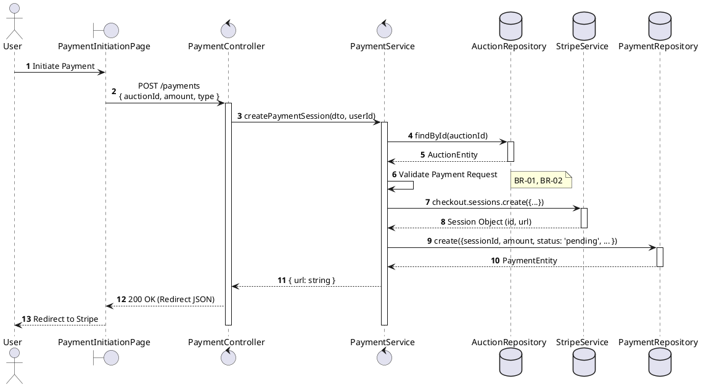
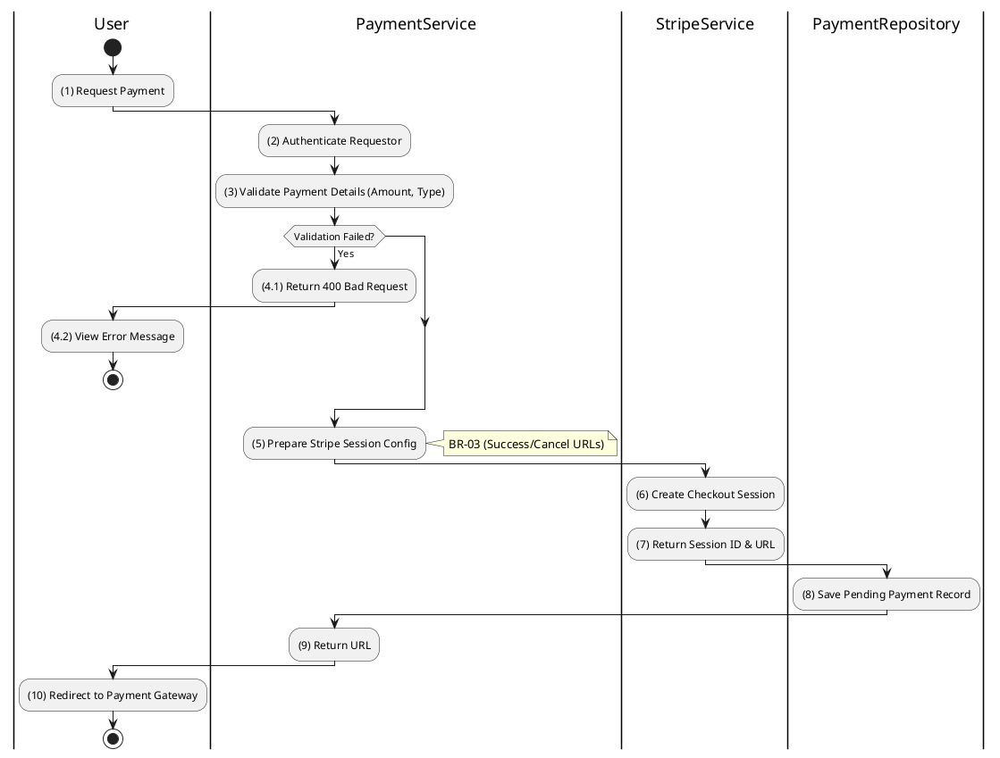

# 3.7.1 Create Payment Session

## 1. Use Case Description

| Field              | Description                                                                                                                                                                           |
| ------------------ | ------------------------------------------------------------------------------------------------------------------------------------------------------------------------------------- |
| **Name**           | Create Payment Session                                                                                                                                                                |
| **Description**    | This use case allows the User to create a Payment Session in the system. This handles the creation of a checkout session for deposits, participation fees, or final winning payments. |
| **Actor**          | Bidder, Winner                                                                                                                                                                        |
| **Trigger**        | When the User initiates payment via other use cases (e.g., "Submit Deposit Payment", "Initiate Winner Payment") or directly via `POST /payments` for generic payment flows.           |
| **Pre-condition**  | • User's device must be connected to the internet. • User is signed in with their account.                                                                                         |
| **Post-condition** | A Payment record is created in the database with status `pending` and a Stripe Checkout Session URL is generated and returned to the User in the system.                              |

## 2. Sequence Flow (MVC)

## 3. Activities Flow (Swimlanes)

## 4. Business Rules

| Activity    | BR Code   | Description                                                                                                                                                                                                                                                                                                                                                                                                                                                                                                                                                                                                                                                                                                                                                                                                                                                                     |
| :---------- | :-------- | :------------------------------------------------------------------------------------------------------------------------------------------------------------------------------------------------------------------------------------------------------------------------------------------------------------------------------------------------------------------------------------------------------------------------------------------------------------------------------------------------------------------------------------------------------------------------------------------------------------------------------------------------------------------------------------------------------------------------------------------------------------------------------------------------------------------------------------------------------------------------------ |
| **(1)**     | **BR-01** | **Displaying Rules:** ❖ The system displays a “PaymentInitiationPage” screen via `Display_View()`. (Refer to “PaymentInitiationPage” view in “View Description” file). ❖ The screen shows the [Payment Amount], a selection for the [Payment Type] (e.g., Deposit, Winning Payment), and a [Pay] button.                                                                                                                                                                                                                                                                                                                                                                                                                                                                                                                                                    |
| **(1)**     | **BR-02** | **Validation Rules (Front-end):** ❖ When the user clicks “Proceed to Payment”, the system triggers a confirmation modal via `Display_Modal('ConfirmationBox')`. ❖ It presents **MSG 11** ("Proceed with [type] payment of [amount]?"), awaiting explicit confirmation before creating the payment session.                                                                                                                                                                                                                                                                                                                                                                                                                                                                                                                                                            |
| **(2)-(3)** | **BR-03** | **Validation Rules (Back-end):** ❖ The system validates the requested `paymentType` by calling `PaymentService.validatePaymentType()`. ❖ If the input is not valid: ⮚ If the requested [paymentType] is not 'deposit' or 'winning_payment', the system returns a 400 Bad Request. ⮚ It displays **MSG 9** (Invalid payment type) on the View.                                                                                                                                                                                                                                                                                                                                                                                                                                                                                                                     |
| **(3)**     | **BR-04** | **Validation Rules (Back-end):** ❖ The system validates the payment [amount] by calling `PaymentService.validateAmount(amount, type, auctionId)`. ❖ It checks that the [amount] is positive and matches the expected context. ❖ If the [paymentType] is 'deposit', the [amount] must exactly match `Auction.depositAmountRequired`. ❖ If the input is not valid, the system returns a 400 Bad Request and displays **MSG 4** (Invalid amount).                                                                                                                                                                                                                                                                                                                                                                                                                    |
| **(5)**     | **BR-05** | **Processing Rules (Stripe Configuration):** ❖ The system configures the Stripe checkout session by calling `StripeService.createCheckoutSession()`. ❖ It sets up `line_items` with the [amount] and currency. ❖ The `mode` is set to 'payment', and `success_url` and `cancel_url` are configured for redirects.                                                                                                                                                                                                                                                                                                                                                                                                                                                                                                                             |
| **(8)**     | **BR-06** | **Storing Rules (Back-end):** ❖ The system creates a new record in the “PAYMENT” table via `PaymentRepository.create()`. ❖ It records the [sessionId] from Stripe, the [amount], sets the [status] to 'pending', and records the [type] of payment.                                                                                                                                                                                                                                                                                                                                                                                                                                                                                                                                                                                                             |
| **(10)**    | **BR-07** | **Displaying Rules (Redirect):** ❖ The system returns the Stripe Checkout URL to the client. ❖ The client’s browser is then redirected to the external payment gateway page.                                                                                                                                                                                                                                                                                                                                                                                                                                                                                                                                                                                                                                                                                        |