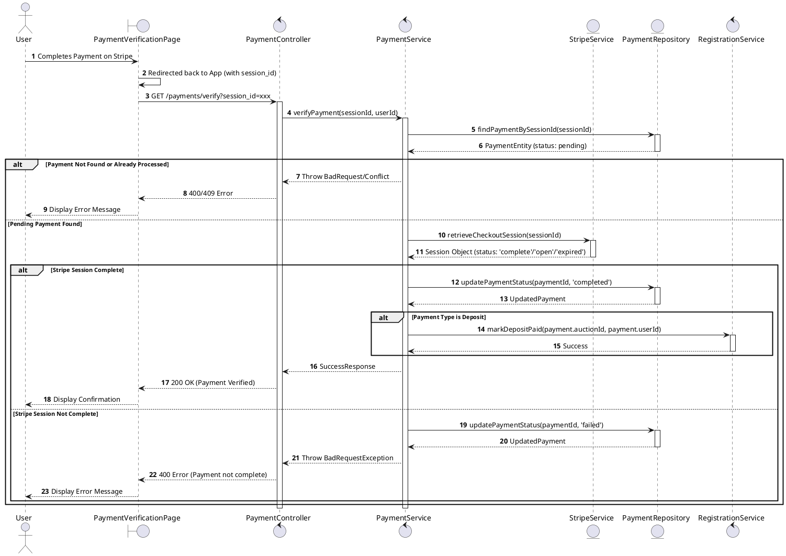
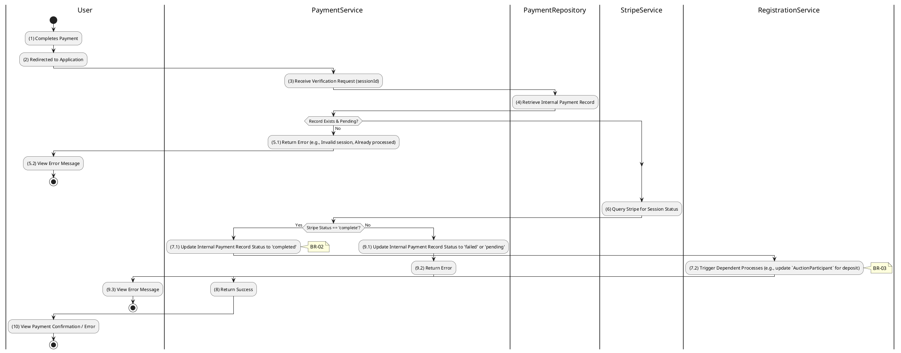

# 3.7.2 Verify Payment

## 1. Use Case Description

| Field              | Description                                                                                                                                                                                       |
| ------------------ | ------------------------------------------------------------------------------------------------------------------------------------------------------------------------------------------------- |
| **Name**           | Verify Payment                                                                                                                                                                                    |
| **Description**    | This use case allows the System to update Payment status in the system. This involves querying Stripe for the session status and updating the internal Payment record accordingly.                |
| **Actor**          | Bidder, Winner, System (via Webhook)                                                                                                                                                              |
| **Trigger**        | When the User is redirected from Stripe to `GET /payments/verify?session_id=xxx` or a Stripe webhook notification notifies the backend.                                                           |
| **Pre-condition**  | • User's device must be connected to the internet. • A Payment record with a `pending` status and associated `sessionId` exists.                                                               |
| **Post-condition** | The Payment record's status is updated to `completed`, `failed`, or `refunded` based on Stripe's status and dependent system processes are triggered if the payment is `completed` in the system. |

<h2>2. Sequence Flow (MVC)</h2>

## 3. Activities Flow (Swimlanes)

## 4. Business Rules

| Activity      | BR Code   | Description                                                                                                                                                                                                                                                                                                                                                                                                                                                                                                                                                                                                                                                                                                                                                                                                                                                                     |
| :------------ | :-------- | :------------------------------------------------------------------------------------------------------------------------------------------------------------------------------------------------------------------------------------------------------------------------------------------------------------------------------------------------------------------------------------------------------------------------------------------------------------------------------------------------------------------------------------------------------------------------------------------------------------------------------------------------------------------------------------------------------------------------------------------------------------------------------------------------------------------------------------------------------------------------------ |
| **(1)-(2)**   | **BR-01** | **Displaying Rules:** ❖ The system renders a “PaymentVerificationPage” via `Display_View()` upon the user’s return from Stripe. ❖ It displays a loading indicator while verifying the payment status.                                                                                                                                                                                                                                                                                                                                                                                                                                                                                                                                                                                                                                                                     |
| **(4)-(5.1)** | **BR-02** | **Verification Rules (Back-end):** ❖ The system calls `PaymentService.verifyPayment(sessionId, userId)` to verify the payment. ❖ It retrieves the `PAYMENT` record using the [sessionId]. ❖ If the input is not valid: ⮚ If the record is not found or the [status] is not 'pending', the system returns a 400 Bad Request (Invalid/processed payment).                                                                                                                                                                                                                                                                                                                                                                                 |
| **(6)**       | **BR-03** | **Payment Gateway Rules:** ❖ The system queries Stripe for the session status via `StripeService.retrieveCheckoutSession(sessionId)`. ❖ If the input is not valid: ⮚ If the Stripe status is not 'complete', the system updates the `PAYMENT` record to 'failed' and returns a 400 Bad Request.                                                                                                                                                                                                                                                                                                                                                                                                                                                                                                                                                                        |
| **(7.1)**     | **BR-04** | **Storing Rules (Back-end):** ❖ Upon successful verification, the system calls `PaymentRepository.update()` to update the database. ❖ It sets the [status] to 'completed' and records the `completedAt` timestamp.                                                                                                                                                                                                                                                                                                                                                                                                                                                                                                                                                                                                                                                         |
| **(7.2)**     | **BR-05** | **Processing Rules (Dependent Trigger):** ❖ The system triggers dependent processes via `PaymentService.triggerDependentProcesses(payment)`. ❖ If the [payment.type] is 'deposit', it updates the “AUCTION_PARTICIPANT” table, setting `depositPaidAt` to now and [status] to 'FINAL_APPROVED'. ❖ If the [payment.type] is 'winning_payment', it updates the “AUCTION” table, setting `paymentReceivedAt` to now.                                                                                                                                                                                                                                                                                                                                                         |
| **(10)**      | **BR-06** | **Displaying Rules (Success):** ❖ The system redirects the user to the appropriate page based on the payment type via `Redirect_To_Appropriate_Page()`. ❖ It displays **MSG 7** ("Payment verified successfully.") to the user.                                                                                                                                                                                                                                                                                                                                                                                                                                                                                                                                                                                                                                           |
                                                                                                                                                                        |