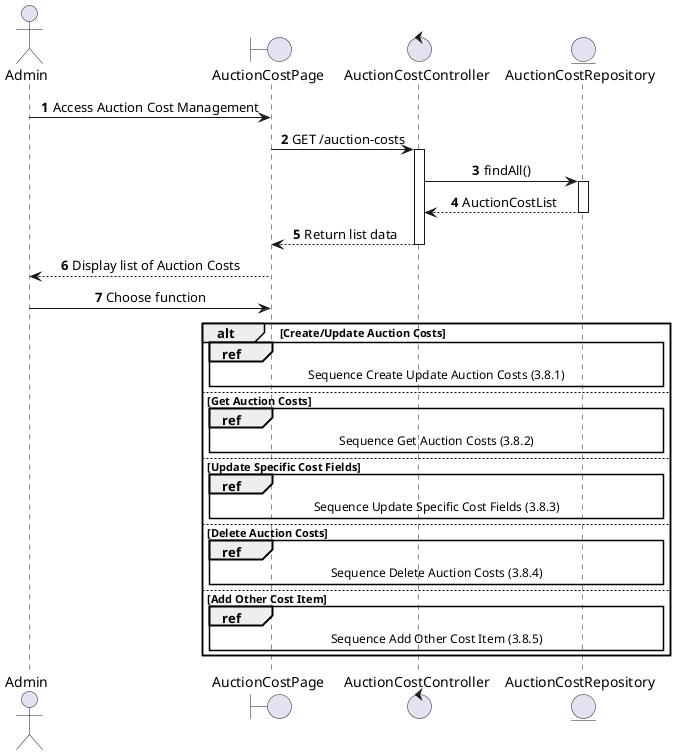
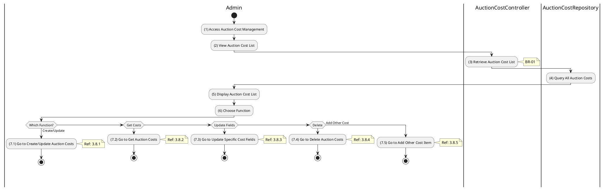

# Use Case 3.8.0: Manage Auction Cost

## 1. Use Case Description

| Field              | Content                                                                                                                                       |
| :----------------- | :-------------------------------------------------------------------------------------------------------------------------------------------- |
| **Name**           | Manage Auction Cost                                                                                                                           |
| **Description**    | This use case allows the **Admin** to choose one of the corresponding functions of CRUD to adjust **Auction Cost** information in the system. |
| **Actor**          | **Admin**, **Auctioneer**                                                                                                                     |
| **Trigger**        | When the **Admin** clicks on the "**Auction Cost**" button on the navigation sidebar.                                                         |
| **Pre-condition**  | 1. **Admin**'s device must be connected to the internet. 2. **Admin** is signed in with their account.                                     |
| **Post-condition** | The **Auction Cost** information is updated to the corresponding function that the **Admin** executes.                                        |

---

## 2. Sequence Flow

---

## 3. Activities Flow (Swimlanes)

---

## 4. Business Rules

| Activity | BR Code   | Description                                                                                                                                                    |
| :------- | :-------- | :------------------------------------------------------------------------------------------------------------------------------------------------------------- |
| **(5)**  | **BR-01** | **Displaying Rule:** The system displays an "**Auction Cost Management**" screen. (Refer to "**Auction Cost Management**" view in "View Description" file). |
| **(6)**  | **BR-02** | **Choosing Rule:** **Admin** can only choose one feature at a time to use.                                                                                  |

---

## 5. Related Child Use Cases

| Use Case ID | Use Case Name               | Description                           |
| :---------- | :-------------------------- | :------------------------------------ |
| 3.8.1       | Create/Update Auction Costs | Create or update auction cost records |
| 3.8.2       | Get Auction Costs           | Retrieve cost details for an auction  |
| 3.8.3       | Update Specific Cost Fields | Partially update specific cost fields |
| 3.8.4       | Delete Auction Costs        | Remove auction cost records           |
| 3.8.5       | Add Other Cost Item         | Add miscellaneous cost items          |
