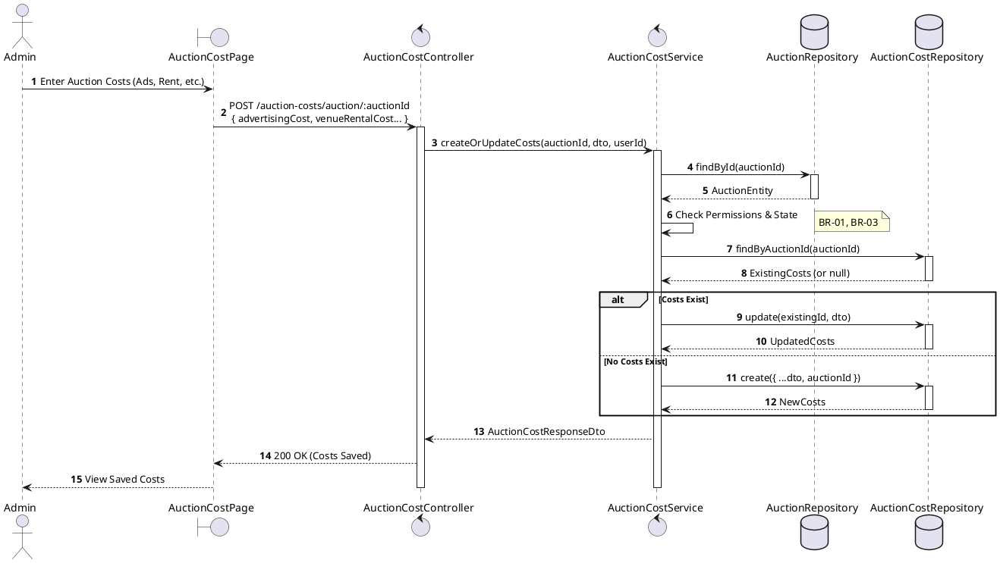
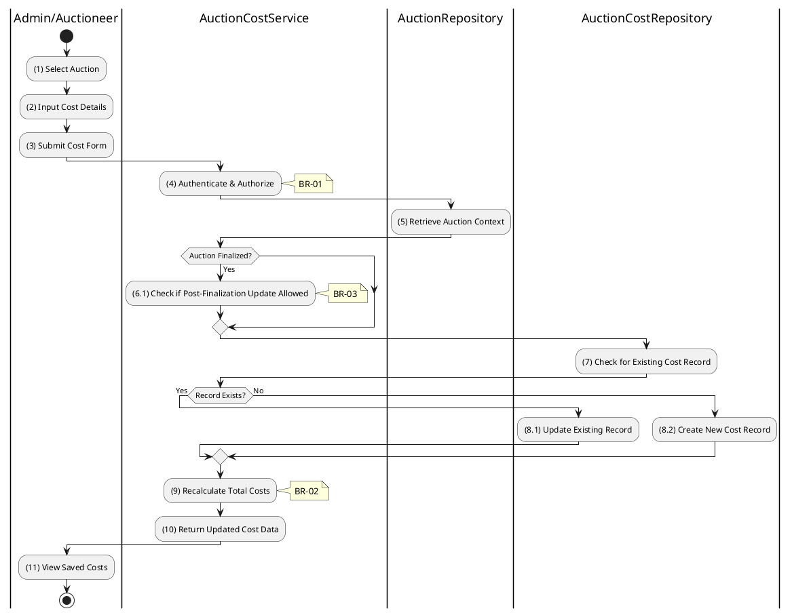

# 3.8.1 Create/Update Auction Costs

## 1. Use Case Description

| Field              | Description                                                                                                          |
| ------------------ | -------------------------------------------------------------------------------------------------------------------- |
| **Name**           | Create/Update Auction Costs                                                                                          |
| **Description**    | This use case allows the Admin to create a new or update existing Auction Costs information in the system.           |
| **Actor**          | Admin                                                                                                                |
| **Trigger**        | When the Admin clicks on the 'Save Costs' button on the AuctionCostPage.                                             |
| **Pre-condition**  | • Admin's device must be connected to the internet. • Admin is signed in with their account.                      |
| **Post-condition** | The Auction Costs information will be stored into the system and display updated record on AuctionCostPage datagrid. |

## 2. Sequence Flow (MVC)

## 3. Activities Flow (Swimlanes)

## 4. Business Rules

| Activity      | BR Code   | Description                                                                                                                                                                                                                                                                                                                                                                                                                                                                                                                                                                                                                                                                                                                                                                                                                                                                     |
| :------------ | :-------- | :------------------------------------------------------------------------------------------------------------------------------------------------------------------------------------------------------------------------------------------------------------------------------------------------------------------------------------------------------------------------------------------------------------------------------------------------------------------------------------------------------------------------------------------------------------------------------------------------------------------------------------------------------------------------------------------------------------------------------------------------------------------------------------------------------------------------------------------------------------------------------ |
| **(1)**       | **BR-01** | **Displaying Rules:** ❖ The system renders an “AuctionCostPage” via `Display_View(auctionId)`. ❖ It displays an input form for cost fields: `advertisingCost`, `venueRentalCost`, `appraisalCost`, etc. ❖ If an existing record is found, the fields are pre-populated with current values.                                                                                                                                                                                                                                                                                                                                                                                                                                                                                                                                                                            |
| **(2)**       | **BR-02** | **Validation Rules (Front-end):** ❖ The system validates the input using `ValidateCostInput(value)`. ❖ If the input is not valid: ⮚ If any cost field is non-numeric or less than 0, the system displays **MSG 4** (Invalid cost value).                                                                                                                                                                                                                                                                                                                                                                                                                                                                                                                                                                                                                               |
| **(4)**       | **BR-03** | **Authorization Rules (Back-end):** ❖ The system checks the authenticated user's role via `AuctionCostService.createOrUpdateCosts()` to ensure they have the necessary permissions. ❖ If the input is not valid: ⮚ If the user's role is not 'admin' or 'auctioneer', the system returns a 403 Forbidden status.                                                                                                                                                                                                                                                                                                                                                                                                                                                                                                                                                       |
| **(6.1)**     | **BR-04** | **State Locking Rules (Back-end):** ❖ The system checks the auction state via `AuctionService.isFinalized(auctionId)`. ❖ If the input is not valid: ⮚ If the [status] is 'success' or 'failed', the system prevents modification and returns a 400 Bad Request, unless a specific policy override is active.                                                                                                                                                                                                                                                                                                                                                                                                                                                                                                                                                           |
| **(7)-(8.2)** | **BR-05** | **Storing Rules (Upsert - Back-end):** ❖ The system queries the “AUCTION_COST” table by [auctionId]. ❖ If a record exists, the system calls `CostRepository.update()` to modify it. ❖ If no record exists, the system calls `CostRepository.create()` to insert a new one, linking it to the [auctionId]. ❖ System moves to step (11) and displays successful notification (Refer to **MSG 7**).                                                                                                                                                                                                                                                                                                                                                                                                                                                                    |
| **(9)**       | **BR-06** | **Calculation Rules (Back-end):** ❖ The system calculates the total costs via `AuctionCostService.calculateTotalCosts(costs)`. ❖ The formula is: `totalCosts = sum(all_individual_cost_fields) + sum(otherCosts.amount)`. ❖ The calculated `totalCosts` is stored in the “AUCTION_COST” record.                                                                                                                                                                                                                                                                                                                                                                                                                                                                                                                                                                        |
| **(11)**      | **BR-07** | **Displaying Rules (Success):** ❖ The system refreshes the view via `Refresh_View('AuctionCostPage')`. ❖ It updates the displayed costs and the newly calculated total.                                                                                                                                                                                                                                                                                                                                                                                                                                                                                                                                                                                                                                                                                                   |