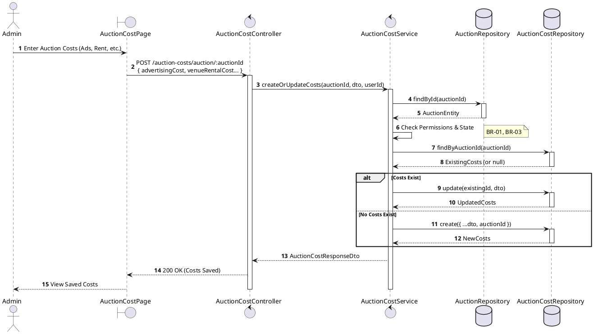
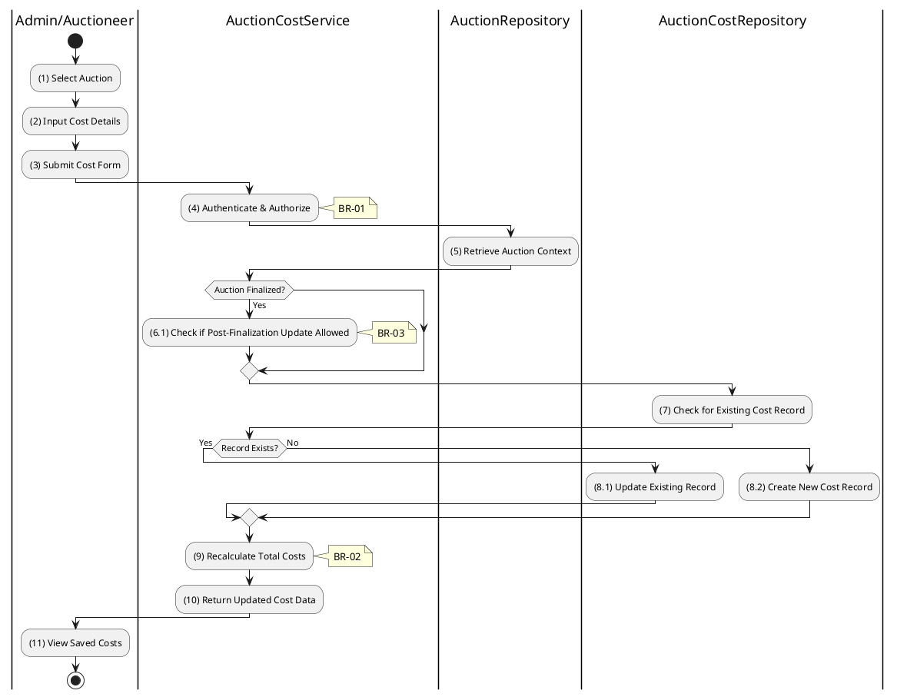

# 3.8.1 Create/Update Auction Costs

## 1. Use Case Description

| Field              | Description                                                                                                          |
| ------------------ | -------------------------------------------------------------------------------------------------------------------- |
| **Name**           | Create/Update Auction Costs                                                                                          |
| **Description**    | This use case allows the Admin to create a new or update existing Auction Costs information in the system.           |
| **Actor**          | Admin                                                                                                                |
| **Trigger**        | When the Admin clicks on the 'Save Costs' button on the AuctionCostPage.                                             |
| **Pre-condition**  | • Admin's device must be connected to the internet. • Admin is signed in with their account.                      |
| **Post-condition** | The Auction Costs information will be stored into the system and display updated record on AuctionCostPage datagrid. |

## 2. Sequence Flow (MVC)

## 3. Activities Flow (Swimlanes)

## 4. Business Rules

| Activity      | BR Code   | Description                                                                                                                                                                                                                                                                                                                                                   |
| :------------ | :-------- | :------------------------------------------------------------------------------------------------------------------------------------------------------------------------------------------------------------------------------------------------------------------------------------------------------------------------------------------------------------ |
| **(1)**       | **BR-01** | **Displaying Rule (Auction Cost Page):** When Admin/Auctioneer selects an auction for cost management, system displays `AuctionCostPage`. If costs exist, fields are pre-populated with existing values.                                                                                                                                                |
| **(2)**       | **BR-02** | **Validation Rule (Input Fields - Front-end):** When Admin inputs cost values, system triggers `Text_change()` validation. All cost fields must be non-negative numbers. If invalid: $\rightarrow$ System displays MSG 4 ("Invalid cost value") adjacent to field.                                                                                |
| **(4)**       | **BR-03** | **Validation Rule (Authorization - Back-end):** System checks if requestor role is `admin` or `auctioneer` in `USERS` table. If unauthorized: $\rightarrow$ System displays MSG 5 ("Forbidden") on the View.                                                                                                                                         |
| **(6.1)**     | **BR-04** | **Validation Rule (Auction Status - Back-end):** System checks if auction is finalized. Updates generally allowed only for non-finalized auctions. Policy may permit post-finalization corrections.                                                                                                                                                  |
| **(7)-(8.2)** | **BR-05** | **Querying/Storing Rule (Upsert Logic):** System retrieves data from the 'AUCTION_COST' table in the database (Refer to 'AUCTION_COST' table in 'DB Sheet' file) based on the auction ID to check for existing record. If exists: The cost data will be updated in the existing record. If not exists: The cost data will be stored as a new record. |
| **(9)**       | **BR-06** | **Processing Rule (Total Calculation):** System automatically calculates `totalCosts` field: $totalCosts = advertisingCost + venueRentalCost + appraisalCost + ...$                                                                                                                                                                                     |
| **(11)**      | **BR-07** | **Displaying Rule (Confirmation):** System displays MSG 7 ("Auction costs saved successfully") on the View. System displays updated cost breakdown with calculated total.                                                                                                                                                                               |
