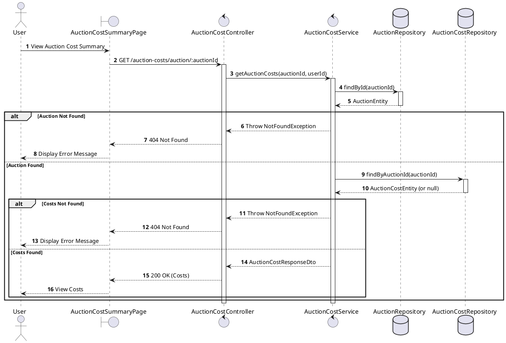
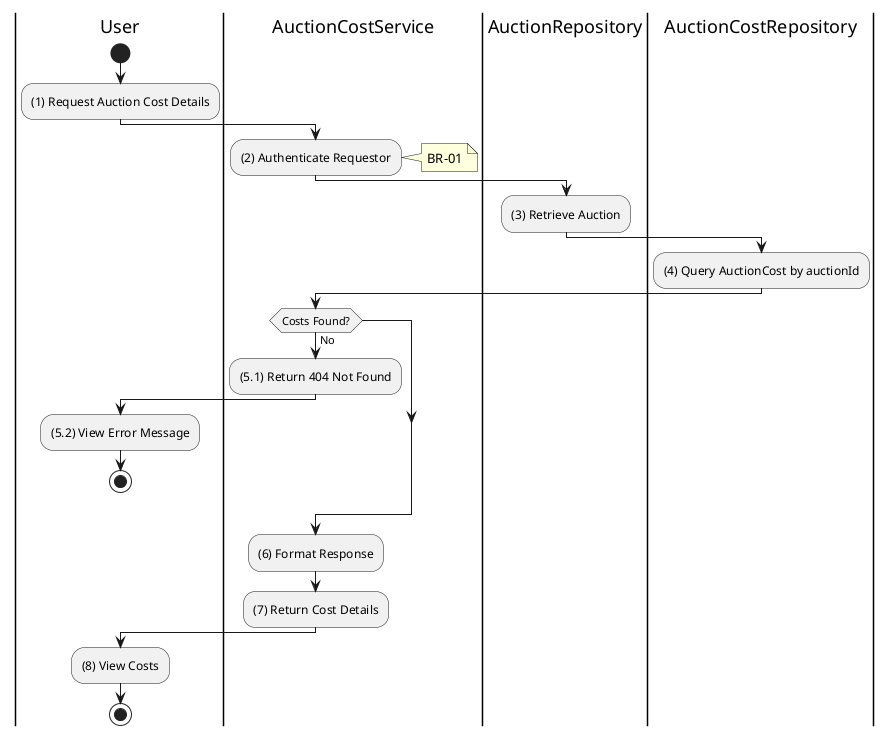

# 3.8.2 Get Auction Costs

## 1. Use Case Description

| Field              | Description                                                                                              |
| ------------------ | -------------------------------------------------------------------------------------------------------- |
| **Name**           | Get Auction Costs                                                                                        |
| **Description**    | This use case allows the User to search Auction Costs information in the system based on input keywords. |
| **Actor**          | User                                                                                                     |
| **Trigger**        | When User clicks on the 'View Costs' button on the AuctionDetailPage screen.                             |
| **Pre-condition**  | • User's device must be connected to the internet. • User is signed in with their account.            |
| **Post-condition** | The Auction Costs details will be displayed on the AuctionCostSummaryPage screen.                        |

<h2>2. Sequence Flow (MVC)</h2>

## 3. Activities Flow (Swimlanes)

## 4. Business Rules

| Activity      | BR Code   | Description                                                                                                                                                                                                                                                                                                  |
| :------------ | :-------- | :----------------------------------------------------------------------------------------------------------------------------------------------------------------------------------------------------------------------------------------------------------------------------------------------------------- |
| **(1)**       | **BR-01** | **Displaying Rule (Auction Cost Summary Page):** When User navigates to auction cost summary, system displays `AuctionCostSummaryPage`. System shows loading indicator while fetching cost data.                                                                                                       |
| **(2)**       | **BR-02** | **Validation Rule (Authentication - Back-end):** System verifies requestor is authenticated. If not authenticated: $\rightarrow$ System displays MSG 5 ("Authentication required") on the View.                                                                                                     |
| **(3)**       | **BR-03** | **Validation Rule (Auction Existence - Back-end):** System retrieves data from the 'AUCTION' table in the database (Refer to 'AUCTION' table in 'DB Sheet' file) based on the auction ID to verify it exists. If not found: $\rightarrow$ System displays MSG 20 ("Auction not found") on the View. |
| **(4)-(5.1)** | **BR-04** | **Querying Rule:** System retrieves data from the 'AUCTION_COST' table in the database (Refer to 'AUCTION_COST' table in 'DB Sheet' file) based on the auction ID. If no cost record found: $\rightarrow$ System displays MSG 20 ("Costs not recorded for this auction") on the View.               |
| **(8)**       | **BR-05** | **Displaying Rule (Cost Breakdown):** System displays cost details showing: - Individual cost categories (advertising, venue, appraisal, etc.) - Other costs list (description and amount for each) - Calculated total costs.                                                                    |
