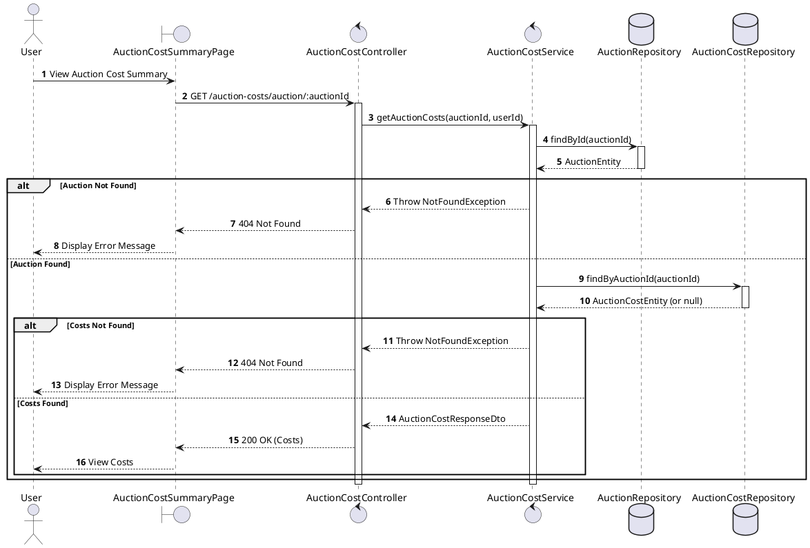
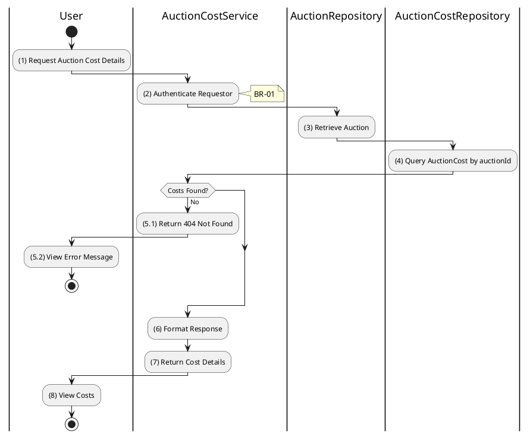

# 3.8.2 Get Auction Costs

## 1. Use Case Description

| Field              | Description                                                                                              |
| ------------------ | -------------------------------------------------------------------------------------------------------- |
| **Name**           | Get Auction Costs                                                                                        |
| **Description**    | This use case allows the User to search Auction Costs information in the system based on input keywords. |
| **Actor**          | User                                                                                                     |
| **Trigger**        | When User clicks on the 'View Costs' button on the AuctionDetailPage screen.                             |
| **Pre-condition**  | • User's device must be connected to the internet. • User is signed in with their account.            |
| **Post-condition** | The Auction Costs details will be displayed on the AuctionCostSummaryPage screen.                        |

<h2>2. Sequence Flow (MVC)</h2>

## 3. Activities Flow (Swimlanes)

## 4. Business Rules

| Activity      | BR Code   | Description                                                                                                                                                                                                                                                                                                                                                                                                                                                                                                                                                                                                                                                                                                                                                                                                                                                                     |
| :------------ | :-------- | :------------------------------------------------------------------------------------------------------------------------------------------------------------------------------------------------------------------------------------------------------------------------------------------------------------------------------------------------------------------------------------------------------------------------------------------------------------------------------------------------------------------------------------------------------------------------------------------------------------------------------------------------------------------------------------------------------------------------------------------------------------------------------------------------------------------------------------------------------------------------------ |
| **(1)**       | **BR-01** | **Displaying Rules:** ❖ The system renders an “AuctionCostSummaryPage” via `Display_View()`. ❖ It displays a loading indicator while the data is being retrieved. ❖ The cost breakdown is rendered in organized sections: Fixed Costs, Variable Costs, and Other Costs.                                                                                                                                                                                                                                                                                                                                                                                                                                                                                                                                                                                                |
| **(2)**       | **BR-02** | **Authorization Rules (Back-end):** ❖ The system checks if the user is authenticated via `AuctionCostService.getAuctionCosts()`. ❖ If the input is not valid: ⮚ If the user is not authenticated, the system returns a 401 Unauthorized status.                                                                                                                                                                                                                                                                                                                                                                                                                                                                                                                                                                                                                         |
| **(3)**       | **BR-03** | **Querying Rules:** ❖ The system calls `AuctionRepository.findById(auctionId)` to verify the auction exists. ❖ If the input is not valid: ⮚ If the auction is not found, the system returns a 404 Not Found error. ⮚ It displays **MSG 20** (Auction not found).                                                                                                                                                                                                                                                                                                                                                                                                                                                                                                                                                                                                    |
| **(4)-(5.1)** | **BR-04** | **Querying Rules:** ❖ The system queries the “AUCTION_COST” table via `AuctionCostRepository.findByAuctionId(auctionId)`. ❖ If the input is not valid: ⮚ If no cost record is found, the system returns a 404 Not Found error. ⮚ It displays **MSG 20** (Costs not recorded).                                                                                                                                                                                                                                                                                                                                                                                                                                                                                                                                                                                       |
| **(8)**       | **BR-05** | **Displaying Rules (Data):** ❖ The system renders the cost details using `Display_CostBreakdown(costs)`. ❖ It displays values for [advertisingCost], [venueRentalCost], and [appraisalCost]. ❖ It iterates through the `otherCosts` array to list each miscellaneous item. ❖ The [totalCosts] is displayed prominently at the bottom.                                                                                                                                                                                                                                                                                                                                                                                                                                                                                                                               |
