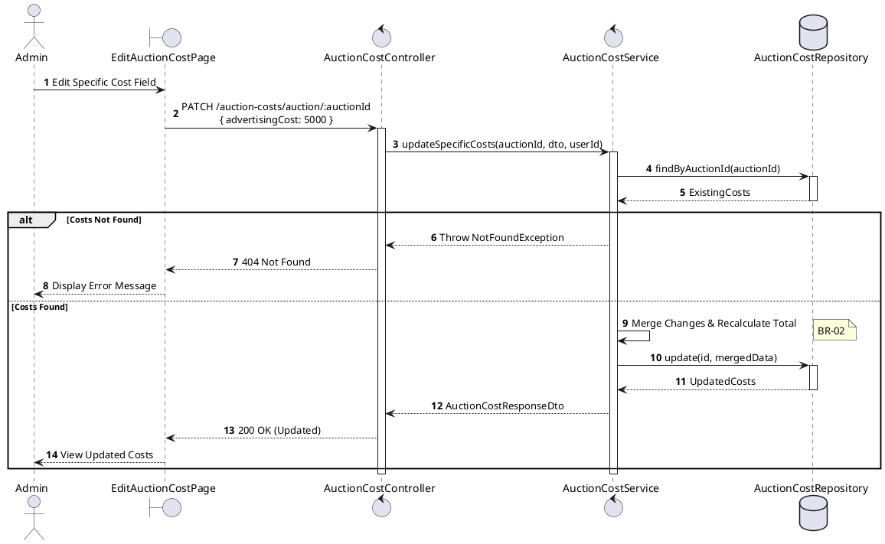
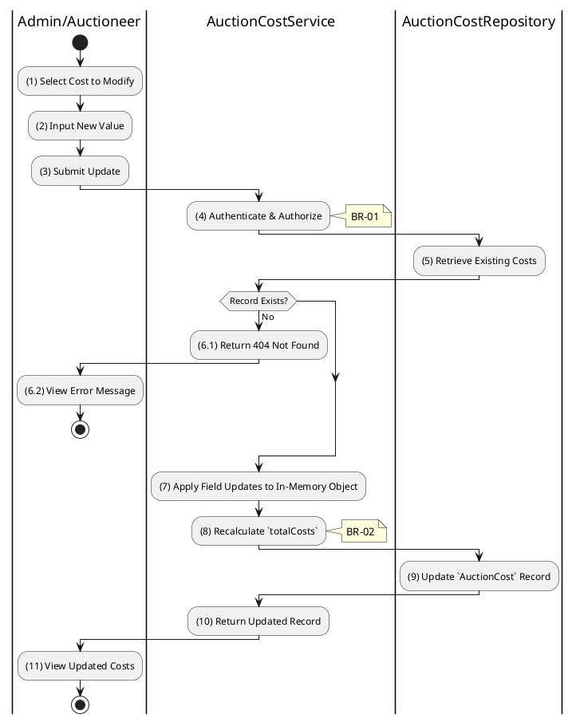

# 3.8.3 Update Specific Cost Fields

## 1. Use Case Description

| Field              | Description                                                                                                     |
| ------------------ | --------------------------------------------------------------------------------------------------------------- |
| **Name**           | Update Specific Cost Fields                                                                                     |
| **Description**    | This use case allows the Admin to update existing Auction Costs information in the system.                      |
| **Actor**          | Admin                                                                                                           |
| **Trigger**        | When the Admin clicks on the [Icon Edit] button on the right of each item on the EditAuctionCostPage datagrid.  |
| **Pre-condition**  | • Admin's device must be connected to the internet. • Admin is signed in with their account.                 |
| **Post-condition** | The Auction Costs information will be updated in the system and display new record on AuctionCostPage datagrid. |

## 2. Sequence Flow (MVC)

## 3. Activities Flow (Swimlanes)

## 4. Business Rules

| Activity      | BR Code   | Description                                                                                                                                                                                                                                                                                                    |
| :------------ | :-------- | :------------------------------------------------------------------------------------------------------------------------------------------------------------------------------------------------------------------------------------------------------------------------------------------------------------- |
| **(1)**       | **BR-01** | **Displaying Rule (Edit Auction Cost Page):** When Admin/Auctioneer selects a cost field to modify, system displays `EditAuctionCostPage`. System pre-populates current value in the editable field.                                                                                                     |
| **(2)**       | **BR-02** | **Validation Rule (Input Field - Front-end):** When Admin inputs new cost value, system triggers `Text_change()` validation. Value must be a non-negative number. If negative: $\rightarrow$ System displays MSG 4 ("Cost value cannot be negative") adjacent to field.                            |
| **(4)**       | **BR-03** | **Validation Rule (Authorization - Back-end):** System checks if requestor role is `admin` or `auctioneer` in `USERS` table. If unauthorized: $\rightarrow$ System displays MSG 5 ("Forbidden") on the View.                                                                                          |
| **(5)-(6.1)** | **BR-04** | **Querying Rule (Existing Record):** System retrieves data from the 'AUCTION_COST' table in the database (Refer to 'AUCTION_COST' table in 'DB Sheet' file) based on the auction ID. If no record found: $\rightarrow$ System displays MSG 20 ("No cost record exists for this auction") on the View. |
| **(7)-(8)**   | **BR-05** | **Processing Rule (Merge & Recalculate):** System merges partial update into existing cost object. System recalculates `totalCosts` field dynamically.                                                                                                                                                   |
| **(9)**       | **BR-06** | **Storing Rule:** System updates `AUCTION_COST` record with merged values and new `totalCosts`.                                                                                                                                                                                                             |
| **(11)**      | **BR-07** | **Displaying Rule (Confirmation):** System displays MSG 7 ("Cost updated successfully") on the View. System displays refreshed cost breakdown with recalculated total.                                                                                                                                   |
