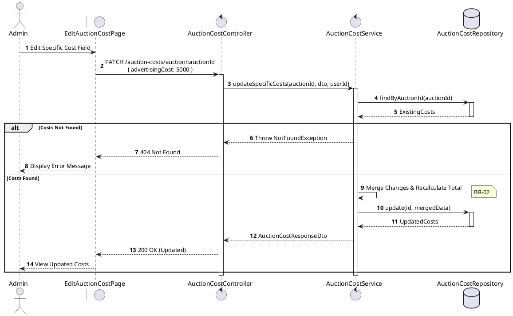
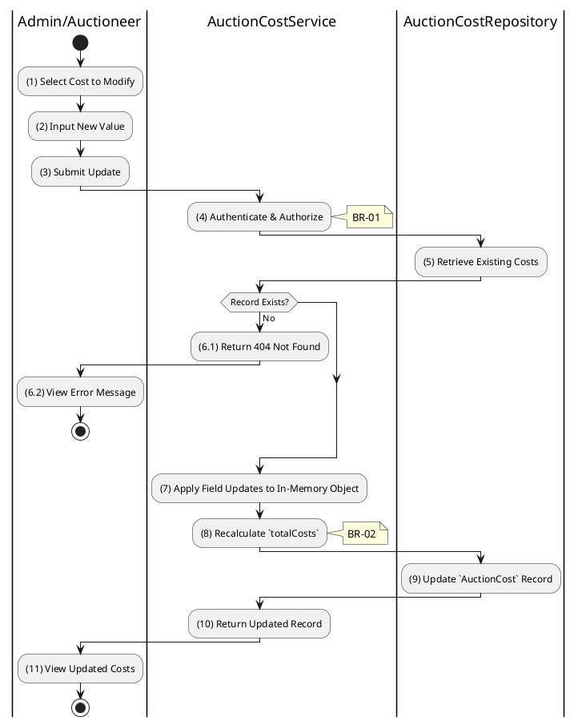

# 3.8.3 Update Specific Cost Fields

## 1. Use Case Description

| Field              | Description                                                                                                     |
| ------------------ | --------------------------------------------------------------------------------------------------------------- |
| **Name**           | Update Specific Cost Fields                                                                                     |
| **Description**    | This use case allows the Admin to update existing Auction Costs information in the system.                      |
| **Actor**          | Admin                                                                                                           |
| **Trigger**        | When the Admin clicks on the [Icon Edit] button on the right of each item on the EditAuctionCostPage datagrid.  |
| **Pre-condition**  | • Admin's device must be connected to the internet. • Admin is signed in with their account.                 |
| **Post-condition** | The Auction Costs information will be updated in the system and display new record on AuctionCostPage datagrid. |

## 2. Sequence Flow (MVC)

## 3. Activities Flow (Swimlanes)

## 4. Business Rules

| Activity      | BR Code   | Description                                                                                                                                                                                                                                                                                                                                                                                                                                                                                                                                                                                                                                                                                                                                                                                                                                                                     |
| :------------ | :-------- | :------------------------------------------------------------------------------------------------------------------------------------------------------------------------------------------------------------------------------------------------------------------------------------------------------------------------------------------------------------------------------------------------------------------------------------------------------------------------------------------------------------------------------------------------------------------------------------------------------------------------------------------------------------------------------------------------------------------------------------------------------------------------------------------------------------------------------------------------------------------------------ |
| **(1)**       | **BR-01** | **Displaying Rules:** ❖ The system renders an “EditAuctionCostPage” for the specific field via `Display_View(costField)`. ❖ It displays an input field pre-filled with the current value. ❖ A [Save] button is provided to commit the change.                                                                                                                                                                                                                                                                                                                                                                                                                                                                                                                                                                                                                          |
| **(2)**       | **BR-02** | **Validation Rules (Front-end):** ❖ The system validates the input via `ValidateCostInput(value)`. ❖ The value must be numeric and greater than or equal to 0. ❖ If the input is not valid: ⮚ The system displays **MSG 4** (Cost value cannot be negative).                                                                                                                                                                                                                                                                                                                                                                                                                                                                                                                                                                                                         |
| **(4)**       | **BR-03** | **Authorization Rules (Back-end):** ❖ The system checks the authenticated user's role via `AuctionCostService.updateSpecificCosts()`. ❖ If the input is not valid: ⮚ If the user's role is not 'admin' or 'auctioneer', the system returns a 403 Forbidden status.                                                                                                                                                                                                                                                                                                                                                                                                                                                                                                                                                                                                      |
| **(5)-(6.1)** | **BR-04** | **Querying Rules (Back-end):** ❖ The system retrieves the existing costs via `AuctionCostRepository.findByAuctionId(auctionId)`. ❖ If the input is not valid: ⮚ If no cost record is found, the system returns a 404 Not Found error. ⮚ It displays **MSG 20** (No cost record exists).                                                                                                                                                                                                                                                                                                                                                                                                                                                                                                                                                                              |
| **(7)-(8)**   | **BR-05** | **Processing Rules (Back-end):** ❖ The system merges the partial update via `AuctionCostService.mergeAndRecalculate(currentCosts, updates)`. ❖ It applies the change to the in-memory object. ❖ It then calls `AuctionCostService.calculateTotalCosts()` to update the [totalCosts].                                                                                                                                                                                                                                                                                                                                                                                                                                                                                                                                                                                   |
| **(9)**       | **BR-06** | **Storing Rules (Back-end):** ❖ The system updates the “AUCTION_COST” table by calling `AuctionCostRepository.update()`. ❖ It saves the new field value and the recalculated [totalCosts]. ❖ System moves to step (11) and displays successful notification (Refer to **MSG 7**).                                                                                                                                                                                                                                                                                                                                                                                                                                                                                                                                                                                      |
| **(11)**      | **BR-07** | **Displaying Rules (Success):** ❖ The system refreshes the summary view via `Refresh_View('AuctionCostSummaryPage')`. ❖ It updates the display to reflect the new cost value and the updated total.                                                                                                                                                                                                                                                                                                                                                                                                                                                                                                                                                                                                                                                                       |