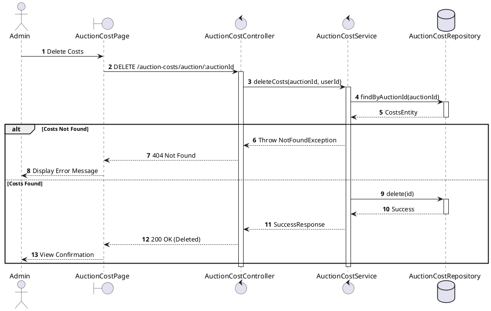
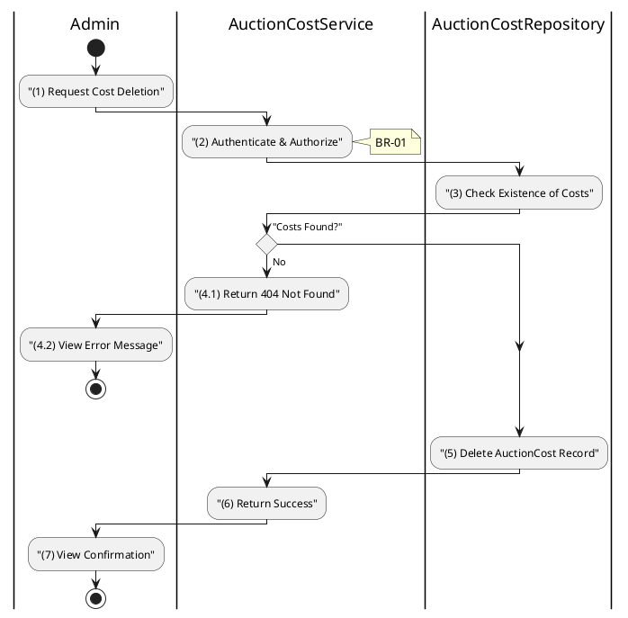

# 3.8.4 Delete Auction Costs

## 1. Use Case Description

| Field              | Description                                                                                                        |
| ------------------ | ------------------------------------------------------------------------------------------------------------------ |
| **Name**           | Delete Auction Costs                                                                                               |
| **Description**    | This use case allows the Admin to delete a Auction Costs information in the system.                                |
| **Actor**          | Admin                                                                                                              |
| **Trigger**        | When the Admin clicks on the [Icon Delete] button on the right of each item on the AuctionCostPage datagrid.       |
| **Pre-condition**  | • Admin's device must be connected to the internet. • Admin is signed in with their account.                    |
| **Post-condition** | The Auction Costs information will be removed from the system and display data change on AuctionCostPage datagrid. |

<h2>2. Sequence Flow (MVC)</h2>

<h2>3. Activities Flow (Swimlanes)</h2>

## 4. Business Rules

| Activity | BR Code   | Description                                                                                                                                                                                                                                                                                                                                                                              |
| :------- | :-------- | :--------------------------------------------------------------------------------------------------------------------------------------------------------------------------------------------------------------------------------------------------------------------------------------------------------------------------------------------------------------------------------------- |
| **(1)**  | **BR-01** | **Displaying Rule:** The system displays a 'Confirmation message box' screen. (Refer to View Description) with **MSG 11** (Are you sure you want to delete all auction costs?). Shows auction name and cost summary before deletion.                                                                                                                                               |
| **(1)**  | **BR-02** | **Selecting Rule:** User selects button. If 'Cancel', use `Close()` to end. If 'Confirm Delete', call method `deleteCosts(auctionId)`.                                                                                                                                                                                                                                             |
| **(5)**  | **BR-03** | **Validation Rule (Back-end/Save):** Check selection against table `AUCTION_COST` for constraints. If auction is 'finalized' or 'completed' → display **MSG 9** (Cannot delete historical records). If costs not found → display **MSG 11** (Not Found), return 404. Else, delete data in table `AUCTION_COST`, display **MSG 7** (Success), use `Close()`, update datagrid. |
