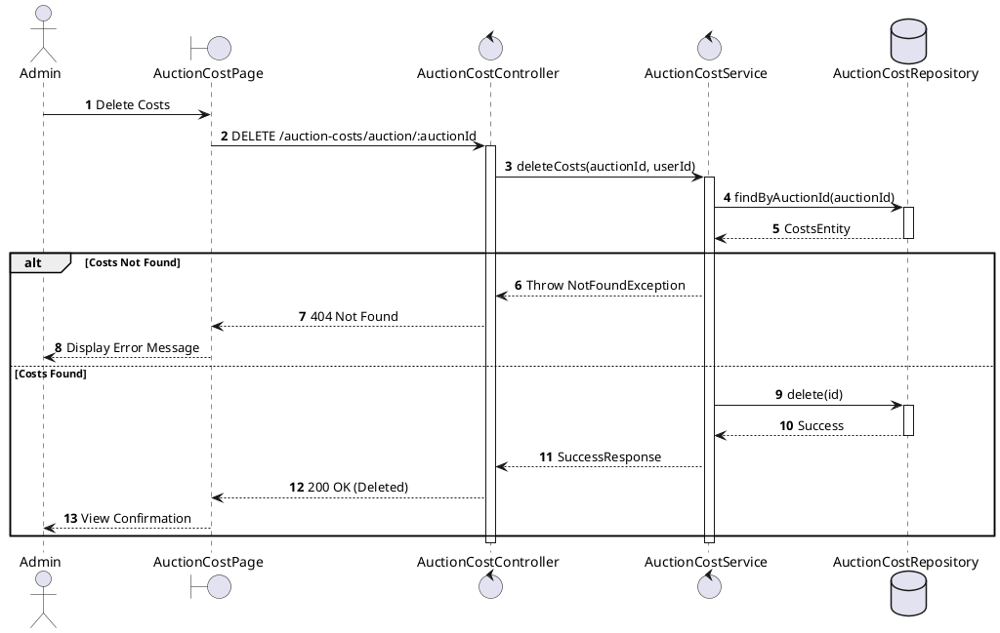
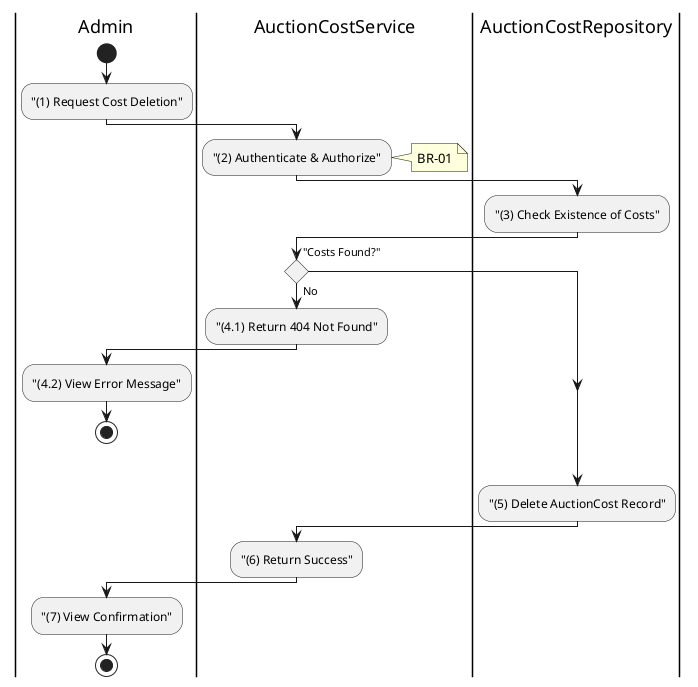

# 3.8.4 Delete Auction Costs

## 1. Use Case Description

| Field              | Description                                                                                                        |
| ------------------ | ------------------------------------------------------------------------------------------------------------------ |
| **Name**           | Delete Auction Costs                                                                                               |
| **Description**    | This use case allows the Admin to delete a Auction Costs information in the system.                                |
| **Actor**          | Admin                                                                                                              |
| **Trigger**        | When the Admin clicks on the [Icon Delete] button on the right of each item on the AuctionCostPage datagrid.       |
| **Pre-condition**  | • Admin's device must be connected to the internet. • Admin is signed in with their account.                    |
| **Post-condition** | The Auction Costs information will be removed from the system and display data change on AuctionCostPage datagrid. |

<h2>2. Sequence Flow (MVC)</h2>

<h2>3. Activities Flow (Swimlanes)</h2>

## 4. Business Rules

| Activity | BR Code   | Description                                                                                                                                                                                                                                                                                                                                                                                                                                                                                                                                                                                                                                                                                                                                                                                                                                      |
| :------- | :-------- | :------------------------------------------------------------------------------------------------------------------------------------------------------------------------------------------------------------------------------------------------------------------------------------------------------------------------------------------------------------------------------------------------------------------------------------------------------------------------------------------------------------------------------------------------------------------------------------------------------------------------------------------------------------------------------------------------------------------------------------------------------------------------------------------------------------------------------------------------------------------------------ |
| **(1)**  | **BR-01** | **Displaying Rules (Confirmation):** ❖ The system displays a confirmation modal, `Display_Modal('ConfirmationBox')`. (Refer to “ConfirmationBox” view in “View Description” file). ❖ It presents **MSG 11** ("Delete all costs for auction [Auction Name]?"), requesting explicit confirmation from the Admin. ❖ The system provides [Confirm Delete] and [Cancel] options.                                                                                                                                                                                                                                                                                                                                                                                       |
| **(1)**  | **BR-02** | **Authorization Rules (Back-end):** ❖ The system checks the authenticated user's role via `AuctionCostService.deleteCosts()`. ❖ If the input is not valid: ⮚ If the user's role is not 'admin', the system returns a 403 Forbidden status.                                                                                                                                                                                                                                                                                                                                                                                                                                                                                                                                                                                                                             |
| **(5)**  | **BR-03** | **Storing Rules (Back-end):** ❖ The system attempts to find the cost record via `AuctionCostRepository.findByAuctionId(auctionId)`. ❖ If the input is not valid: ⮚ If no record is found, the system returns a 404 Not Found error. ❖ If authorized and found, the system deletes the record from the “AUCTION_COST” table. ❖ System moves to step (7) and displays successful notification (Refer to **MSG 7**). ❖ The system refreshes the costs view to reflect the deletion.                                                                                                                                                                                                                                                                                                                                                                              |
