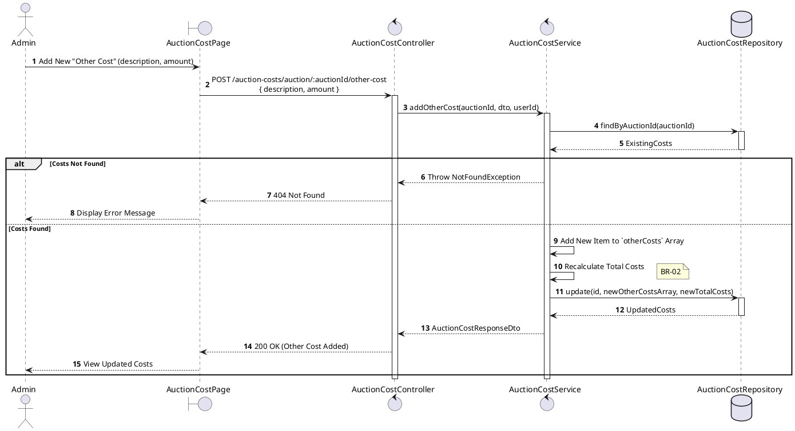
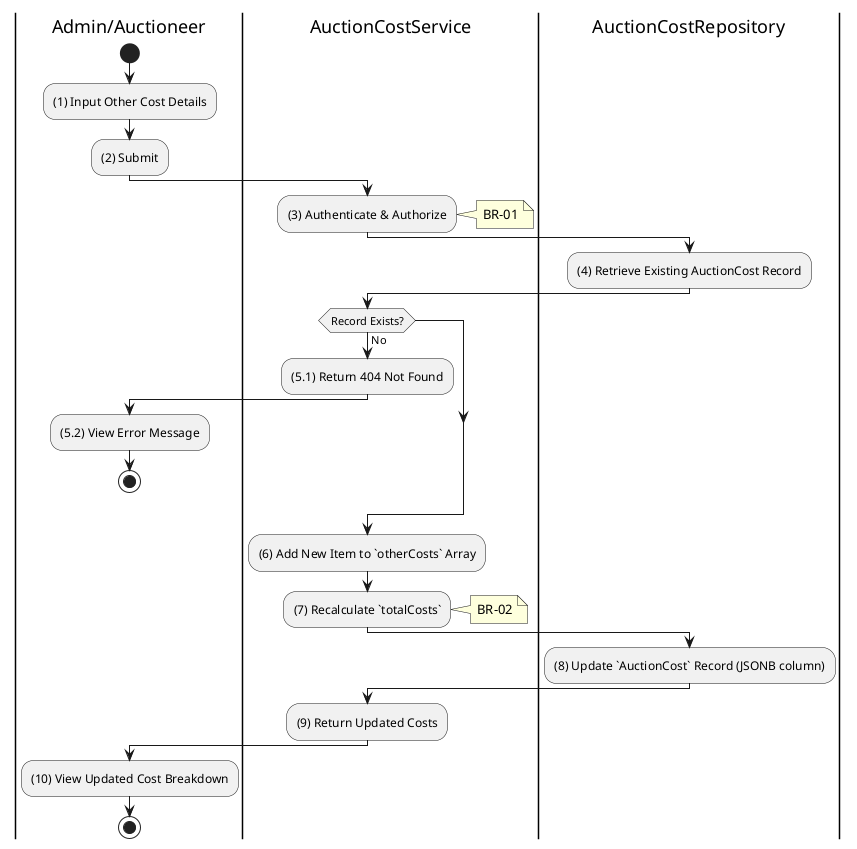

# 3.8.5 Add Other Cost Item

## 1. Use Case Description

| Field              | Description                                                                                                        |
| ------------------ | ------------------------------------------------------------------------------------------------------------------ |
| **Name**           | Add Other Cost Item                                                                                                |
| **Description**    | This use case allows the Admin to create a new Other Cost Item information in the system.                          |
| **Actor**          | Admin                                                                                                              |
| **Trigger**        | When the Admin clicks on the 'Add Other Cost' button on the AuctionCostPage.                                       |
| **Pre-condition**  | • Admin's device must be connected to the internet. • Admin is signed in with their account.                    |
| **Post-condition** | The Other Cost Item information will be stored into the system and display new record on AuctionCostPage datagrid. |

## 2. Sequence Flow (MVC)

## 3. Activities Flow (Swimlanes)

## 4. Business Rules

| Activity      | BR Code   | Description                                                                                                                                                                                                                                                                                                       |
| :------------ | :-------- | :---------------------------------------------------------------------------------------------------------------------------------------------------------------------------------------------------------------------------------------------------------------------------------------------------------------- |
| **(1)**       | **BR-01** | **Displaying Rule (Add Other Cost Form):** When Admin/Auctioneer clicks "Add Other Cost", system displays input form. Form includes Description (text) and Amount (number) fields.                                                                                                                          |
| **(1)**       | **BR-02** | **Validation Rule (Required Fields - Front-end):** When Admin submits form, system triggers validation. If `description` is `isEmpty()` or `amount` is empty/invalid: $\rightarrow$ System displays MSG 1 ("Description and Amount are required") adjacent to fields.                                    |
| **(1)**       | **BR-03** | **Validation Rule (Amount - Front-end):** When Admin inputs amount, system triggers `Text_change()` validation. Amount must be a positive number. If invalid: $\rightarrow$ System displays MSG 4 ("Invalid amount") adjacent to field.                                                               |
| **(3)**       | **BR-04** | **Validation Rule (Authorization - Back-end):** System checks if requestor role is `admin` or `auctioneer` in `USERS` table. If unauthorized: $\rightarrow$ System displays MSG 5 ("Forbidden") on the View.                                                                                             |
| **(4)-(5.1)** | **BR-05** | **Querying Rule (Existing Record):** System retrieves data from the 'AUCTION_COST' table in the database (Refer to 'AUCTION_COST' table in 'DB Sheet' file) based on the auction ID. If no cost record found: $\rightarrow$ System displays MSG 20 ("Please create base cost record first") on the View. |
| **(6)-(7)**   | **BR-06** | **Processing Rule (Array Append & Recalculate):** System appends new item to `otherCosts` JSON array. System recalculates `totalCosts` including new other cost amount.                                                                                                                                     |
| **(8)**       | **BR-07** | **Storing Rule:** System updates `AUCTION_COST` record: - Updates `otherCosts` JSONB column with appended array - Updates `totalCosts` with recalculated value                                                                                                                                           |
| **(10)**      | **BR-08** | **Displaying Rule (Confirmation):** System displays MSG 7 ("Other cost added successfully") on the View. System displays updated cost breakdown including new other cost item.                                                                                                                              |
