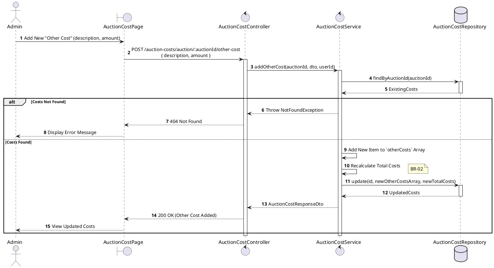
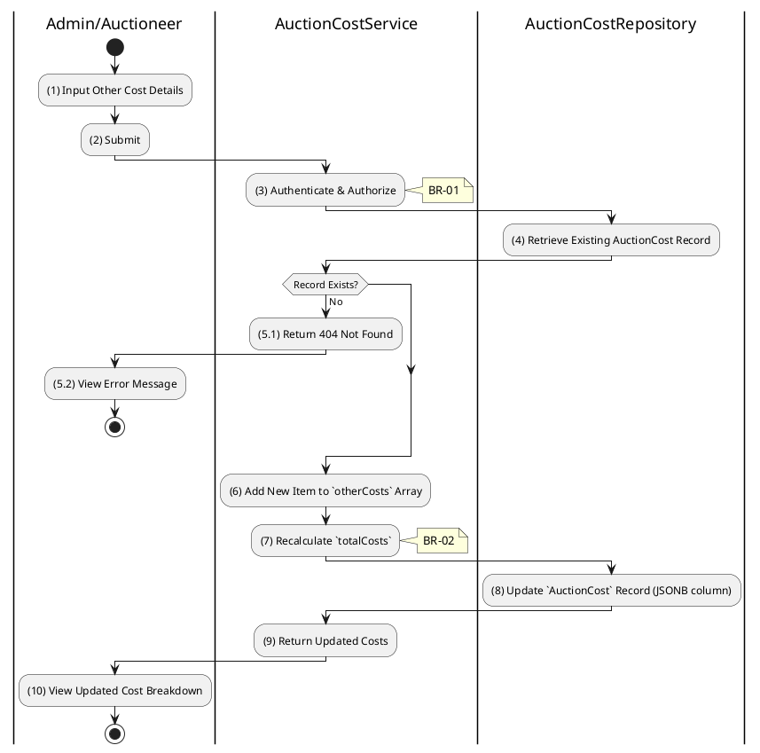

# 3.8.5 Add Other Cost Item

## 1. Use Case Description

| Field              | Description                                                                                                        |
| ------------------ | ------------------------------------------------------------------------------------------------------------------ |
| **Name**           | Add Other Cost Item                                                                                                |
| **Description**    | This use case allows the Admin to create a new Other Cost Item information in the system.                          |
| **Actor**          | Admin                                                                                                              |
| **Trigger**        | When the Admin clicks on the 'Add Other Cost' button on the AuctionCostPage.                                       |
| **Pre-condition**  | • Admin's device must be connected to the internet. • Admin is signed in with their account.                    |
| **Post-condition** | The Other Cost Item information will be stored into the system and display new record on AuctionCostPage datagrid. |

## 2. Sequence Flow (MVC)

## 3. Activities Flow (Swimlanes)

## 4. Business Rules

| Activity      | BR Code   | Description                                                                                                                                                                                                                                                                                                                                                                                                                                                                                                                                                                                                                                                                                                                                                                                                                                                                     |
| :------------ | :-------- | :------------------------------------------------------------------------------------------------------------------------------------------------------------------------------------------------------------------------------------------------------------------------------------------------------------------------------------------------------------------------------------------------------------------------------------------------------------------------------------------------------------------------------------------------------------------------------------------------------------------------------------------------------------------------------------------------------------------------------------------------------------------------------------------------------------------------------------------------------------------------------ |
| **(1)**       | **BR-01** | **Displaying Rules:** ❖ The system displays an “AddOtherCostItem” modal via `Display_Modal()`. ❖ It renders a form with a [Description] text input and an [Amount] number input. ❖ The [Add] button is initially disabled until valid input is detected.                                                                                                                                                                                                                                                                                                                                                                                                                                                                                                                                                                                                               |
| **(1)**       | **BR-02** | **Validation Rules (Front-end):** ❖ As the user types, the system performs `ValidateInput(description, amount)`. ❖ If the input is not valid: ⮚ If the [description] is empty or the [amount] is less than or equal to 0, the system keeps the [Add] button disabled. ⮚ It displays **MSG 1** (Mandatory Field) or **MSG 4** (Invalid Amount) as appropriate.                                                                                                                                                                                                                                                                                                                                                                                                                                                                                                       |
| **(3)**       | **BR-03** | **Authorization Rules (Back-end):** ❖ The system checks the authenticated user's role via `AuctionCostService.addOtherCost()`. ❖ If the input is not valid: ⮚ If the user's role is not 'admin' or 'auctioneer', the system returns a 403 Forbidden status.                                                                                                                                                                                                                                                                                                                                                                                                                                                                                                                                                                                                            |
| **(4)-(5.1)** | **BR-04** | **Querying Rules (Back-end):** ❖ The system queries the “AUCTION_COST” table via `AuctionCostRepository.findByAuctionId(auctionId)`. ❖ If the input is not valid: ⮚ If no base cost record exists, the system returns a 404 Not Found error. ⮚ It displays **MSG 20** (Create base cost record first).                                                                                                                                                                                                                                                                                                                                                                                                                                                                                                                                                              |
| **(6)-(7)**   | **BR-05** | **Processing Rules (Back-end):** ❖ The system calls `AuctionCostService.addOtherCost(auctionId, dto)` to process the new item. ❖ It appends the new `{ description, amount }` object to the existing `otherCosts` JSONB array. ❖ The system then recalculates the `totalCosts`.                                                                                                                                                                                                                                                                                                                                                                                                                                                                                                                                                                                        |
| **(8)**       | **BR-06** | **Storing Rules (Back-end):** ❖ The system updates the record in the “AUCTION_COST” table by calling `AuctionCostRepository.update()`. ❖ It saves the updated [otherCosts] array and the new [totalCosts] value. ❖ System moves to step (10) and displays successful notification (Refer to **MSG 7**).                                                                                                                                                                                                                                                                                                                                                                                                                                                                                                                                                                |
| **(10)**      | **BR-07** | **Displaying Rules (Success):** ❖ The system refreshes the cost page via `Refresh_View('AuctionCostPage')`. ❖ It updates the display to show the newly added item in the "Other Costs" section and the updated total cost.                                                                                                                                                                                                                                                                                                                                                                                                                                                                                                                                                                                                                                                |
