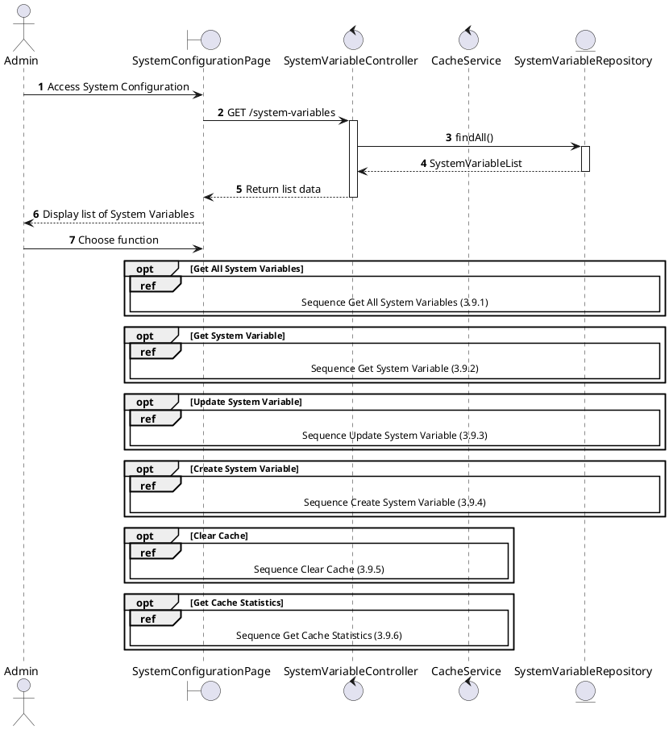
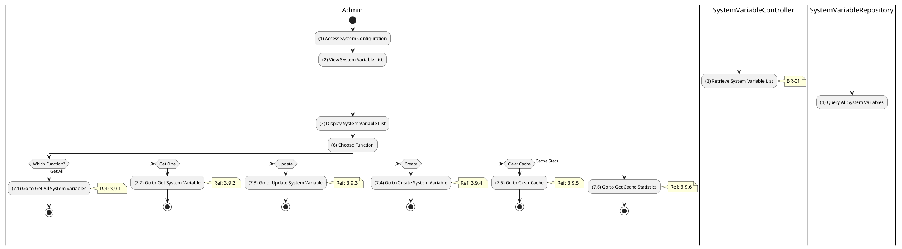

# Use Case 3.9.0: Manage System Configuration

## 1. Use Case Description

| Field              | Content                                                                                                                                               |
| :----------------- | :---------------------------------------------------------------------------------------------------------------------------------------------------- |
| **Name**           | Manage System Configuration                                                                                                                           |
| **Description**    | This use case allows the **Admin** to choose one of the corresponding functions of CRUD to adjust **System Configuration** information in the system. |
| **Actor**          | **Admin**, **Super Admin**                                                                                                                            |
| **Trigger**        | When the **Admin** clicks on the "**System Configuration**" button on the navigation sidebar.                                                         |
| **Pre-condition**  | 1. **Admin**'s device must be connected to the internet. 2. **Admin** is signed in with their account.                                             |
| **Post-condition** | The **System Configuration** information is updated to the corresponding function that the **Admin** executes.                                        |

---

## 2. Sequence Flow

---

## 3. Activities Flow (Swimlanes)

---

## 4. Business Rules

| Activity | BR Code   | Description                                                                                                                                                                                                                                                                                                                                                                                                                                                                                                                                                                                                                                                                                                                                                                                                                                                                     |
| :------- | :-------- | :------------------------------------------------------------------------------------------------------------------------------------------------------------------------------------------------------------------------------------------------------------------------------------------------------------------------------------------------------------------------------------------------------------------------------------------------------------------------------------------------------------------------------------------------------------------------------------------------------------------------------------------------------------------------------------------------------------------------------------------------------------------------------------------------------------------------------------------------------------------------------ |
| **(5)**  | **BR-01** | **Displaying Rules:** ❖ The system displays a “SystemConfigurationPage” screen via `Display_View()`. (Refer to “System Configuration Management” view in “View Description” file). ❖ The system calls `SystemVariableController.findAll()` to retrieve configuration data. ❖ It renders a data table listing variables with columns: [Category], [Key], [Value], and [DataType].                                                                                                                                                                                                                                                                                                                                                                                                                                                                                       |
| **(6)**  | **BR-02** | **Choosing Rules:** ❖ The Admin selects a configuration function. The system uses `Frontend_Navigation()` to handle redirection. ❖ If “Get All” is selected, the system redirects to `3.9.1`. ❖ If “Get One” is selected, it redirects to the detail view `3.9.2`. ❖ If “Update” is selected, the system initiates the update process `3.9.3`. ❖ If “Create” is selected, it opens the creation form `3.9.4`. ❖ If “Clear Cache” is selected, it triggers the cache clearing action `3.9.5`. ❖ If “Cache Stats” is selected, it redirects to the statistics page `3.9.6`. ❖ Only one feature can be selected at a time.                                                                                                                                                                                                                                 |
---

## 5. Related Child Use Cases

| Use Case ID | Use Case Name            | Description                                 |
| :---------- | :----------------------- | :------------------------------------------ |
| 3.9.1       | Get All System Variables | Retrieve all system configuration variables |
| 3.9.2       | Get System Variable      | Retrieve a specific system variable by key  |
| 3.9.3       | Update System Variable   | Modify an existing system variable          |
| 3.9.4       | Create System Variable   | Create a new system variable                |
| 3.9.5       | Clear Cache              | Clear the system configuration cache        |
| 3.9.6       | Get Cache Statistics     | View cache usage statistics                 |
