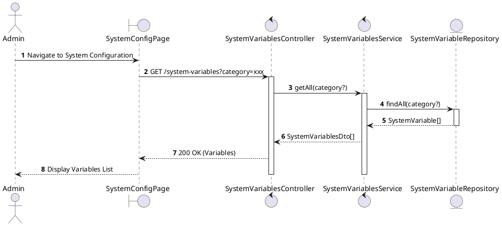
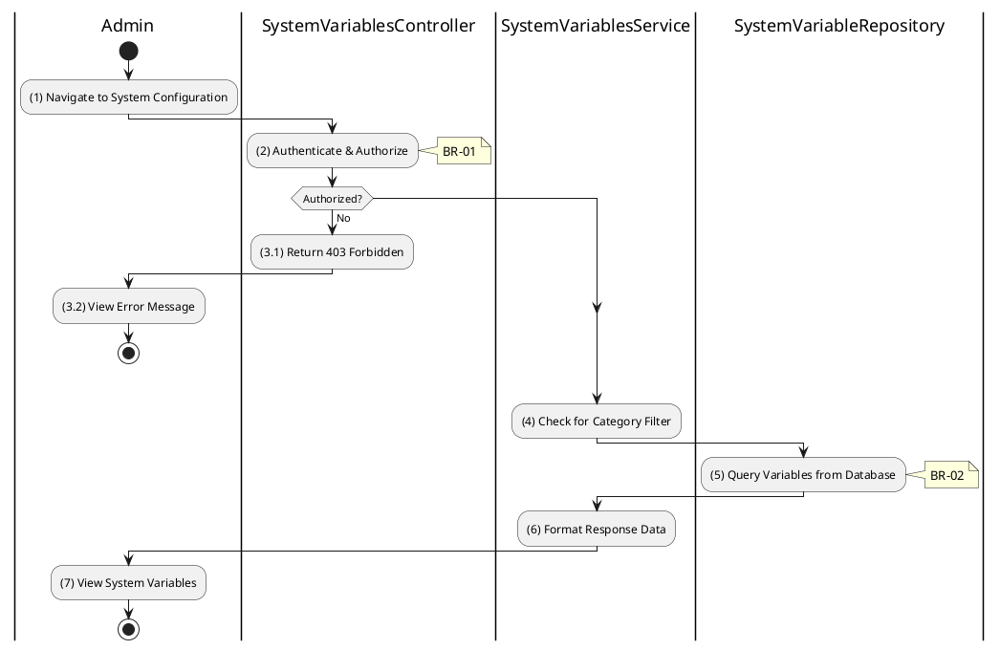

# 3.9.1 Get All System Variables

## 1. Use Case Description

| Field              | Description                                                                                                     |
| ------------------ | --------------------------------------------------------------------------------------------------------------- |
| **Name**           | Get All System Variables                                                                                        |
| **Description**    | This use case allows the Admin to retrieve all system configuration variables or filter by category.            |
| **Actor**          | Admin, Super Admin                                                                                              |
| **Trigger**        | When the Admin navigates to the "System Configuration" page or requests `GET /system-variables`.                |
| **Pre-condition**  | • Admin's device must be connected to the internet. • Admin is signed in with `admin` or `super_admin` role. |
| **Post-condition** | The system configuration variables are retrieved and displayed to the Admin.                                    |

## 2. Sequence Flow (MVC)

## 3. Activities Flow (Swimlanes)

## 4. Business Rules

| Activity | BR Code   | Description                                                                                                                                                                                                                                                                            |
| :------- | :-------- | :------------------------------------------------------------------------------------------------------------------------------------------------------------------------------------------------------------------------------------------------------------------------------------- |
| **(1)**  | **BR-01** | **Displaying Rule (System Configuration Page):** When Admin navigates to system configuration, system displays `SystemConfigPage`. System shows loading state while fetching variables. System groups variables by category.                                                  |
| **(2)**  | **BR-02** | **Validation Rule (Authorization - Back-end):** System checks if requestor role is `admin` or `super_admin` in `USERS` table. System variables configuration is admin-only sensitive data. If unauthorized: $\rightarrow$ System displays MSG 5 ("Forbidden") on the View. |
| **(4)**  | **BR-03** | **Processing Rule (Category Filter):** If category parameter provided, system filters variables by category. Valid categories: `deposit`, `commission`, `dossier`, `general`. If no category: return all variables.                                                           |
| **(5)**  | **BR-04** | **Querying Rule:** System retrieves data from the 'SYSTEM_VARIABLE' table in the database. System includes: category, key, value, dataType, description, isActive. System utilizes cache for frequently accessed variables.                                                   |
| **(7)**  | **BR-05** | **Displaying Rule (Variables Display):** System displays variables grouped by category. System shows: key, current value, data type, description. System indicates active/inactive status.                                                                                    |
