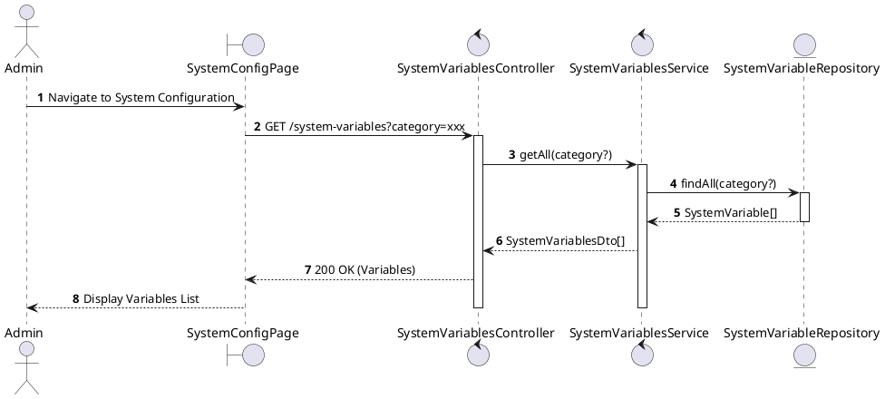
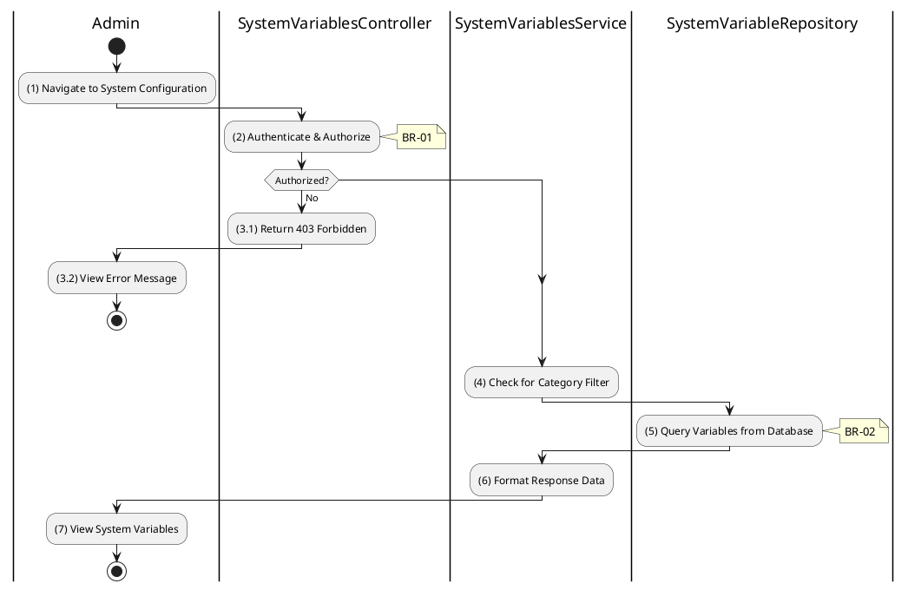

# 3.9.1 Get All System Variables

## 1. Use Case Description

| Field              | Description                                                                                                     |
| ------------------ | --------------------------------------------------------------------------------------------------------------- |
| **Name**           | Get All System Variables                                                                                        |
| **Description**    | This use case allows the Admin to retrieve all system configuration variables or filter by category.            |
| **Actor**          | Admin, Super Admin                                                                                              |
| **Trigger**        | When the Admin navigates to the "System Configuration" page or requests `GET /system-variables`.                |
| **Pre-condition**  | • Admin's device must be connected to the internet. • Admin is signed in with `admin` or `super_admin` role. |
| **Post-condition** | The system configuration variables are retrieved and displayed to the Admin.                                    |

## 2. Sequence Flow (MVC)

## 3. Activities Flow (Swimlanes)

## 4. Business Rules

| Activity | BR Code   | Description                                                                                                                                                                                                                                                                                                                                                                                                                                                                                                                                                                                                                                                                                                                                                                                                                                                                     |
| :------- | :-------- | :------------------------------------------------------------------------------------------------------------------------------------------------------------------------------------------------------------------------------------------------------------------------------------------------------------------------------------------------------------------------------------------------------------------------------------------------------------------------------------------------------------------------------------------------------------------------------------------------------------------------------------------------------------------------------------------------------------------------------------------------------------------------------------------------------------------------------------------------------------------------------ |
| **(1)**  | **BR-01** | **Displaying Rules:** ❖ The system renders the “SystemConfigPage” via `Display_View()`. ❖ It provides a dropdown to filter variables by [Category]. ❖ A data table is rendered showing: [Key], [Value], [DataType], [Description], and an [IsActive] status indicator.                                                                                                                                                                                                                                                                                                                                                                                                                                                                                                                                                                                                 |
| **(2)**  | **BR-02** | **Authorization Rules (Back-end):** ❖ The system calls `SystemVariablesService.getAll()` and verifies the user's role. ❖ If the input is not valid: ⮚ If the user's role is not 'admin' or 'super_admin', the system returns a 403 Forbidden status.                                                                                                                                                                                                                                                                                                                                                                                                                                                                                                                                                                                                                   |
| **(4)**  | **BR-03** | **Querying Rules:** ❖ The system invokes `SystemVariableRepository.findAll(category)` to fetch the data. ❖ It queries the “SYSTEM_VARIABLE” table. ❖ If a [category] filter is provided, the query includes a WHERE clause (`WHERE [category] = filter`). ❖ The results are ordered by [category] and [key].                                                                                                                                                                                                                                                                                                                                                                                                                                                                                                                                                        |
| **(5)**  | **BR-04** | **Processing Rules (Cache):** ❖ The system first attempts to retrieve variables from the cache via `CacheService.get('systemVariables', category)`. ❖ If the data is available in the cache, it is returned immediately. ❖ If not, the system queries the database and stores the result in the cache for future requests.                                                                                                                                                                                                                                                                                                                                                                                                                                                                                                                                             |
| **(7)**  | **BR-05** | **Displaying Rules (Data Table):** ❖ The system renders the results via `Display_DataTable('SystemVariables', data)`. ❖ It formats the [Value] based on the [DataType] (e.g., displaying booleans as checkboxes, formatting JSON strings).                                                                                                                                                                                                                                                                                                                                                                                                                                                                                                                                                                                                                                |
