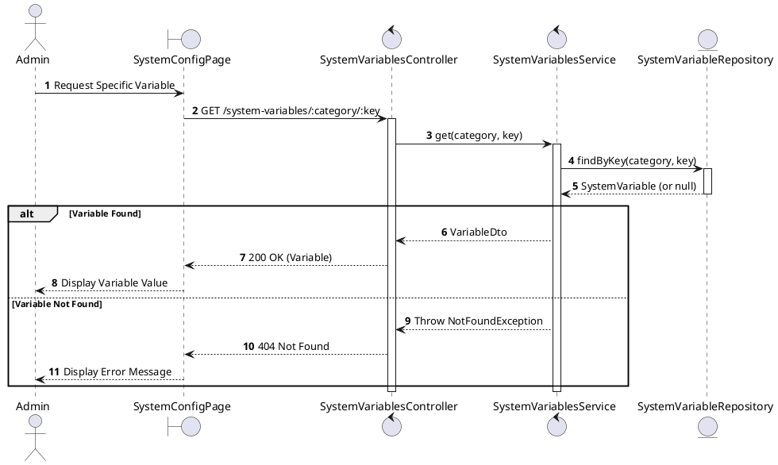
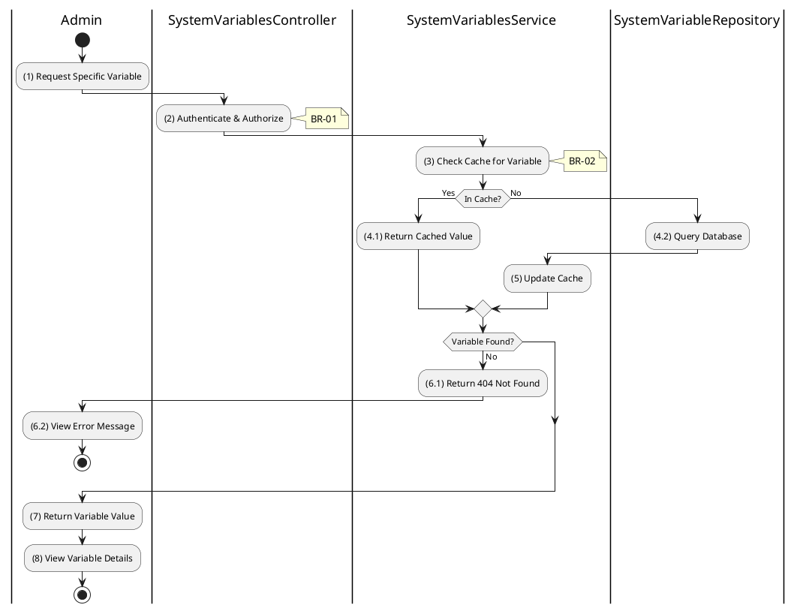

# 3.9.2 Get System Variable

## 1. Use Case Description

| Field              | Description                                                                                                     |
| ------------------ | --------------------------------------------------------------------------------------------------------------- |
| **Name**           | Get System Variable                                                                                             |
| **Description**    | This use case allows the Admin to retrieve a specific system configuration variable by category and key.        |
| **Actor**          | Admin, Super Admin                                                                                              |
| **Trigger**        | When the Admin requests `GET /system-variables/:category/:key`.                                                 |
| **Pre-condition**  | • Admin's device must be connected to the internet. • Admin is signed in with `admin` or `super_admin` role. |
| **Post-condition** | The specific system configuration variable is retrieved and displayed to the Admin.                             |

## 2. Sequence Flow (MVC)

## 3. Activities Flow (Swimlanes)

## 4. Business Rules

| Activity  | BR Code   | Description                                                                                                                                                                                                                                                                                                                                                                                                                                                                                                                                                                                                                                                                                                                                                                                                                                                                     |
| :-------- | :-------- | :------------------------------------------------------------------------------------------------------------------------------------------------------------------------------------------------------------------------------------------------------------------------------------------------------------------------------------------------------------------------------------------------------------------------------------------------------------------------------------------------------------------------------------------------------------------------------------------------------------------------------------------------------------------------------------------------------------------------------------------------------------------------------------------------------------------------------------------------------------------------------ |
| **(1)**   | **BR-01** | **Displaying Rules:** ❖ The system displays a “SystemVariableDetailsPage” via `Display_View()`. ❖ It renders read-only fields for: [Category], [Key], [Value], [DataType], and [Description].                                                                                                                                                                                                                                                                                                                                                                                                                                                                                                                                                                                                                                                                             |
| **(2)**   | **BR-02** | **Authorization Rules (Back-end):** ❖ The system calls `SystemVariablesService.get()` and checks the user's role. ❖ If the input is not valid: ⮚ If the user's role is not 'admin' or 'super_admin', the system returns a 403 Forbidden status.                                                                                                                                                                                                                                                                                                                                                                                                                                                                                                                                                                                                                        |
| **(3)**   | **BR-03** | **Processing Rules (Cache):** ❖ The system attempts to fetch the specific variable from the cache via `CacheService.get('systemVariable', category, key)`. ❖ If found, the cached value is returned immediately. ❖ If not found, the system proceeds to query the database and updates the cache with the result.                                                                                                                                                                                                                                                                                                                                                                                                                                                                                                                                                      |
| **(4.2)** | **BR-04** | **Querying Rules:** ❖ The system queries the “SYSTEM_VARIABLE” table using `SystemVariableRepository.findByKey(category, key)`. ❖ If the input is not valid: ⮚ If the variable is not found, the system returns a 404 Not Found error.                                                                                                                                                                                                                                                                                                                                                                                                                                                                                                                                                                                                                                 |
| **(7)**   | **BR-05** | **Displaying Rules (Data):** ❖ The system formats the displayed value using `Display_Formatted_Value(value, dataType)`. ❖ It ensures appropriate formatting based on the [dataType] (e.g., "true"/"false" strings for booleans, pretty-printed JSON for objects).                                                                                                                                                                                                                                                                                                                                                                                                                                                                                                                                                                                                         |