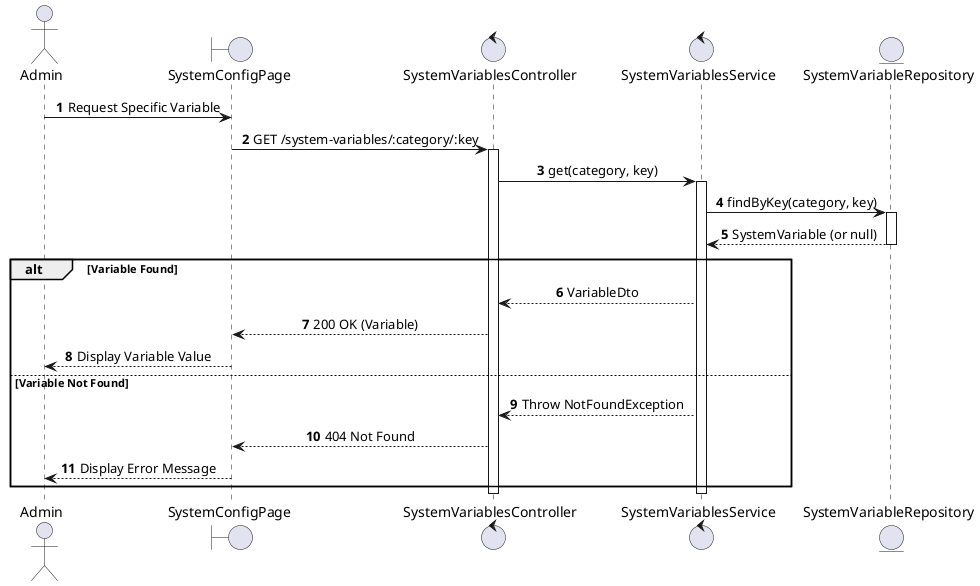
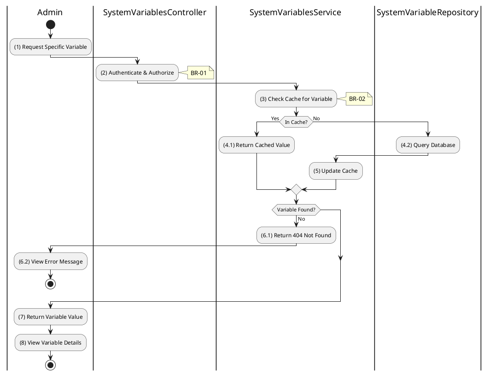

# 3.9.2 Get System Variable

## 1. Use Case Description

| Field              | Description                                                                                                     |
| ------------------ | --------------------------------------------------------------------------------------------------------------- |
| **Name**           | Get System Variable                                                                                             |
| **Description**    | This use case allows the Admin to retrieve a specific system configuration variable by category and key.        |
| **Actor**          | Admin, Super Admin                                                                                              |
| **Trigger**        | When the Admin requests `GET /system-variables/:category/:key`.                                                 |
| **Pre-condition**  | • Admin's device must be connected to the internet. • Admin is signed in with `admin` or `super_admin` role. |
| **Post-condition** | The specific system configuration variable is retrieved and displayed to the Admin.                             |

## 2. Sequence Flow (MVC)

## 3. Activities Flow (Swimlanes)

## 4. Business Rules

| Activity  | BR Code   | Description                                                                                                                                                                                                            |
| :-------- | :-------- | :--------------------------------------------------------------------------------------------------------------------------------------------------------------------------------------------------------------------- |
| **(1)**   | **BR-01** | **Processing Rule (Key Format):** Variable key format: `{category}.{subkey}`. Example: `deposit.general.min_percentage`. System parses category and key from URL parameters.                                  |
| **(2)**   | **BR-02** | **Validation Rule (Authorization - Back-end):** System checks if requestor role is `admin` or `super_admin`. If unauthorized: $\rightarrow$ System displays MSG 5 ("Forbidden") on the View.                  |
| **(3)**   | **BR-03** | **Processing Rule (Caching):** System checks in-memory cache first for performance. Cache TTL configured per category. Cache invalidated on variable update.                                                  |
| **(4.2)** | **BR-04** | **Querying Rule:** System retrieves data from the 'SYSTEM_VARIABLE' table by category and key. If variable not found: $\rightarrow$ System displays MSG 20 ("Variable not found") on the View.                |
| **(7)**   | **BR-05** | **Processing Rule (Type Parsing):** System parses value according to `dataType`: - `number`: Parse as numeric - `boolean`: Parse as true/false - `json`: Parse as JSON object - `string`: Return as-is. |
