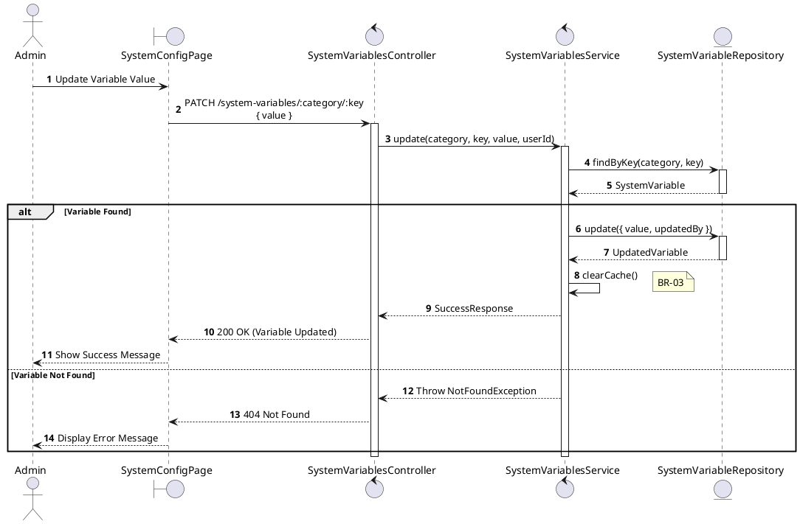
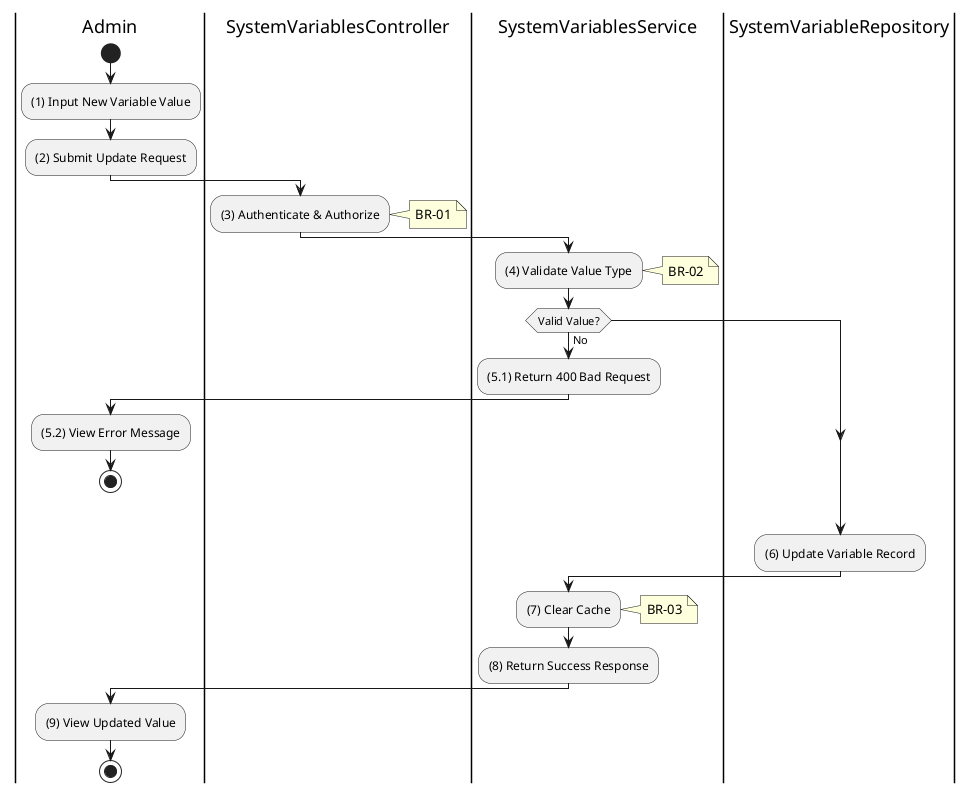

# 3.9.3 Update System Variable

## 1. Use Case Description

| Field              | Description                                                                                                                                         |
| ------------------ | --------------------------------------------------------------------------------------------------------------------------------------------------- |
| **Name**           | Update System Variable                                                                                                                              |
| **Description**    | This use case allows the Admin to update an existing system configuration variable value.                                                           |
| **Actor**          | Admin, Super Admin                                                                                                                                  |
| **Trigger**        | When the Admin submits an updated value via `PATCH /system-variables/:category/:key`.                                                               |
| **Pre-condition**  | • Admin's device must be connected to the internet. • Admin is signed in with `admin` or `super_admin` role. • Variable exists in the system. |
| **Post-condition** | The system configuration variable is updated and cache is cleared.                                                                                  |

## 2. Sequence Flow (MVC)

## 3. Activities Flow (Swimlanes)

## 4. Business Rules

| Activity | BR Code   | Description                                                                                                                                                                                                      |
| :------- | :-------- | :--------------------------------------------------------------------------------------------------------------------------------------------------------------------------------------------------------------- |
| **(1)**  | **BR-01** | **Validation Rule (Input - Front-end):** When Admin enters new value, system validates format based on dataType. If invalid format: $\rightarrow$ System displays MSG 4 ("Invalid format") on the View. |
| **(3)**  | **BR-02** | **Validation Rule (Authorization - Back-end):** System checks if requestor role is `admin` or `super_admin`. If unauthorized: $\rightarrow$ System displays MSG 5 ("Forbidden") on the View.            |
| **(4)**  | **BR-03** | **Validation Rule (Type Validation):** System validates value against expected dataType: - `number`: Must be valid numeric - `boolean`: Must be "true" or "false" - `json`: Must be valid JSON.      |
| **(6)**  | **BR-04** | **Storing Rule:** System saves to `SYSTEM_VARIABLE` table: - `value = [new value as string]` - `updatedBy = [admin user ID]` - `updatedAt = now()`                                                   |
| **(7)**  | **BR-05** | **Processing Rule (Cache Invalidation):** System clears entire cache after variable update. Ensures all subsequent reads get fresh values. Critical for configuration consistency.                      |
| **(9)**  | **BR-06** | **Displaying Rule (Success Confirmation):** System displays MSG 7 ("Variable updated successfully") on the View. System refreshes variable display with new value.                                         |
