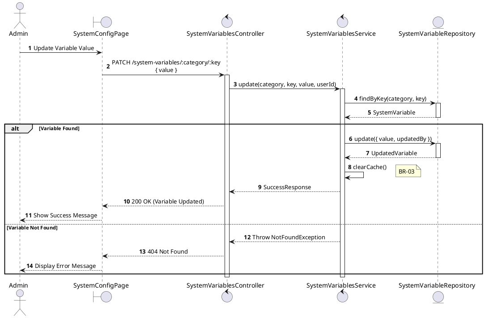
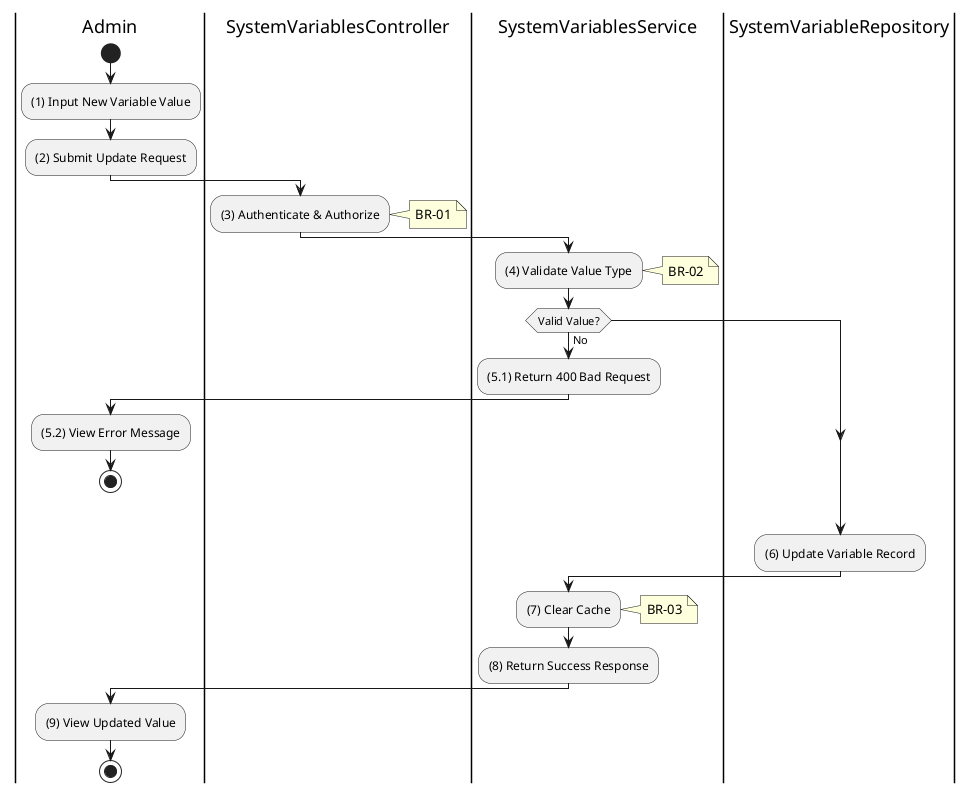

# 3.9.3 Update System Variable

## 1. Use Case Description

| Field              | Description                                                                                                                                         |
| ------------------ | --------------------------------------------------------------------------------------------------------------------------------------------------- |
| **Name**           | Update System Variable                                                                                                                              |
| **Description**    | This use case allows the Admin to update an existing system configuration variable value.                                                           |
| **Actor**          | Admin, Super Admin                                                                                                                                  |
| **Trigger**        | When the Admin submits an updated value via `PATCH /system-variables/:category/:key`.                                                               |
| **Pre-condition**  | • Admin's device must be connected to the internet. • Admin is signed in with `admin` or `super_admin` role. • Variable exists in the system. |
| **Post-condition** | The system configuration variable is updated and cache is cleared.                                                                                  |

## 2. Sequence Flow (MVC)

## 3. Activities Flow (Swimlanes)

## 4. Business Rules

| Activity | BR Code   | Description                                                                                                                                                                                                      |
| :------- | :-------- | :--------------------------------------------------------------------------------------------------------------------------------------------------------------------------------------------------------------- |
| **(1)**  | **BR-01** | **Displaying Rule:**  Function: `Display_View('EditSystemVariablePage')`  Logic: Render input field for [Value] (type-specific: text, checkbox, number). Display current [Value], [DataType]. |
| **(3)**  | **BR-02** | **Authorization Rule (Back-end):**  Function: Call `SystemVariablesService.update()`  Logic: Check Requestor Role. IF Role NOT IN ['admin', 'super_admin'] THEN Return 403 (Forbidden).            |
| **(4)**  | **BR-03** | **Validation Rule (Back-end):**  Function: `SystemVariablesService.validateValue(value, dataType)`  Logic: Validate input [value] against [dataType]. IF Type Mismatch THEN Return 400 (Invalid format). |
| **(6)**  | **BR-04** | **Storing Rule (Back-end):**  Function: `SystemVariableRepository.update()`  Logic: Update `SYSTEM_VARIABLE` SET [value]=newValue, [updatedBy]=UserId, [updatedAt]=NOW(). Display MSG 7 (Success). |
| **(7)**  | **BR-05** | **Processing Rule (Cache):**  Function: `CacheService.clear()`  Logic: Invalidate relevant cache entries (e.g., specific variable or entire cache).                                                  |
| **(9)**  | **BR-06** | **Displaying Rule (Success):**  Function: `Refresh_View('SystemVariableDetailsPage')`  Logic: Update displayed value. Show success notification.                                                  |
