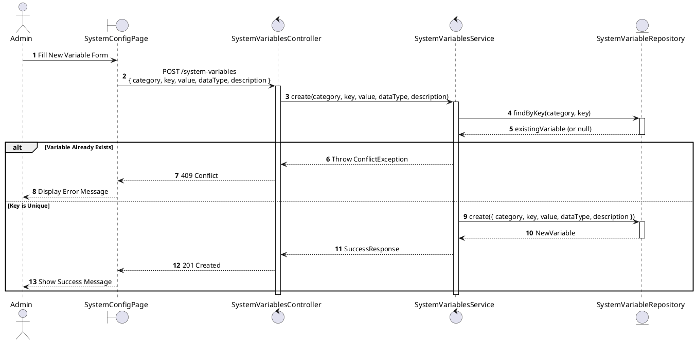
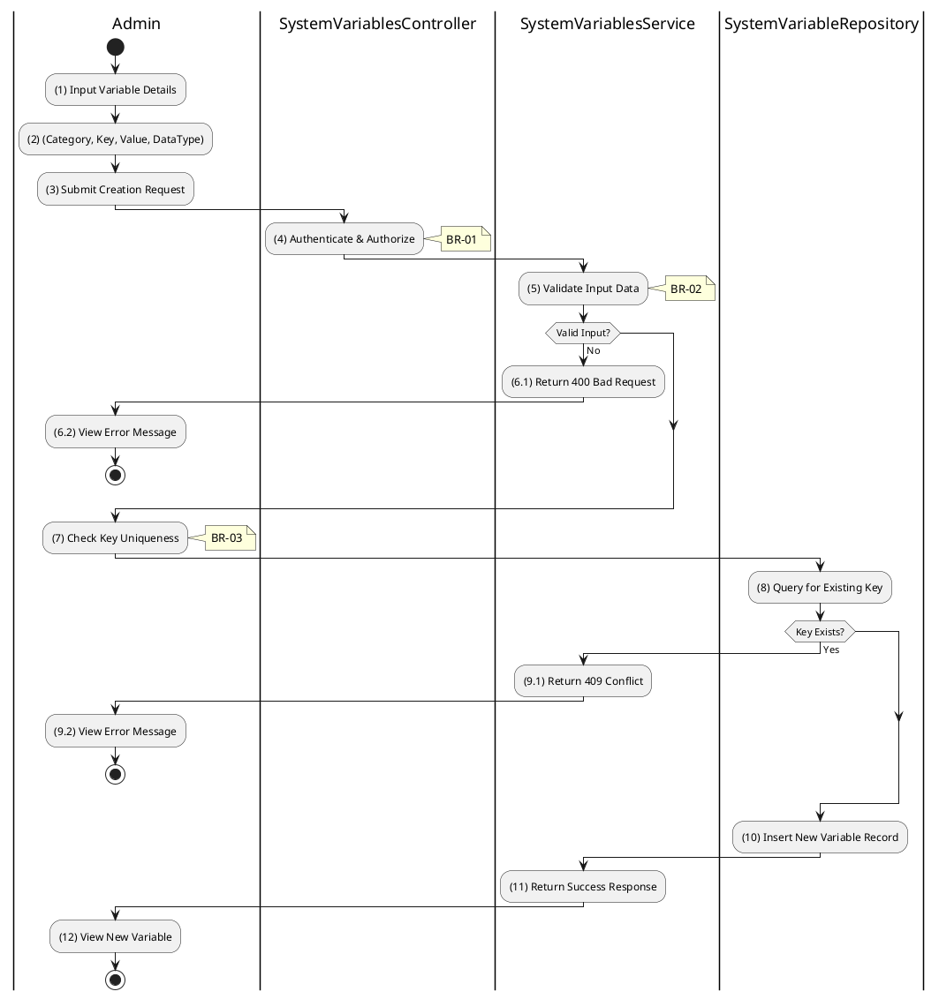

# 3.9.4 Create System Variable

## 1. Use Case Description

| Field              | Description                                                                                                     |
| ------------------ | --------------------------------------------------------------------------------------------------------------- |
| **Name**           | Create System Variable                                                                                          |
| **Description**    | This use case allows the Admin to create a new system configuration variable.                                   |
| **Actor**          | Admin, Super Admin                                                                                              |
| **Trigger**        | When the Admin submits a new variable via `POST /system-variables`.                                             |
| **Pre-condition**  | • Admin's device must be connected to the internet. • Admin is signed in with `admin` or `super_admin` role. |
| **Post-condition** | The new system configuration variable is created and stored in the database.                                    |

## 2. Sequence Flow (MVC)

## 3. Activities Flow (Swimlanes)

## 4. Business Rules

| Activity | BR Code   | Description                                                                                                                                                                                                                             |
| :------- | :-------- | :-------------------------------------------------------------------------------------------------------------------------------------------------------------------------------------------------------------------------------------- |
| **(1)**  | **BR-01** | **Displaying Rule (Create Variable Form):** System displays form with: category dropdown, key input, value input, dataType dropdown, description textarea. All fields except description are mandatory.                           |
| **(2)**  | **BR-02** | **Validation Rule (Input - Front-end):** Key format: lowercase with dots (e.g., `min_percentage`). Valid dataTypes: `number`, `boolean`, `string`, `json`. If `isEmpty()` on mandatory fields: $\rightarrow$ Display MSG 1. |
| **(4)**  | **BR-03** | **Validation Rule (Authorization - Back-end):** System checks if requestor role is `admin` or `super_admin`. If unauthorized: $\rightarrow$ System displays MSG 5 ("Forbidden") on the View.                                   |
| **(7)**  | **BR-04** | **Validation Rule (Uniqueness):** System checks `SYSTEM_VARIABLE` table for duplicate (category, key) combination. If duplicate: $\rightarrow$ System displays MSG 12 ("Variable key already exists") on the View.             |
| **(10)** | **BR-05** | **Storing Rule:** System saves to `SYSTEM_VARIABLE` table: - `category`, `key`, `value`, `dataType`, `description` - `isActive = true` - `createdAt = now()`                                                                |
| **(12)** | **BR-06** | **Displaying Rule (Success Confirmation):** System displays MSG 7 ("Variable created successfully") on the View. System refreshes variable list to show new entry.                                                                |
