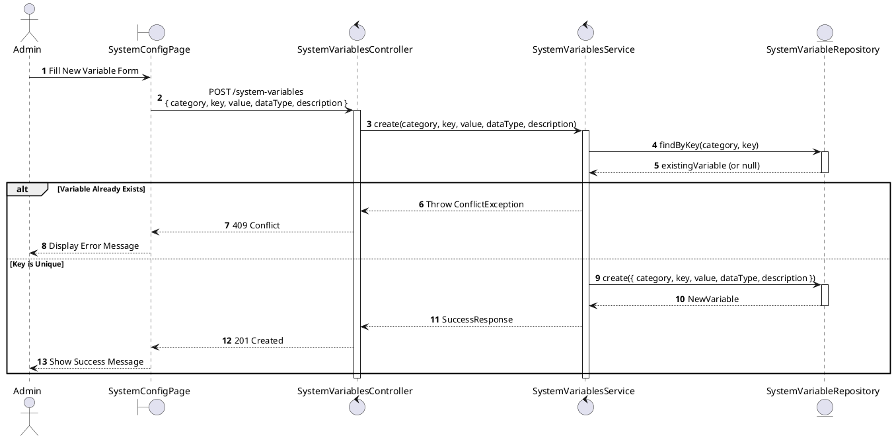
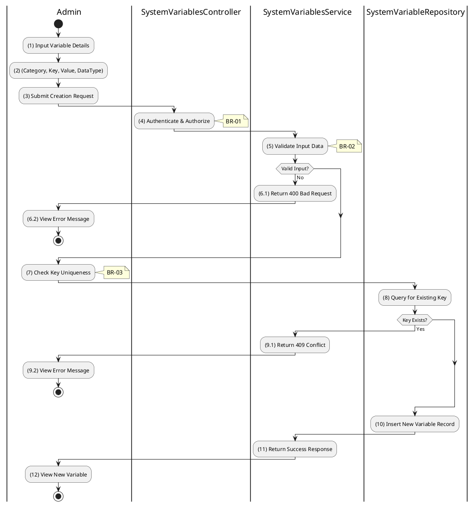

# 3.9.4 Create System Variable

## 1. Use Case Description

| Field              | Description                                                                                                     |
| ------------------ | --------------------------------------------------------------------------------------------------------------- |
| **Name**           | Create System Variable                                                                                          |
| **Description**    | This use case allows the Admin to create a new system configuration variable.                                   |
| **Actor**          | Admin, Super Admin                                                                                              |
| **Trigger**        | When the Admin submits a new variable via `POST /system-variables`.                                             |
| **Pre-condition**  | • Admin's device must be connected to the internet. • Admin is signed in with `admin` or `super_admin` role. |
| **Post-condition** | The new system configuration variable is created and stored in the database.                                    |

## 2. Sequence Flow (MVC)

## 3. Activities Flow (Swimlanes)

## 4. Business Rules

| Activity | BR Code   | Description                                                                                                                                                                                                                             |
| :------- | :-------- | :-------------------------------------------------------------------------------------------------------------------------------------------------------------------------------------------------------------------------------------- |
| **(1)**  | **BR-01** | **Displaying Rule:**  Function: `Display_View('CreateSystemVariablePage')`  Logic: Render form with [Category] dropdown, [Key] input, [Value] input, [DataType] dropdown, [Description] textarea.                         |
| **(2)**  | **BR-02** | **Validation Rule (Front-end):**  Function: `ValidateInput(form)`  Logic: Key format: `lowercase.with.dots`. Required fields: [Category], [Key], [Value], [DataType]. IF Invalid THEN Display MSG 1.                     |
| **(4)**  | **BR-03** | **Authorization Rule (Back-end):**  Function: Call `SystemVariablesService.create()`  Logic: Check Requestor Role. IF Role NOT IN ['admin', 'super_admin'] THEN Return 403 (Forbidden).                                   |
| **(7)**  | **BR-04** | **Uniqueness Rule (Back-end):**  Function: `SystemVariableRepository.findByKey(category, key)`  Logic: IF (Category, Key) already exists THEN   Return 409 Conflict   Display MSG 12 (Key already exists). END IF |
| **(10)** | **BR-05** | **Storing Rule (Back-end):**  Function: `SystemVariableRepository.create()`  Logic: Insert into `SYSTEM_VARIABLE` table: [category], [key], [value], [dataType], [description], [isActive]=TRUE, [createdAt]=NOW(). Display MSG 7 (Success). |
| **(12)** | **BR-06** | **Displaying Rule (Success):**  Function: `Refresh_View('SystemConfigPage')`  Logic: Show success notification. Update variable list.                                                                                    |
