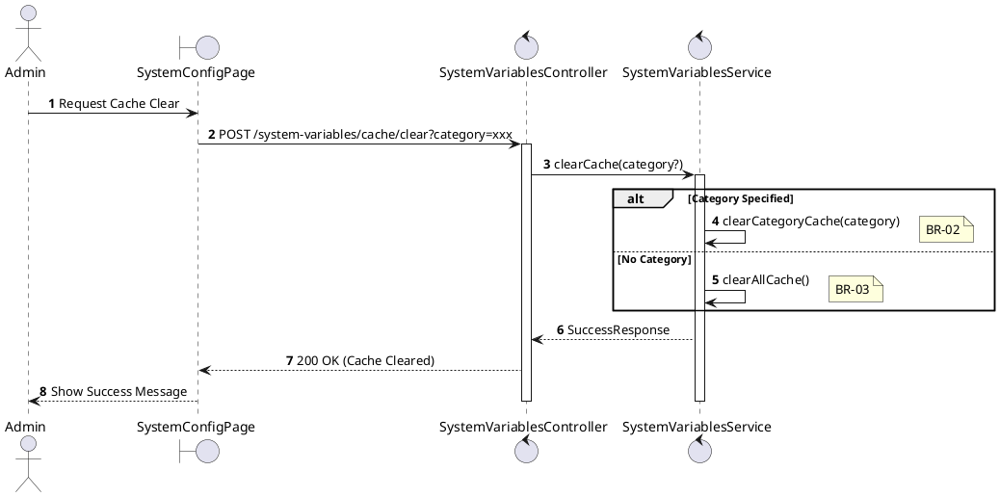
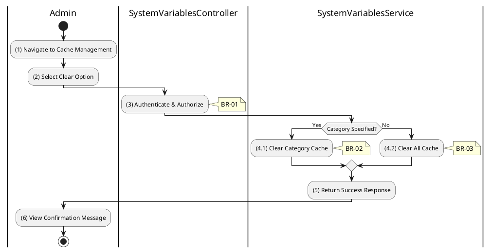

# 3.9.5 Clear Cache

## 1. Use Case Description

| Field              | Description                                                                                                     |
| ------------------ | --------------------------------------------------------------------------------------------------------------- |
| **Name**           | Clear Cache                                                                                                     |
| **Description**    | This use case allows the Admin to manually clear the system variables cache for troubleshooting or updates.     |
| **Actor**          | Admin, Super Admin                                                                                              |
| **Trigger**        | When the Admin requests `POST /system-variables/cache/clear`.                                                   |
| **Pre-condition**  | • Admin's device must be connected to the internet. • Admin is signed in with `admin` or `super_admin` role. |
| **Post-condition** | The system variables cache is cleared, forcing fresh database reads on next access.                             |

## 2. Sequence Flow (MVC)

## 3. Activities Flow (Swimlanes)

## 4. Business Rules

| Activity  | BR Code   | Description                                                                                                                                                                                           |
| :-------- | :-------- | :---------------------------------------------------------------------------------------------------------------------------------------------------------------------------------------------------- |
| **(1)**   | **BR-01** | **Displaying Rule:**  Function: `Display_View('SystemConfigPage')`  Logic: Render [Clear All Cache] button. Render category-specific [Clear Cache] buttons.                           |
| **(3)**   | **BR-02** | **Authorization Rule (Back-end):**  Function: Call `SystemVariablesService.clearCache()`  Logic: Check Requestor Role. IF Role NOT IN ['admin', 'super_admin'] THEN Return 403 (Forbidden). |
| **(4.1)** | **BR-03** | **Processing Rule (Back-end):**  Function: `CacheService.clearCategoryCache(category)`  Logic: Remove entries related to [category] from cache.                                          |
| **(4.2)** | **BR-04** | **Processing Rule (Back-end):**  Function: `CacheService.clearAllCache()`  Logic: Remove ALL system variable entries from cache.                                                         |
| **(6)**   | **BR-05** | **Displaying Rule (Success):**  Function: `Display_Notification('Success', message)`  Logic: Show Toast: "Cache cleared successfully." IF category THEN "Cache cleared for [category]". |