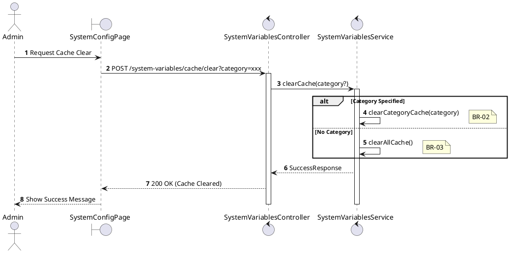
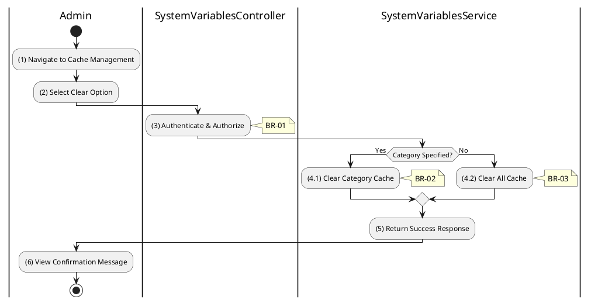

# 3.9.5 Clear Cache

## 1. Use Case Description

| Field              | Description                                                                                                     |
| ------------------ | --------------------------------------------------------------------------------------------------------------- |
| **Name**           | Clear Cache                                                                                                     |
| **Description**    | This use case allows the Admin to manually clear the system variables cache for troubleshooting or updates.     |
| **Actor**          | Admin, Super Admin                                                                                              |
| **Trigger**        | When the Admin requests `POST /system-variables/cache/clear`.                                                   |
| **Pre-condition**  | • Admin's device must be connected to the internet. • Admin is signed in with `admin` or `super_admin` role. |
| **Post-condition** | The system variables cache is cleared, forcing fresh database reads on next access.                             |

## 2. Sequence Flow (MVC)

## 3. Activities Flow (Swimlanes)

## 4. Business Rules

| Activity  | BR Code   | Description                                                                                                                                                                                           |
| :-------- | :-------- | :---------------------------------------------------------------------------------------------------------------------------------------------------------------------------------------------------- |
| **(1)**   | **BR-01** | **Displaying Rule (Cache Management):** System displays cache management section with: - "Clear All Cache" button - Category-specific clear options - Cache statistics display.           |
| **(3)**   | **BR-02** | **Validation Rule (Authorization - Back-end):** System checks if requestor role is `admin` or `super_admin`. If unauthorized: $\rightarrow$ System displays MSG 5 ("Forbidden") on the View. |
| **(4.1)** | **BR-03** | **Processing Rule (Category Clear):** System clears cache entries for specified category only. Other categories remain cached. Useful for targeted cache refresh.                            |
| **(4.2)** | **BR-04** | **Processing Rule (Full Clear):** System clears entire system variables cache. All subsequent reads will hit database. Performance impact: temporary until cache repopulates.                |
| **(6)**   | **BR-05** | **Displaying Rule (Success Confirmation):** System displays MSG "Cache cleared successfully" on the View. If category specified: "Cache cleared for category: [category]".                      |
