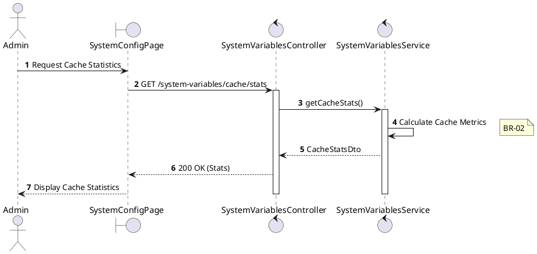
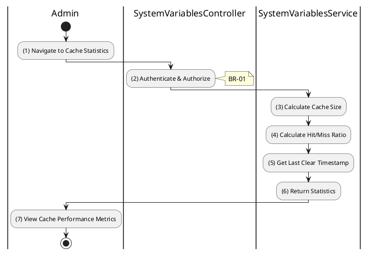

# 3.9.6 Get Cache Statistics

## 1. Use Case Description

| Field              | Description                                                                                                     |
| ------------------ | --------------------------------------------------------------------------------------------------------------- |
| **Name**           | Get Cache Statistics                                                                                            |
| **Description**    | This use case allows the Admin to view cache statistics for monitoring system performance.                      |
| **Actor**          | Admin, Super Admin                                                                                              |
| **Trigger**        | When the Admin requests `GET /system-variables/cache/stats`.                                                    |
| **Pre-condition**  | • Admin's device must be connected to the internet. • Admin is signed in with `admin` or `super_admin` role. |
| **Post-condition** | The cache statistics are retrieved and displayed to the Admin.                                                  |

## 2. Sequence Flow (MVC)

## 3. Activities Flow (Swimlanes)

## 4. Business Rules

| Activity    | BR Code   | Description                                                                                                                                                                                           |
| :---------- | :-------- | :---------------------------------------------------------------------------------------------------------------------------------------------------------------------------------------------------- |
| **(1)**     | **BR-01** | **Displaying Rule (Cache Statistics Page):** System displays cache statistics section with: - Cache size (entries count) - Hit/miss ratio - Last cleared timestamp.                       |
| **(2)**     | **BR-02** | **Validation Rule (Authorization - Back-end):** System checks if requestor role is `admin` or `super_admin`. If unauthorized: $\rightarrow$ System displays MSG 5 ("Forbidden") on the View. |
| **(3)-(5)** | **BR-03** | **Processing Rule (Metrics Calculation):** System calculates: - Total cached entries - Cache hit count - Cache miss count - Hit ratio percentage.                                      |
| **(7)**     | **BR-04** | **Displaying Rule (Stats Display):** System displays cache metrics in dashboard format. Shows: entries count, hit rate, memory usage (if available). Helps admin monitor cache health.       |
