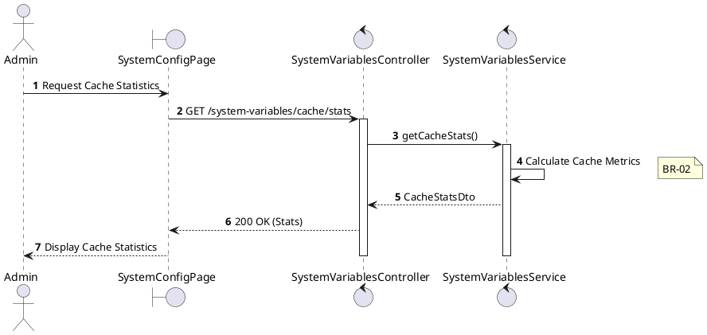
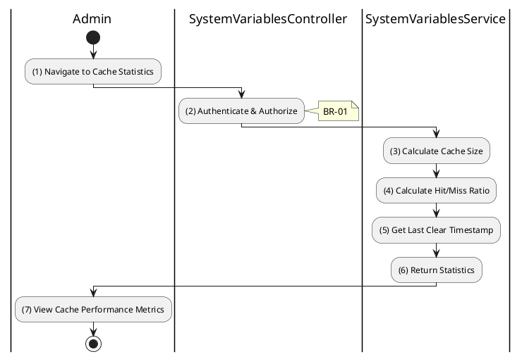

# 3.9.6 Get Cache Statistics

## 1. Use Case Description

| Field              | Description                                                                                                     |
| ------------------ | --------------------------------------------------------------------------------------------------------------- |
| **Name**           | Get Cache Statistics                                                                                            |
| **Description**    | This use case allows the Admin to view cache statistics for monitoring system performance.                      |
| **Actor**          | Admin, Super Admin                                                                                              |
| **Trigger**        | When the Admin requests `GET /system-variables/cache/stats`.                                                    |
| **Pre-condition**  | • Admin's device must be connected to the internet. • Admin is signed in with `admin` or `super_admin` role. |
| **Post-condition** | The cache statistics are retrieved and displayed to the Admin.                                                  |

## 2. Sequence Flow (MVC)

## 3. Activities Flow (Swimlanes)

## 4. Business Rules

| Activity    | BR Code   | Description                                                                                                                                                                                           |
| :---------- | :-------- | :---------------------------------------------------------------------------------------------------------------------------------------------------------------------------------------------------- |
| **(1)**     | **BR-01** | **Displaying Rule:**  Function: `Display_View('SystemConfigPage')`  Logic: Render Cache Statistics panel. Show loading indicator initially.                                          |
| **(2)**     | **BR-02** | **Authorization Rule (Back-end):**  Function: Call `SystemVariablesService.getCacheStats()`  Logic: Check Requestor Role. IF Role NOT IN ['admin', 'super_admin'] THEN Return 403 (Forbidden). |
| **(3)-(5)** | **BR-03** | **Calculation Rule (Back-end):**  Function: `CacheService.getStats()`  Logic: Retrieve: `totalEntries`, `hits`, `misses`, `lastClearTimestamp`. Calculate `hitRate` = (hits / (hits + misses)) * 100. |
| **(7)**     | **BR-04** | **Displaying Rule (Data):**  Function: `Display_CacheStats(stats)`  Logic: Render: Total Entries, Cache Hits, Cache Misses, Hit Rate (%), Last Cleared At.                             |
