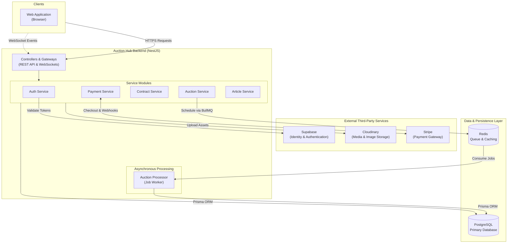
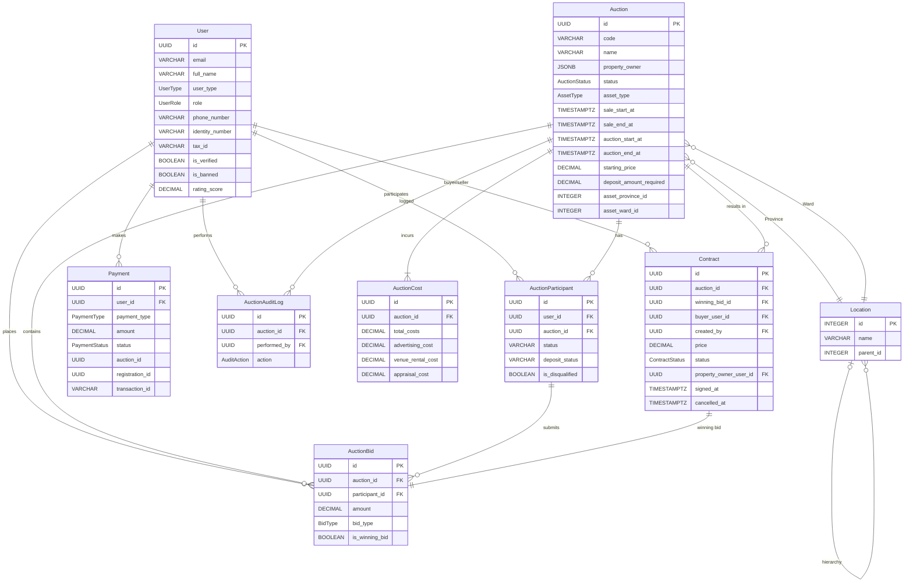
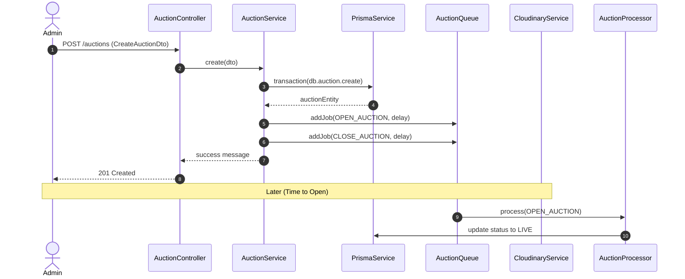

# System Architecture Documentation

This document provides visual representations of the system's data structure and core application logic.

## 1. High-Level System Architecture

This section provides a bird's-eye view of the Auction Hub platform, illustrating how clients interact with the backend infrastructure, external services, and data layers. The system follows a monolith architecture built on NestJS, employing Redis for background job queueing and third-party APIs for extended functionality.

## 2. Entity Relationship Diagram (ERD)

## 3. High-Detail Class Diagram

This diagram provides an exhaustive view of the system's architecture, including Controllers, Services, DTOs, Background Processors, and their complex inter-dependencies.

```mermaid
classDiagram
    class PrismaService {
        +user: Prisma.UserDelegate
        +auction: Prisma.AuctionDelegate
        +contract: Prisma.ContractDelegate
        +payment: Prisma.PaymentDelegate
        +article: Prisma.ArticleDelegate
        +location: Prisma.LocationDelegate
    }
    class SupabaseService {
        +auth: SupabaseAuthClient
        +authAdmin: SupabaseAuthAdminClient
    }
    class CloudinaryService {
        +uploadFile(file)
        +deleteFile(publicId)
        +deleteMultipleFiles(publicIds)
    }
    class PdfGeneratorService {
        +generateContractPdf(data)
        +generateContractPdfEnglish(data)
    }

    class AuthController {
        -authService: AuthService
        +register(dto)
        +login(dto)
        +forgotPassword(dto)
        +verifyEmail(dto)
    }
    class AuthService {
        -prisma: PrismaService
        -supabase: SupabaseService
        +register(request)
        +login(request)
        +validateUniqueFields(request)
    }
    class UserService {
        -prisma: PrismaService
        -supabase: SupabaseService
        +registerUser(token, req)
        +promoteUser(token, userId, data)
        +getCurrentUser(token)
    }

    class AuctionController {
        -auctionService: AuctionService
        +findAll(query)
        +findOne(id)
        +create(dto)
        +update(id, dto)
        +remove(id)
        +updateRelation(id, dto)
    }
    class AuctionService {
        -prisma: PrismaService
        -cloudinary: CloudinaryService
        -auctionQueue: Queue
        +findAll(query)
        +findOne(id)
        +create(dto)
        +update(id, dto)
        +updateRelations(id, relatedIds)
        -toAuctionDetail(entity)
    }
    class AuctionProcessor {
        -prisma: PrismaService
        +process(job)
        +openAuction(id)
        +closeAuction(id)
    }
    class AuctionQueue {
        +AUCTION_QUEUE string
        +ADD_JOB(name, data)
    }

    class ContractController {
        -contractService: ContractService
        +findAll(query, user)
        +findOne(id, user)
        +create(dto, user)
        +sign(id, dto, user)
        +cancel(id, dto, user)
        +exportToPdf(id, user)
    }
    class ContractService {
        -prisma: PrismaService
        -pdfGenerator: PdfGeneratorService
        +findAll(query, userId)
        +findOne(id, userId)
        +create(dto, userId)
        +sign(id, dto, userId)
        +exportToPdf(id, userId)
        -checkAccess(contract, userId)
    }

    class PaymentController {
        -paymentService: PaymentService
        +createPayment(dto)
        +verifyPayment(sessionId)
    }
    class PaymentService {
        -prisma: PrismaService
        -stripe: Stripe
        +createPayment(userId, req)
        +verifyPayment(sessionId)
        +constructEvent(payload, sig)
        -isZeroDecimalCurrency(currency)
    }
    class PaymentWebhookController {
        -paymentService: PaymentService
        +handleWebhook(payload, sig)
    }

    class ArticleController {
        -articleService: ArticleService
        +findAll(query)
        +findOne(id)
        +create(dto)
    }
    class ArticleService {
        -prisma: PrismaService
        -cloudinary: CloudinaryService
        +findAll(query)
        +create(dto)
        +updateRelations(id, relatedIds)
    }

    AuthController ..> AuthService
    AuctionController ..> AuctionService
    ContractController ..> ContractService
    PaymentController ..> PaymentService
    PaymentWebhookController ..> PaymentService
    ArticleController ..> ArticleService

    AuthService ..> PrismaService
    AuthService ..> SupabaseService
    UserService ..> PrismaService
    UserService ..> SupabaseService

    AuctionService ..> PrismaService
    AuctionService ..> CloudinaryService
    AuctionService ..> AuctionQueue : "schedules"

    AuctionProcessor ..> PrismaService
    AuctionProcessor --|> WorkerHost

    ContractService ..> PrismaService
    ContractService ..> PdfGeneratorService

    PaymentService ..> PrismaService

    ArticleService ..> PrismaService
    ArticleService ..> CloudinaryService
```

## 4. Interaction Diagram (General Logic Flow)

This diagram shows how a common request (e.g., Creating an Auction) flows through the system.

