# TÀI LIỆU ĐẶC TẢ CƠ SỞ DỮ LIỆU (DATABASE SPECIFICATION)

Tài liệu này mô tả chi tiết cấu trúc các bảng trong cơ sở dữ liệu của hệ thống Auction Hub dựa trên schema Prisma.

---

### Table: User

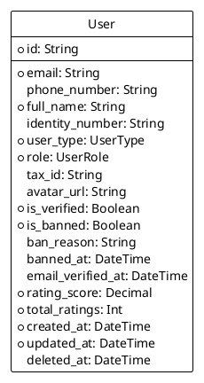

| TÊN THUỘC TÍNH  | KIỂU DỮ LIỆU | RÀNG BUỘC                            | Ý NGHĨA                                  |
| :-------------- | :----------- | :----------------------------------- | :--------------------------------------- |
| id              | String       | Khóa chính; bắt buộc; duy nhất       | Định danh duy nhất của người dùng (UUID) |
| email           | String       | Bắt buộc; duy nhất                   | Địa chỉ thư điện tử của người dùng       |
| phoneNumber     | String       | Tùy chọn; duy nhất                   | Số điện thoại liên lạc                   |
| fullName        | String       | Bắt buộc                             | Họ và tên đầy đủ                         |
| identityNumber  | String       | Tùy chọn; duy nhất                   | Số CMND/CCCD hoặc Hộ chiếu               |
| userType        | UserType     | Bắt buộc                             | Loại người dùng (Cá nhân/Doanh nghiệp)   |
| role            | UserRole     | Bắt buộc; Mặc định là bidder         | Vai trò/Phân quyền trong hệ thống        |
| taxId           | String       | Tùy chọn                             | Mã số thuế (đối với doanh nghiệp)        |
| avatarUrl       | String       | Tùy chọn                             | Đường dẫn ảnh đại diện                   |
| isVerified      | Boolean      | Bắt buộc; Mặc định là false          | Trạng thái xác minh tài khoản            |
| isBanned        | Boolean      | Bắt buộc; Mặc định là false          | Trạng thái bị khóa tài khoản             |
| banReason       | String       | Tùy chọn                             | Lý do bị khóa tài khoản                  |
| bannedAt        | DateTime     | Tùy chọn                             | Thời điểm bị khóa tài khoản              |
| emailVerifiedAt | DateTime     | Tùy chọn                             | Thời điểm xác nhận email                 |
| ratingScore     | Decimal      | Bắt buộc; Mặc định là 5.00           | Điểm đánh giá uy tín người dùng          |
| totalRatings    | Int          | Bắt buộc; Mặc định là 0              | Tổng số lượt đánh giá nhận được          |
| createdAt       | DateTime     | Bắt buộc; Mặc định là bây giờ        | Thời điểm tạo tài khoản                  |
| updatedAt       | DateTime     | Bắt buộc; Tự động cập nhật thời gian | Thời điểm cập nhật thông tin gần nhất    |
| deletedAt       | DateTime     | Tùy chọn                             | Thời điểm xóa mềm tài khoản              |

---

### Table: Auction

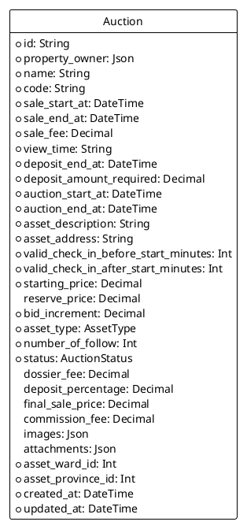

| TÊN THUỘC TÍNH                 | KIỂU DỮ LIỆU  | RÀNG BUỘC                                    | Ý NGHĨA                                  |
| :----------------------------- | :------------ | :------------------------------------------- | :--------------------------------------- |
| id                             | String        | Khóa chính; bắt buộc; duy nhất               | Định danh duy nhất của cuộc đấu giá      |
| propertyOwner                  | Json          | Bắt buộc                                     | Thông tin chủ sở hữu tài sản (Snapshot)  |
| name                           | String        | Bắt buộc                                     | Tên cuộc đấu giá                         |
| code                           | String        | Bắt buộc; duy nhất                           | Mã số định danh cuộc đấu giá             |
| saleStartAt                    | DateTime      | Bắt buộc                                     | Thời điểm bắt đầu bán hồ sơ              |
| saleEndAt                      | DateTime      | Bắt buộc                                     | Thời điểm kết thúc bán hồ sơ             |
| saleFee                        | Decimal       | Bắt buộc                                     | Phí tham gia đấu giá                     |
| viewTime                       | String        | Bắt buộc                                     | Thời gian xem tài sản                    |
| depositEndAt                   | DateTime      | Bắt buộc                                     | Thời hạn cuối nộp tiền đặt trước         |
| depositAmountRequired          | Decimal       | Bắt buộc                                     | Số tiền đặt trước yêu cầu                |
| auctionStartAt                 | DateTime      | Bắt buộc                                     | Thời điểm bắt đầu buổi đấu giá           |
| auctionEndAt                   | DateTime      | Bắt buộc                                     | Thời điểm kết thúc buổi đấu giá          |
| assetDescription               | String        | Bắt buộc                                     | Mô tả chi tiết tài sản đấu giá           |
| assetAddress                   | String        | Bắt buộc                                     | Địa chỉ nơi đặt tài sản                  |
| validCheckInBeforeStartMinutes | Int           | Bắt buộc                                     | Thời gian check-in sớm tối đa (phút)     |
| validCheckInAfterStartMinutes  | Int           | Bắt buộc                                     | Thời gian check-in muộn tối đa (phút)    |
| startingPrice                  | Decimal       | Bắt buộc                                     | Giá khởi điểm của tài sản                |
| reservePrice                   | Decimal       | Tùy chọn                                     | Giá khởi điểm tối thiểu để bán           |
| bidIncrement                   | Decimal       | Bắt buộc                                     | Bước giá tối thiểu cho mỗi lần trả giá   |
| assetType                      | AssetType     | Bắt buộc                                     | Loại tài sản (Bất động sản, Động sản...) |
| numberOfFollow                 | Int           | Bắt buộc; Mặc định là 0                      | Số người dùng quan tâm                   |
| status                         | AuctionStatus | Bắt buộc; Mặc định là scheduled              | Trạng thái hiện tại của cuộc đấu giá     |
| dossierFee                     | Decimal       | Tùy chọn                                     | Phí hồ sơ đấu giá thực tế                |
| depositPercentage              | Decimal       | Tùy chọn                                     | Tỷ lệ phần trăm tiền đặt trước           |
| finalSalePrice                 | Decimal       | Tùy chọn                                     | Giá bán sau cùng khi kết thúc            |
| commissionFee                  | Decimal       | Tùy chọn                                     | Phí hoa hồng đấu giá                     |
| images                         | Json          | Tùy chọn                                     | Danh sách hình ảnh tài sản               |
| attachments                    | Json          | Tùy chọn                                     | Tài liệu pháp lý đính kèm                |
| assetWardId                    | Int           | Bắt buộc; Khóa ngoại tham chiếu đến Location | ID Phường/Xã nơi có tài sản              |
| assetProvinceId                | Int           | Bắt buộc; Khóa ngoại tham chiếu đến Location | ID Tỉnh/Thành phố nơi có tài sản         |
| createdAt                      | DateTime      | Bắt buộc; Mặc định là bây giờ                | Thời điểm tạo cuộc đấu giá               |
| updatedAt                      | DateTime      | Bắt buộc; Tự động cập nhật thời gian         | Thời điểm cập nhật thông tin gần nhất    |

---

### Table: Location

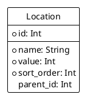

| TÊN THUỘC TÍNH | KIỂU DỮ LIỆU | RÀNG BUỘC                                    | Ý NGHĨA                                       |
| :------------- | :----------- | :------------------------------------------- | :-------------------------------------------- |
| id             | Int          | Khóa chính; bắt buộc; duy nhất               | Mã định danh địa điểm (theo chuẩn hành chính) |
| name           | String       | Bắt buộc                                     | Tên đơn vị hành chính (Tỉnh, Huyện, Xã)       |
| value          | Int          | Bắt buộc                                     | Giá trị số đại diện                           |
| sortOrder      | Int          | Bắt buộc                                     | Thứ tự hiển thị trong danh sách               |
| parentId       | Int          | Tùy chọn; Khóa ngoại tham chiếu đến Location | ID của đơn vị cấp trên (Huyện -> Tỉnh)        |

---

### Table: AuctionRelation

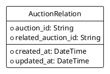

| TÊN THUỘC TÍNH   | KIỂU DỮ LIỆU | RÀNG BUỘC                            | Ý NGHĨA                                        |
| :--------------- | :----------- | :----------------------------------- | :--------------------------------------------- |
| auctionId        | String       | Khóa chính; Bắt buộc; Khóa ngoại     | ID cuộc đấu giá gốc                            |
| relatedAuctionId | String       | Khóa chính; Bắt buộc; Khóa ngoại     | ID cuộc đấu giá liên quan (ví dụ: đấu giá lại) |
| createdAt        | DateTime     | Bắt buộc; Mặc định là bây giờ        | Thời điểm tạo mối quan hệ                      |
| updatedAt        | DateTime     | Bắt buộc; Tự động cập nhật thời gian | Thời điểm cập nhật mối quan hệ                 |

---

### Table: AuctionCost

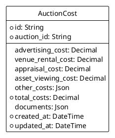

| TÊN THUỘC TÍNH   | KIỂU DỮ LIỆU | RÀNG BUỘC                            | Ý NGHĨA                               |
| :--------------- | :----------- | :----------------------------------- | :------------------------------------ |
| id               | String       | Khóa chính; bắt buộc; duy nhất       | Định danh bảng chi phí                |
| auctionId        | String       | Bắt buộc; duy nhất; Khóa ngoại       | ID cuộc đấu giá tương ứng             |
| advertisingCost  | Decimal      | Tùy chọn; Mặc định là 0              | Chi phí đăng tin, quảng cáo           |
| venueRentalCost  | Decimal      | Tùy chọn; Mặc định là 0              | Chi phí thuê địa điểm tổ chức         |
| appraisalCost    | Decimal      | Tùy chọn; Mặc định là 0              | Chi phí thẩm định giá                 |
| assetViewingCost | Decimal      | Tùy chọn; Mặc định là 0              | Chi phí tổ chức cho khách xem tài sản |
| otherCosts       | Json         | Tùy chọn                             | Các chi phí phát sinh khác            |
| totalCosts       | Decimal      | Bắt buộc; Mặc định là 0              | Tổng cộng tất cả chi phí              |
| documents        | Json         | Tùy chọn                             | Chứng từ, hóa đơn đính kèm            |
| createdAt        | DateTime     | Bắt buộc; Mặc định là bây giờ        | Thời điểm nhập chi phí                |
| updatedAt        | DateTime     | Bắt buộc; Tự động cập nhật thời gian | Thời điểm cập nhật chi phí            |

---

### Table: SystemVariable

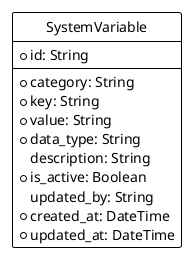

| TÊN THUỘC TÍNH | KIỂU DỮ LIỆU | RÀNG BUỘC                            | Ý NGHĨA                                   |
| :------------- | :----------- | :----------------------------------- | :---------------------------------------- |
| id             | String       | Khóa chính; bắt buộc; duy nhất       | Định danh cấu hình                        |
| category       | String       | Bắt buộc                             | Nhóm cấu hình (deposit, commission...)    |
| key            | String       | Bắt buộc; duy nhất theo nhóm         | Khóa của biến cấu hình                    |
| value          | String       | Bắt buộc                             | Giá trị của cấu hình (lưu dạng chuỗi)     |
| dataType       | String       | Bắt buộc; Mặc định là "string"       | Kiểu dữ liệu thực tế (number, boolean...) |
| description    | String       | Tùy chọn                             | Giải thích công dụng của cấu hình         |
| isActive       | Boolean      | Bắt buộc; Mặc định là true           | Trạng thái sử dụng                        |
| updatedBy      | String       | Tùy chọn                             | ID người cập nhật cuối cùng               |
| createdAt      | DateTime     | Bắt buộc; Mặc định là bây giờ        | Thời điểm tạo                             |
| updatedAt      | DateTime     | Bắt buộc; Tự động cập nhật thời gian | Thời điểm cập nhật                        |

---

### Table: AuctionParticipant

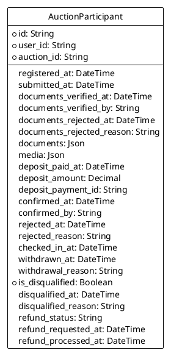

| TÊN THUỘC TÍNH          | KIỂU DỮ LIỆU | RÀNG BUỘC                                   | Ý NGHĨA                                   |
| :---------------------- | :----------- | :------------------------------------------ | :---------------------------------------- |
| id                      | String       | Khóa chính; bắt buộc; duy nhất              | Định danh phiếu đăng ký tham gia          |
| userId                  | String       | Bắt buộc; Khóa ngoại tham chiếu đến User    | ID khách hàng tham gia                    |
| auctionId               | String       | Bắt buộc; Khóa ngoại tham chiếu đến Auction | ID cuộc đấu giá                           |
| registeredAt            | DateTime     | Tùy chọn                                    | Thời điểm nhấn đăng ký                    |
| submittedAt             | DateTime     | Tùy chọn                                    | Thời điểm hoàn tất nộp hồ sơ              |
| documentsVerifiedAt     | DateTime     | Tùy chọn                                    | Thời điểm duyệt hồ sơ pháp lý             |
| documentsVerifiedBy     | String       | Tùy chọn; Khóa ngoại                        | Nhân viên thực hiện duyệt hồ sơ           |
| documentsRejectedAt     | DateTime     | Tùy chọn                                    | Thời điểm từ chối hồ sơ                   |
| documentsRejectedReason | String       | Tùy chọn                                    | Lý do hồ sơ không đạt                     |
| documents               | Json         | Tùy chọn                                    | Bản scan các giấy tờ pháp lý              |
| media                   | Json         | Tùy chọn                                    | Hình ảnh/Video định danh                  |
| depositPaidAt           | DateTime     | Tùy chọn                                    | Thời điểm người dùng nộp tiền cọc         |
| depositAmount           | Decimal      | Tùy chọn                                    | Số tiền cọc thực tế đã nộp                |
| depositPaymentId        | String       | Tùy chọn                                    | Mã giao dịch nộp cọc                      |
| confirmedAt             | DateTime     | Tùy chọn                                    | Thời điểm chính thức đủ điều kiện đấu giá |
| confirmedBy             | String       | Tùy chọn; Khóa ngoại                        | Người xác nhận tư cách người đấu giá      |
| rejectedAt              | DateTime     | Tùy chọn (Cũ)                               | Thời điểm bị từ chối chung                |
| rejectedReason          | String       | Tùy chọn (Cũ)                               | Lý do bị từ chối chung                    |
| checkedInAt             | DateTime     | Tùy chọn                                    | Thời điểm vào phòng đấu giá trực tuyến    |
| withdrawnAt             | DateTime     | Tùy chọn                                    | Thời điểm xin rút không tham gia          |
| withdrawalReason        | String       | Tùy chọn                                    | Lý do xin rút                             |
| isDisqualified          | Boolean      | Bắt buộc; Mặc định là false                 | Trạng thái bị tước quyền đấu giá          |
| disqualifiedAt          | DateTime     | Tùy chọn                                    | Thời điểm bị tước quyền                   |
| disqualifiedReason      | String       | Tùy chọn                                    | Lý do vi phạm quy chế                     |
| refundStatus            | String       | Tùy chọn                                    | Trạng thái hoàn trả tiền đặt trước        |
| refundRequestedAt       | DateTime     | Tùy chọn                                    | Thời điểm yêu cầu hoàn tiền               |
| refundProcessedAt       | DateTime     | Tùy chọn                                    | Thời điểm đã thực hiện hoàn tiền          |

---

### Table: AuctionBid

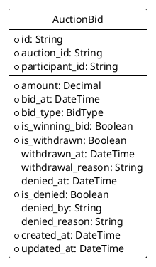

| TÊN THUỘC TÍNH   | KIỂU DỮ LIỆU | RÀNG BUỘC                                              | Ý NGHĨA                                      |
| :--------------- | :----------- | :----------------------------------------------------- | :------------------------------------------- |
| id               | String       | Khóa chính; bắt buộc; duy nhất                         | Định danh lượt trả giá                       |
| auctionId        | String       | Bắt buộc; Khóa ngoại tham chiếu đến Auction            | ID cuộc đấu giá đang diễn ra                 |
| participantId    | String       | Bắt buộc; Khóa ngoại tham chiếu đến AuctionParticipant | ID của người đấu giá                         |
| amount           | Decimal      | Bắt buộc                                               | Giá tiền đề xuất                             |
| bidAt            | DateTime     | Bắt buộc                                               | Thời điểm gửi lệnh trả giá                   |
| bidType          | BidType      | Bắt buộc; Mặc định là manual                           | Trả giá thủ công hay tự động (Auto-bid)      |
| isWinningBid     | Boolean      | Bắt buộc; Mặc định là false                            | Trạng thái giá cao nhất/thắng cuộc           |
| isWithdrawn      | Boolean      | Bắt buộc; Mặc định là false                            | Trạng thái lệnh trả giá bị rút               |
| withdrawnAt      | DateTime     | Tùy chọn                                               | Thời điểm rút lệnh trả giá                   |
| withdrawalReason | String       | Tùy chọn                                               | Lý do rút lệnh                               |
| deniedAt         | DateTime     | Tùy chọn                                               | Thời điểm lệnh trả giá bị hủy bỏ             |
| isDenied         | Boolean      | Bắt buộc; Mặc định là false                            | Trạng thái lệnh trả giá bị quản trị viên hủy |
| deniedBy         | String       | Tùy chọn; Khóa ngoại                                   | Quản trị viên thực hiện hủy lệnh             |
| deniedReason     | String       | Tùy chọn                                               | Lý do hủy lệnh trả giá                       |
| createdAt        | DateTime     | Bắt buộc; Mặc định là bây giờ                          | Thời điểm ghi nhận vào DB                    |
| updatedAt        | DateTime     | Bắt buộc; Tự động cập nhật thời gian                   | Thời điểm cập nhật cuối cùng                 |

---

### Table: AutoBidSetting

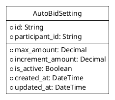

| TÊN THUỘC TÍNH  | KIỂU DỮ LIỆU | RÀNG BUỘC                                              | Ý NGHĨA                                    |
| :-------------- | :----------- | :----------------------------------------------------- | :----------------------------------------- |
| id              | String       | Khóa chính; bắt buộc; duy nhất                         | Định danh cấu hình trả giá tự động         |
| participantId   | String       | Bắt buộc; Khóa ngoại tham chiếu đến AuctionParticipant | ID người dùng cài đặt                      |
| maxAmount       | Decimal      | Bắt buộc                                               | Mức giá cao nhất hệ thống được tự động trả |
| incrementAmount | Decimal      | Bắt buộc                                               | Bước giá tự động cộng thêm mỗi lần         |
| isActive        | Boolean      | Bắt buộc; Mặc định là true                             | Trạng thái kích hoạt tính năng             |
| createdAt       | DateTime     | Bắt buộc; Mặc định là bây giờ                          | Thời điểm cài đặt                          |
| updatedAt       | DateTime     | Bắt buộc; Tự động cập nhật thời gian                   | Thời điểm cập nhật cài đặt                 |

---

### Table: Contract

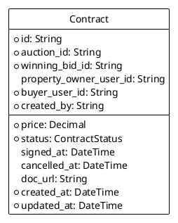

| TÊN THUỘC TÍNH      | KIỂU DỮ LIỆU   | RÀNG BUỘC                                      | Ý NGHĨA                                |
| :------------------ | :------------- | :--------------------------------------------- | :------------------------------------- |
| id                  | String         | Khóa chính; bắt buộc; duy nhất                 | Định danh hợp đồng trúng đấu giá       |
| auctionId           | String         | Bắt buộc; Khóa ngoại tham chiếu đến Auction    | ID cuộc đấu giá thành công             |
| winningBidId        | String         | Bắt buộc; Khóa ngoại tham chiếu đến AuctionBid | ID lượt trả giá thắng cuộc             |
| propertyOwnerUserId | String         | Tùy chọn; Khóa ngoại tham chiếu đến User       | ID người bán/chủ tài sản               |
| buyerUserId         | String         | Bắt buộc; Khóa ngoại tham chiếu đến User       | ID người mua/người trúng giá           |
| createdBy           | String         | Bắt buộc; Khóa ngoại tham chiếu đến User       | Quản trị viên tạo hợp đồng             |
| price               | Decimal        | Bắt buộc                                       | Giá trị mua bán cuối cùng              |
| status              | ContractStatus | Bắt buộc                                       | Trạng thái hợp đồng (Draft, Signed...) |
| signedAt            | DateTime       | Tùy chọn                                       | Thời điểm các bên ký kết               |
| cancelledAt         | DateTime       | Tùy chọn                                       | Thời điểm hợp đồng bị hủy bỏ           |
| docUrl              | String         | Tùy chọn                                       | Đường dẫn bản mềm hợp đồng (PDF)       |
| createdAt           | DateTime       | Bắt buộc; Mặc định là bây giờ                  | Thời điểm tạo bản ghi                  |
| updatedAt           | DateTime       | Bắt buộc; Tự động cập nhật thời gian           | Thời điểm cập nhật cuối cùng           |

---

### Table: AuctionAuditLog

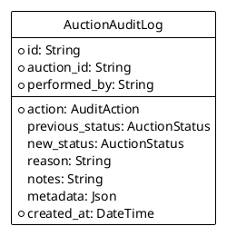

| TÊN THUỘC TÍNH | KIỂU DỮ LIỆU  | RÀNG BUỘC                                   | Ý NGHĨA                             |
| :------------- | :------------ | :------------------------------------------ | :---------------------------------- |
| id             | String        | Khóa chính; bắt buộc; duy nhất              | Định danh log lịch sử               |
| auctionId      | String        | Bắt buộc; Khóa ngoại tham chiếu đến Auction | Cuộc đấu giá bị tác động            |
| performedBy    | String        | Bắt buộc; Khóa ngoại tham chiếu đến User    | Người đã thực hiện hành động        |
| action         | AuditAction   | Bắt buộc                                    | Loại hành động thực hiện            |
| previousStatus | AuctionStatus | Tùy chọn                                    | Trạng thái cũ trước khi đổi         |
| newStatus      | AuctionStatus | Tùy chọn                                    | Trạng thái mới sau khi đổi          |
| reason         | String        | Tùy chọn                                    | Lý do (nếu hành động yêu cầu lý do) |
| notes          | String        | Tùy chọn                                    | Ghi chú thêm                        |
| metadata       | Json          | Tùy chọn                                    | Thông tin kỹ thuật chi tiết         |
| createdAt      | DateTime      | Bắt buộc; Mặc định là bây giờ               | Thời gian ghi nhận hành động        |

---

### Table: Payment

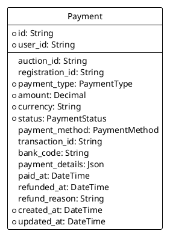

| TÊN THUỘC TÍNH | KIỂU DỮ LIỆU  | RÀNG BUỘC                                   | Ý NGHĨA                                       |
| :------------- | :------------ | :------------------------------------------ | :-------------------------------------------- |
| id             | String        | Khóa chính; bắt buộc; duy nhất              | Định danh giao dịch                           |
| userId         | String        | Bắt buộc; Khóa ngoại tham chiếu đến User    | Người thực hiện thanh toán                    |
| auctionId      | String        | Tùy chọn; Khóa ngoại tham chiếu đến Auction | Liên kết tới cuộc đấu giá                     |
| registrationId | String        | Tùy chọn                                    | Liên kết tới đăng ký tham gia                 |
| paymentType    | PaymentType   | Bắt buộc                                    | Mục đích thanh toán (cọc, phí hồ sơ...)       |
| amount         | Decimal       | Bắt buộc                                    | Tổng số tiền giao dịch                        |
| currency       | String        | Bắt buộc; Mặc định là "VND"                 | Đơn vị tiền tệ                                |
| status         | PaymentStatus | Bắt buộc; Mặc định là pending               | Trạng thái xử lý giao dịch                    |
| paymentMethod  | PaymentMethod | Tùy chọn                                    | Hình thức (bank_transfer, e_wallet...)        |
| transactionId  | String        | Tùy chọn                                    | Mã số tham chiếu từ ngân hàng/cổng thanh toán |
| bankCode       | String        | Tùy chọn                                    | Tên Ngân hàng                                 |
| paymentDetails | Json          | Tùy chọn                                    | Toàn bộ dữ liệu phản hồi từ cổng thanh toán   |
| paidAt         | DateTime      | Tùy chọn                                    | Thời điểm tiền vào tài khoản hệ thống         |
| refundedAt     | DateTime      | Tùy chọn                                    | Thời điểm hoàn tiền thành công                |
| refundReason   | String        | Tùy chọn                                    | Lý do hoàn trả tiền                           |
| createdAt      | DateTime      | Bắt buộc; Mặc định là bây giờ               | Thời điểm tạo lệnh                            |
| updatedAt      | DateTime      | Bắt buộc; Tự động cập nhật thời gian        | Thời điểm cập nhật lệnh                       |

---

### Table: Article

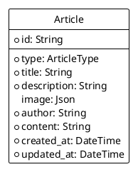

| TÊN THUỘC TÍNH | KIỂU DỮ LIỆU | RÀNG BUỘC                            | Ý NGHĨA                                   |
| :------------- | :----------- | :----------------------------------- | :---------------------------------------- |
| id             | String       | Khóa chính; bắt buộc; duy nhất       | Định danh bài viết                        |
| type           | ArticleType  | Bắt buộc                             | Thể loại (Tin tức, Thông báo, Pháp lý...) |
| title          | String       | Bắt buộc                             | Tựa đề bài viết                           |
| description    | String       | Bắt buộc                             | Đoạn mô tả ngắn/Lời dẫn                   |
| image          | Json         | Tùy chọn                             | Hình ảnh đại diện bài viết                |
| author         | String       | Bắt buộc                             | Tác giả bài viết                          |
| content        | String       | Bắt buộc                             | Nội dung chi tiết (HTML/MD)               |
| createdAt      | DateTime     | Bắt buộc; Mặc định là bây giờ        | Thời điểm xuất bản                        |
| updatedAt      | DateTime     | Bắt buộc; Tự động cập nhật thời gian | Thời điểm chỉnh sửa gần nhất              |

---

### Table: ArticleRelation

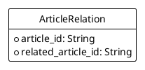

| TÊN THUỘC TÍNH   | KIỂU DỮ LIỆU | RÀNG BUỘC                        | Ý NGHĨA               |
| :--------------- | :----------- | :------------------------------- | :-------------------- |
| articleId        | String       | Khóa chính; Bắt buộc; Khóa ngoại | ID bài viết hiện tại  |
| relatedArticleId | String       | Khóa chính; Bắt buộc; Khóa ngoại | ID bài viết liên quan |
