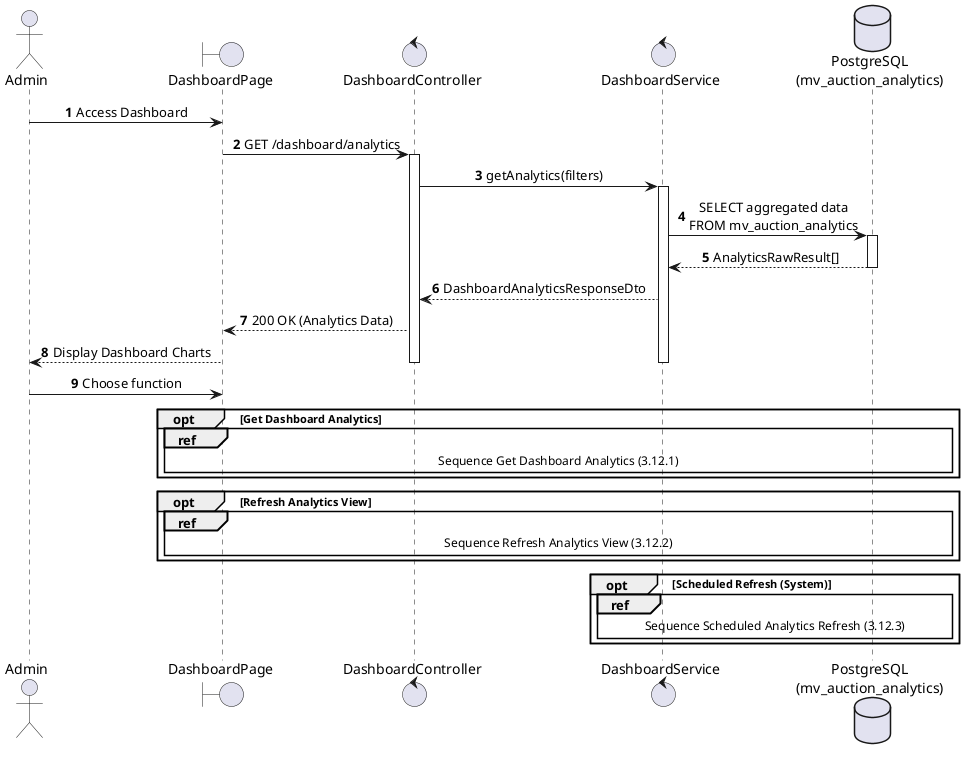
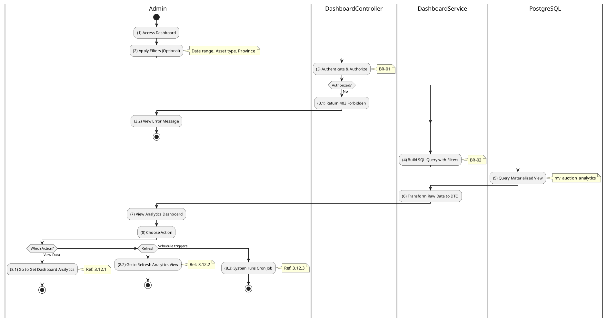

# Use Case 3.12.0: Manage Dashboard Analytics

## 1. Use Case Description

| Field              | Content                                                                                                                                                                                           |
| :----------------- | :------------------------------------------------------------------------------------------------------------------------------------------------------------------------------------------------ |
| **Name**           | Manage Dashboard Analytics                                                                                                                                                                        |
| **Description**    | This use case allows the **Admin** to view aggregated analytics data from the admin dashboard, powered by a PostgreSQL materialized view for high performance.                                    |
| **Actor**          | **Admin**, **Super Admin**, **System**                                                                                                                                                            |
| **Trigger**        | When the **Admin** navigates to the "**Dashboard**" page or when the system executes the scheduled refresh job.                                                                                   |
| **Pre-condition**  | 1. **Admin**'s device must be connected to the internet. 2. **Admin** is signed in with `admin` or `super_admin` role. 3. The materialized view `mv_auction_analytics` must be initialized. |
| **Post-condition** | The analytics data is retrieved and displayed, or the materialized view is refreshed with latest auction data.                                                                                    |

---

## 2. Sequence Flow

---

## 3. Activities Flow (Swimlanes)

---

## 4. Business Rules

| Activity | BR Code   | Description                                                                                                                                                                                                                                                                                                                                                                     |
| :------- | :-------- | :------------------------------------------------------------------------------------------------------------------------------------------------------------------------------------------------------------------------------------------------------------------------------------------------------------------------------------------------------------------------------ |
| **(3)**  | **BR-01** | **Authorization Rules:** ❖ The system uses `RolesGuard` to verify the user's role. ❖ Only users with `admin` or `super_admin` role can access dashboard endpoints. ❖ If the user's role is not authorized, the system returns a 403 Forbidden status.                                                                                                                  |
| **(4)**  | **BR-02** | **Query Construction Rules:** ❖ The system uses Prisma's tagged template literals (`Prisma.sql`) to prevent SQL injection. ❖ All dynamic parameters (dates, assetType, provinceId) are safely escaped. ❖ Default date range is from `2000-01-01` to current date if not specified. ❖ Multiple filter conditions are joined with AND operator.                       |
| **(5)**  | **BR-03** | **Materialized View Rules:** ❖ The view `mv_auction_analytics` must exist before querying. ❖ If the view does not exist, the system returns a 500 error with helpful message to run setup script. ❖ The view uses concurrent refresh to allow reads during update. ❖ A unique index (`idx_mv_unique_id`) is required for concurrent refresh.                        |
| **(7)**  | **BR-04** | **Display Rules:** ❖ The system renders summary cards showing: [Total GMV], [Total Revenue], [Avg Bids], [Success Rate %], [Total Auctions], [Successful Auctions]. ❖ Time series data is displayed as line/bar charts grouped by day, week, or month. ❖ Numeric values are formatted for Vietnamese locale (VND currency).                                            |
| **(8)**  | **BR-05** | **Refresh Rules:** ❖ Manual refresh via `POST /dashboard/analytics/refresh` triggers immediate view refresh. ❖ Automatic refresh runs every hour via `@Cron(CronExpression.EVERY_HOUR)`. ❖ AuctionFinalizationService triggers refresh after auction closes for timely updates. ❖ Concurrent refresh allows uninterrupted read access during the refresh operation. |

---

## 5. Related Child Use Cases

| Use Case ID | Use Case Name               | Description                                              |
| :---------- | :-------------------------- | :------------------------------------------------------- |
| 3.12.1      | Get Dashboard Analytics     | Retrieve aggregated analytics data with optional filters |
| 3.12.2      | Refresh Analytics View      | Manually trigger materialized view refresh               |
| 3.12.3      | Scheduled Analytics Refresh | Automatic hourly refresh via cron job                    |
