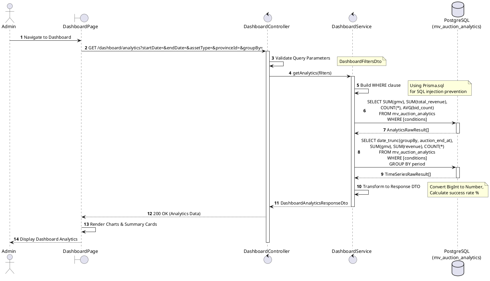
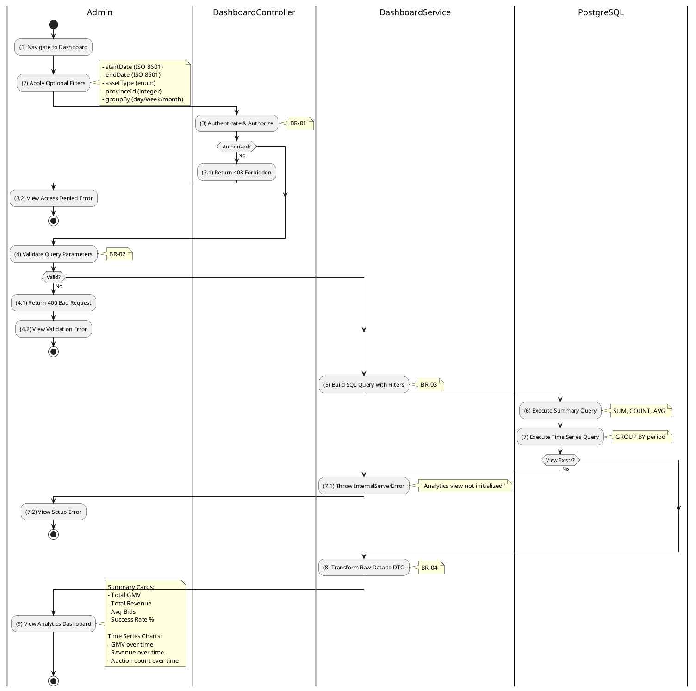

# 3.12.1 Get Dashboard Analytics

## 1. Use Case Description

| Field              | Description                                                                                                                                                                          |
| ------------------ | ------------------------------------------------------------------------------------------------------------------------------------------------------------------------------------ |
| **Name**           | Get Dashboard Analytics                                                                                                                                                              |
| **Description**    | This use case allows the Admin to retrieve aggregated analytics data from the admin dashboard, with optional filters for date range, asset type, province, and time series grouping. |
| **Actor**          | Admin, Super Admin                                                                                                                                                                   |
| **Trigger**        | When the Admin navigates to the "Dashboard" page or requests `GET /dashboard/analytics`.                                                                                             |
| **Pre-condition**  | • Admin's device must be connected to the internet.<br>• Admin is signed in with `admin` or `super_admin` role.<br>• Materialized view `mv_auction_analytics` has been initialized.  |
| **Post-condition** | The aggregated analytics data is retrieved from the materialized view and displayed to the Admin.                                                                                    |

## 2. Sequence Flow (MVC)



## 3. Activities Flow (Swimlanes)



## 4. Business Rules

| Activity | BR Code   | Description                                                                                                                                                                                                                                                                                                                                                                                                                                                                        |
| :------- | :-------- | :--------------------------------------------------------------------------------------------------------------------------------------------------------------------------------------------------------------------------------------------------------------------------------------------------------------------------------------------------------------------------------------------------------------------------------------------------------------------------------- |
| **(3)**  | **BR-01** | **Authorization Rules (Back-end):**<br>❖ The system uses `RolesGuard` decorator to check user role.<br>❖ The `@Roles(UserRole.admin, UserRole.super_admin)` decorator enforces role requirement.<br>❖ If the user's role is not `admin` or `super_admin`, the system returns 403 Forbidden status.<br>❖ Valid JWT token is required in the Authorization header.                                                                                                                   |
| **(4)**  | **BR-02** | **Validation Rules:**<br>❖ `startDate` must be a valid ISO 8601 date string (validated by `@IsDateString()`).<br>❖ `endDate` must be a valid ISO 8601 date string.<br>❖ `assetType` must be a valid `AssetType` enum value (validated by `@IsEnum(AssetType)`).<br>❖ `provinceId` must be a valid integer (validated by `@IsInt()`).<br>❖ `groupBy` must be one of: `day`, `week`, `month` (default: `day`).                                                                       |
| **(5)**  | **BR-03** | **Query Construction Rules (SQL Injection Prevention):**<br>❖ The system uses `Prisma.sql` tagged template literals for secure query building.<br>❖ All dynamic filter values are properly escaped using Prisma's parameterized queries.<br>❖ Default date range: `2000-01-01` to current date if not specified.<br>❖ Filter conditions are joined using `Prisma.join(conditions, ' AND ')`.<br>❖ The `auction_end_at` column is used as the base time filter.                     |
| **(8)**  | **BR-04** | **Data Transformation Rules:**<br>❖ PostgreSQL `COUNT(*)` returns `bigint`, which is converted to JavaScript `number` using `Number()` constructor.<br>❖ PostgreSQL `DECIMAL` values are converted to JavaScript `number` for JSON serialization.<br>❖ Success rate is calculated as: `(successCount / totalCount) * 100`, rounded to 2 decimal places.<br>❖ Time series dates are converted to ISO 8601 string format.<br>❖ Null GMV/revenue values default to 0 for display.     |
| **(9)**  | **BR-05** | **Display Rules (Front-end):**<br>❖ Summary section displays six KPI cards: [Total GMV], [Total Revenue], [Avg Bids], [Success Rate %], [Total Auctions], [Successful Auctions].<br>❖ Monetary values are formatted as Vietnamese Dong (VND) with thousand separators.<br>❖ Time series data is rendered as interactive charts (line/bar).<br>❖ Charts support zooming and tooltips for detailed information.<br>❖ Filter controls allow dynamic data refresh without page reload. |

## 5. Response Structure

### Success Response (200 OK)

```typescript
{
  summary: {
    totalGmv: number,           // e.g., 15000000000 (VND)
    totalRevenue: number,       // e.g., 450000000 (VND)
    avgBids: number,            // e.g., 12.4
    successRatePercentage: number, // e.g., 82.5
    totalAuctions: number,      // e.g., 150
    successfulAuctions: number  // e.g., 124
  },
  timeSeries: [
    {
      date: string,             // e.g., "2025-12-01T00:00:00.000Z"
      gmv: number,              // e.g., 500000000
      revenue: number,          // e.g., 15000000
      auctionCount: number      // e.g., 5
    }
    // ... more data points
  ]
}
```

### Error Responses

| Status | Description                                      |
| ------ | ------------------------------------------------ |
| 400    | Invalid query parameters (validation error)      |
| 401    | Unauthorized - valid JWT token required          |
| 403    | Forbidden - admin or super_admin role required   |
| 500    | Analytics view not initialized or database error |
