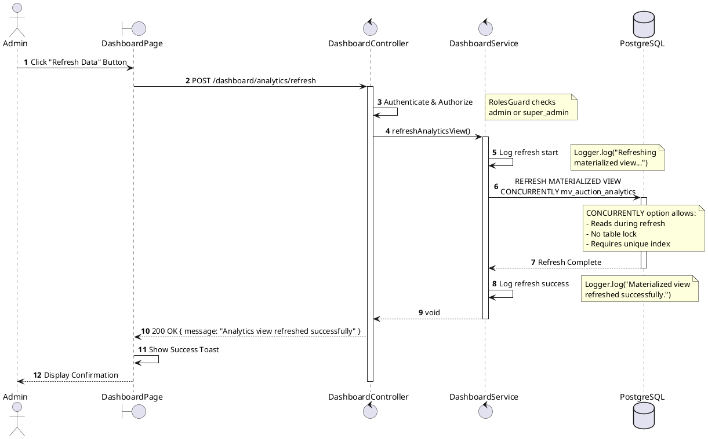
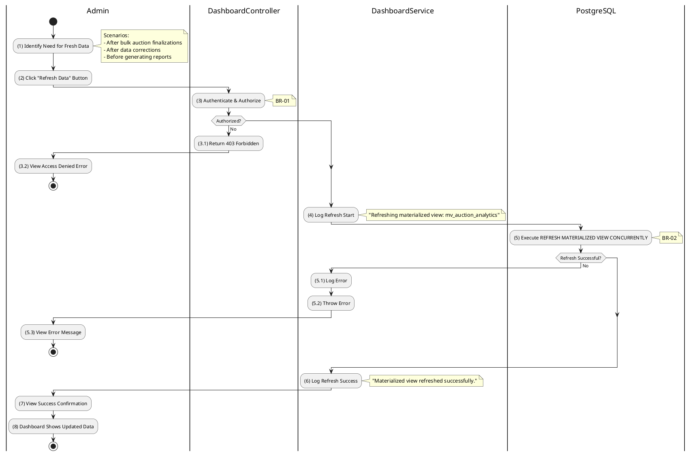

# 3.12.2 Refresh Analytics View

## 1. Use Case Description

| Field              | Description                                                                                                                                                                         |
| ------------------ | ----------------------------------------------------------------------------------------------------------------------------------------------------------------------------------- |
| **Name**           | Refresh Analytics View                                                                                                                                                              |
| **Description**    | This use case allows the Admin to manually trigger a refresh of the `mv_auction_analytics` materialized view to reflect the latest auction data immediately.                        |
| **Actor**          | Admin, Super Admin                                                                                                                                                                  |
| **Trigger**        | When the Admin sends a request to `POST /dashboard/analytics/refresh` after significant data changes.                                                                               |
| **Pre-condition**  | • Admin's device must be connected to the internet.<br>• Admin is signed in with `admin` or `super_admin` role.<br>• Materialized view `mv_auction_analytics` has been initialized. |
| **Post-condition** | The materialized view is refreshed with the latest auction data, making new analytics immediately available.                                                                        |

## 2. Sequence Flow (MVC)



## 3. Activities Flow (Swimlanes)



## 4. Business Rules

| Activity | BR Code   | Description                                                                                                                                                                                                                                                                                                                                                                                                                                            |
| :------- | :-------- | :----------------------------------------------------------------------------------------------------------------------------------------------------------------------------------------------------------------------------------------------------------------------------------------------------------------------------------------------------------------------------------------------------------------------------------------------------- |
| **(3)**  | **BR-01** | **Authorization Rules (Back-end):**<br>❖ The system uses `RolesGuard` decorator to check user role.<br>❖ The `@Roles(UserRole.admin, UserRole.super_admin)` decorator enforces role requirement.<br>❖ If the user's role is not `admin` or `super_admin`, the system returns 403 Forbidden status.<br>❖ Valid JWT token is required in the Authorization header.                                                                                       |
| **(5)**  | **BR-02** | **Concurrent Refresh Rules:**<br>❖ The system uses `REFRESH MATERIALIZED VIEW CONCURRENTLY` command.<br>❖ This option requires a unique index on the materialized view (`idx_mv_unique_id` on `id` column).<br>❖ Concurrent refresh allows ongoing read queries to continue without blocking.<br>❖ The refresh operation recalculates all aggregated data from the source tables.<br>❖ If the unique index is missing, PostgreSQL will throw an error. |
| **(5)**  | **BR-03** | **Error Handling Rules:**<br>❖ If the materialized view does not exist, the system logs the error and throws an exception.<br>❖ If the unique index is missing, PostgreSQL returns an error about concurrent refresh requirements.<br>❖ All errors are logged via `Logger.error()` with full stack trace.<br>❖ The original error is re-thrown to propagate to the controller.                                                                         |
| **(6)**  | **BR-04** | **Logging Rules:**<br>❖ The system logs the start of refresh operation: "Refreshing materialized view: mv_auction_analytics".<br>❖ On success, logs: "Materialized view refreshed successfully."<br>❖ On failure, logs error with stack trace for debugging.                                                                                                                                                                                           |
| **(8)**  | **BR-05** | **Data Freshness Rules:**<br>❖ After refresh, the materialized view contains the latest auction data from source tables.<br>❖ The view aggregates data from: Auction, AuctionBid, AuctionParticipant, Contract tables.<br>❖ Calculated fields include: GMV (final sale price), commission fees, dossier fees, bid counts.<br>❖ Subsequent GET requests will return the newly refreshed data.                                                           |

## 5. Technical Details

### PostgreSQL Command

```sql
REFRESH MATERIALIZED VIEW CONCURRENTLY mv_auction_analytics;
```

### Prerequisites

The materialized view requires:

1. **Unique Index**: `idx_mv_unique_id` on the `id` column
2. **Source Tables**: Auction, AuctionBid, AuctionParticipant, Contract, AuctionCost

### Performance Considerations

| Factor             | Impact                                            |
| ------------------ | ------------------------------------------------- |
| Concurrent Refresh | Allows reads during refresh (no downtime)         |
| Refresh Duration   | Depends on data volume (typically seconds)        |
| Lock Level         | No exclusive lock (ShareUpdateExclusiveLock only) |
| Index Requirement  | Unique index is mandatory for CONCURRENTLY option |

## 6. Response Structure

### Success Response (200 OK)

```json
{
  "message": "Analytics view refreshed successfully"
}
```

### Error Responses

| Status | Description                                       |
| ------ | ------------------------------------------------- |
| 401    | Unauthorized - valid JWT token required           |
| 403    | Forbidden - admin or super_admin role required    |
| 500    | Refresh failed (view not found or database error) |
