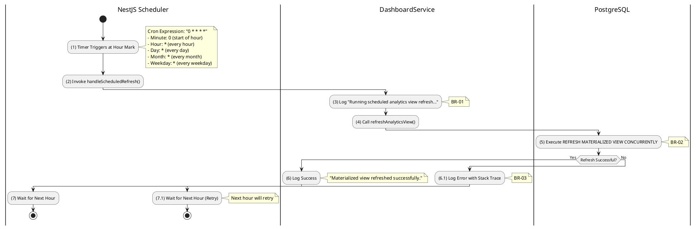

# 3.12.3 Scheduled Analytics Refresh

## 1. Use Case Description

| Field              | Description                                                                                                                                                     |
| ------------------ | --------------------------------------------------------------------------------------------------------------------------------------------------------------- |
| **Name**           | Scheduled Analytics Refresh                                                                                                                                     |
| **Description**    | This use case describes the automated cron job that refreshes the `mv_auction_analytics` materialized view every hour to ensure analytics data remains current. |
| **Actor**          | System (Cron Job)                                                                                                                                               |
| **Trigger**        | The NestJS scheduler triggers this job automatically every hour using `@Cron(CronExpression.EVERY_HOUR)`.                                                       |
| **Pre-condition**  | • The server is running.<br>• The `@nestjs/schedule` module is enabled.<br>• Materialized view `mv_auction_analytics` has been initialized.                     |
| **Post-condition** | The materialized view is refreshed with the latest auction data, ensuring dashboard shows current information.                                                  |

## 2. Sequence Flow (MVC)

```plantuml
@startuml
autonumber
skinparam sequenceMessageAlign center

actor "NestJS Scheduler" as Scheduler
control "DashboardService" as Service
database "PostgreSQL" as DB

Scheduler -> Scheduler: Trigger at start of each hour
note right: @Cron(EVERY_HOUR)\n"0 * * * *"

Scheduler -> Service: handleScheduledRefresh()
activate Service

Service -> Service: Log scheduled refresh start
note right: "Running scheduled analytics\nview refresh..."

Service -> Service: refreshAnalyticsView()
activate Service

Service -> DB: REFRESH MATERIALIZED VIEW\nCONCURRENTLY mv_auction_analytics
activate DB

alt Success
    DB --> Service: Refresh Complete
    deactivate DB

    Service -> Service: Log success
    note right: "Materialized view\nrefreshed successfully."

else Failure
    DB --> Service: Error

    Service -> Service: Log error with stack trace
    note right: Logger.error()

    Service --> Scheduler: Error (logged, not thrown)
endif

deactivate Service
deactivate Service
@enduml
```

## 3. Activities Flow (Swimlanes)



## 4. Business Rules

| Activity  | BR Code   | Description                                                                                                                                                                                                                                                                                                                                        |
| :-------- | :-------- | :------------------------------------------------------------------------------------------------------------------------------------------------------------------------------------------------------------------------------------------------------------------------------------------------------------------------------------------------- |
| **(3)**   | **BR-01** | **Logging Rules (Start):**<br>❖ The system logs the start of scheduled refresh: "Running scheduled analytics view refresh...".<br>❖ This log entry provides audit trail for automated refreshes.<br>❖ Logs are written using NestJS Logger service with DashboardService context.                                                                  |
| **(5)**   | **BR-02** | **Cron Schedule Rules:**<br>❖ The cron job uses `CronExpression.EVERY_HOUR` which translates to `0 * * * *`.<br>❖ This means the job runs at minute 0 of every hour (e.g., 1:00, 2:00, 3:00, etc.).<br>❖ The schedule is managed by `@nestjs/schedule` module.<br>❖ Job execution is non-blocking and runs in the background.                      |
| **(5)**   | **BR-03** | **Concurrent Refresh Rules:**<br>❖ Uses `REFRESH MATERIALIZED VIEW CONCURRENTLY` for non-blocking refresh.<br>❖ Dashboard queries continue to work during refresh using stale data.<br>❖ Once refresh completes, new data is atomically available.<br>❖ Requires unique index `idx_mv_unique_id` on the view's `id` column.                        |
| **(6.1)** | **BR-04** | **Error Handling Rules:**<br>❖ Errors are logged but NOT re-thrown to prevent crashing the scheduler.<br>❖ Full stack trace is logged for debugging: `Logger.error('...', error.stack)`.<br>❖ Failed refreshes will be retried automatically at the next hourly interval.<br>❖ Persistent failures should trigger alerting (optional integration). |
| **(7)**   | **BR-05** | **Safety Net Purpose:**<br>❖ This scheduled job serves as a "safety net" in case triggered refreshes fail.<br>❖ Primary refresh is triggered by AuctionFinalizationService after auction closes.<br>❖ Hourly refresh ensures data is never more than 1 hour stale.<br>❖ Covers edge cases where triggered refresh might be missed.                 |

## 5. Technical Implementation

### NestJS Decorator

```typescript
@Cron(CronExpression.EVERY_HOUR)
async handleScheduledRefresh(): Promise<void> {
  this.logger.log('Running scheduled analytics view refresh...');
  await this.refreshAnalyticsView();
}
```

### Cron Expression Breakdown

| Field   | Value | Meaning       |
| ------- | ----- | ------------- |
| Minute  | 0     | At minute 0   |
| Hour    | \*    | Every hour    |
| Day     | \*    | Every day     |
| Month   | \*    | Every month   |
| Weekday | \*    | Every weekday |

### Execution Timeline (Example)

| Time     | Action                                     |
| -------- | ------------------------------------------ |
| 13:00:00 | Cron triggers handleScheduledRefresh()     |
| 13:00:00 | Log: "Running scheduled analytics view..." |
| 13:00:02 | REFRESH MATERIALIZED VIEW completes        |
| 13:00:02 | Log: "Materialized view refreshed..."      |
| 14:00:00 | Next scheduled execution                   |

## 6. Dependencies

### Module Requirements

```typescript
// app.module.ts
import { ScheduleModule } from '@nestjs/schedule';

@Module({
  imports: [
    ScheduleModule.forRoot(), // Enables cron jobs
    // ... other modules
  ]
})
```

### Database Requirements

1. Materialized view `mv_auction_analytics` must exist
2. Unique index `idx_mv_unique_id` must exist for concurrent refresh

## 7. Refresh Triggers Summary

| Trigger Type     | Schedule       | Description                                  |
| ---------------- | -------------- | -------------------------------------------- |
| **Scheduled**    | Every hour     | Safety net via `@Cron(EVERY_HOUR)`           |
| **Manual**       | On demand      | Admin triggers via POST /analytics/refresh   |
| **Event-driven** | After finalize | AuctionFinalizationService calls after close |
