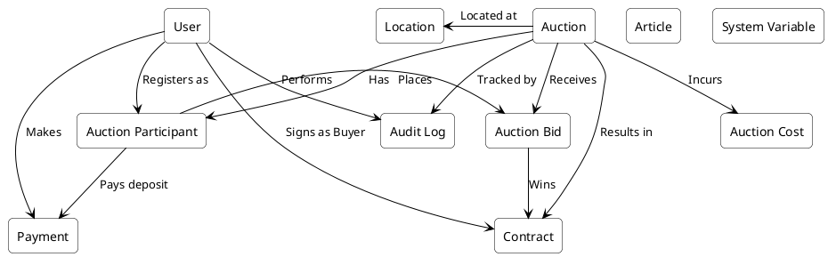
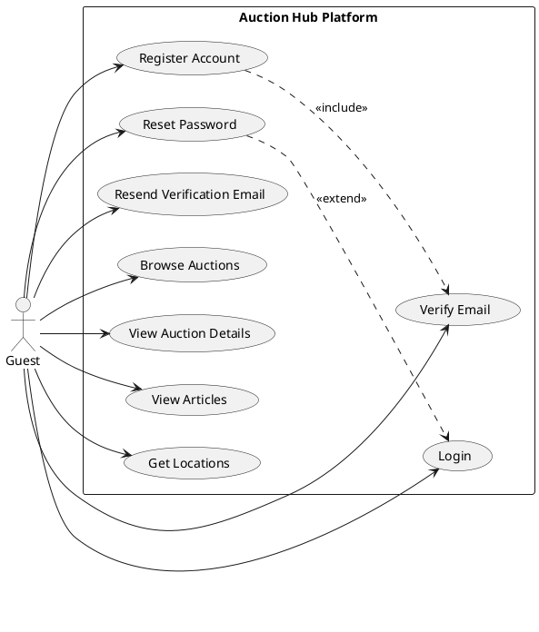
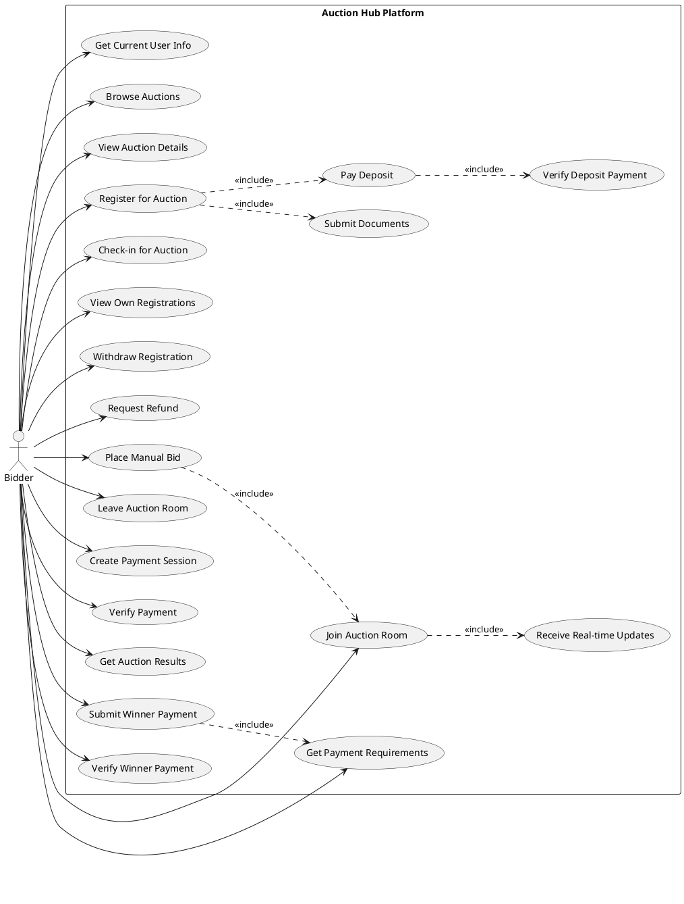
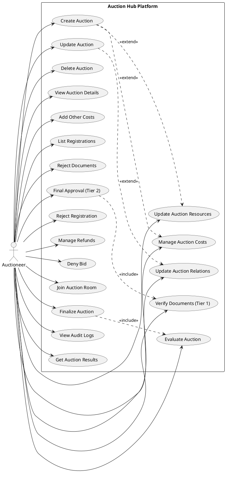
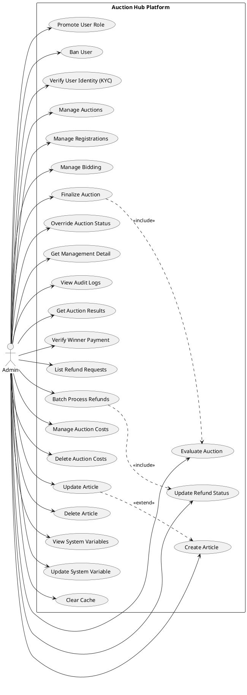
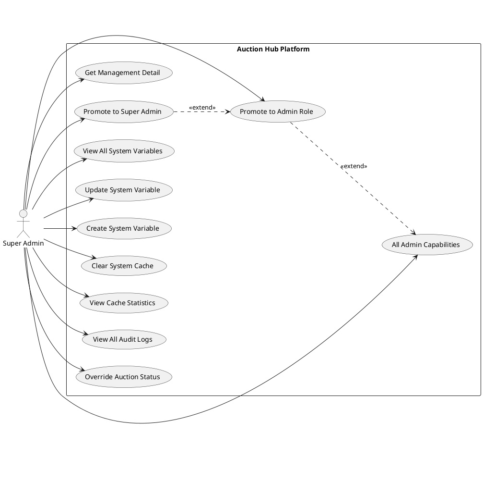
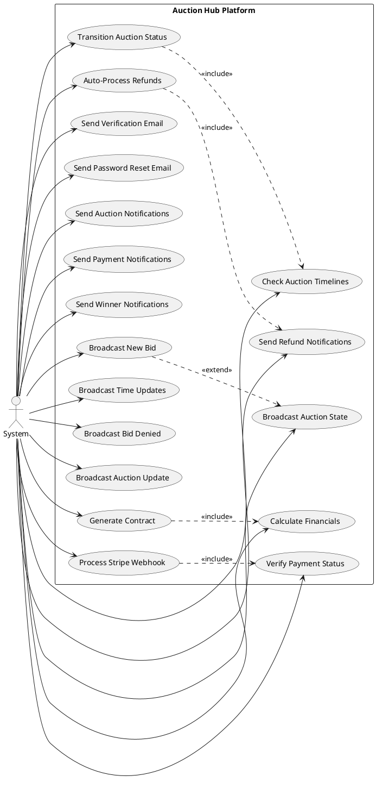
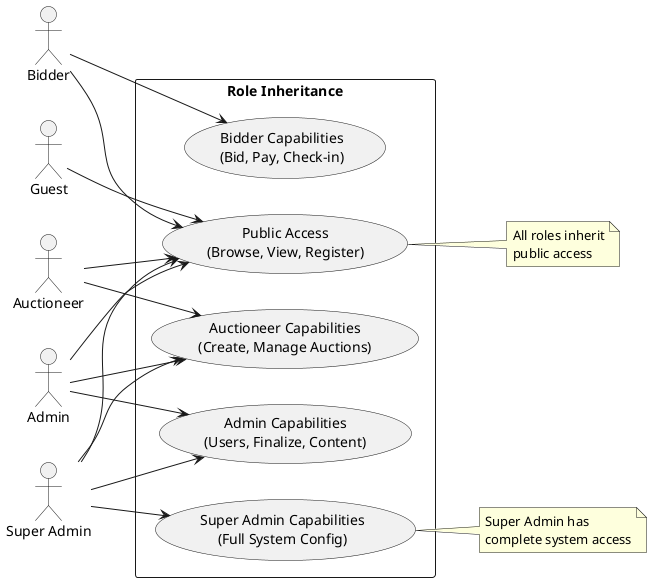

# Business Requirements Document (BRD)

# Auction Hub - Vietnamese Auction Platform

# Nền tảng Đấu giá Việt Nam

---

**Document Title:** Business Requirements Document  
**Project Name:** Auction Hub  
**Date:** December 23, 2025  
**Version:** 0.1  
**Prepared by:** AI Business Analyst

---

## Revision History

| Date       | Version | Author              | Change Description                                   |
| :--------- | :------ | :------------------ | :--------------------------------------------------- |
| 2025-12-23 | 0.1     | AI Business Analyst | Initial document creation based on codebase analysis |

---

## Approval

| Date | Version | Approver Name | Position        |
| :--- | :------ | :------------ | :-------------- |
|      | 0.1     |               | Project Sponsor |
|      | 0.1     |               | Product Owner   |
|      | 0.1     |               | Technical Lead  |

---

## Table of Contents

1. [Objective and Scope](#1-objective-and-scope)
2. [Business Requirement](#2-business-requirement)
   - 2.1 [Application Overview](#21-application-overview)
   - 2.2 [Domain Model](#22-domain-model)
   - 2.3 [Use Cases and Actors](#23-use-cases-and-actors)
   - 2.4 [Security Matrix](#24-security-matrix)
   - 2.5 [Change Requirement](#25-change-requirement)
3. [Appendix](#3-appendix)
   - 3.1 [Glossary](#31-glossary)
   - 3.2 [Mapping to Application](#32-mapping-to-application)
   - 3.3 [Open Issues](#33-open-issues)

---

## 1. Objective and Scope

### 1.1 Objective

This Business Requirements Document (BRD) defines the business requirements for the **Auction Hub** platform—a comprehensive Vietnamese online auction system designed to facilitate the legal auction of various asset types in compliance with Vietnamese regulations (Nghị định 17/2010/NĐ-CP).

The platform enables property owners to list assets for auction, allows bidders to participate in real-time bidding sessions, and provides administrators with tools to manage the complete auction lifecycle from registration to finalization and payment processing.

### 1.2 Scope

The Auction Hub platform supports the following business capabilities:

- **User Management**: Registration, authentication, role-based access control, and identity verification (KYC)
- **Auction Management**: Creation, scheduling, and lifecycle management of auction listings
- **Bidder Registration**: Multi-tier approval process with document verification and deposit payment
- **Real-time Bidding**: Live auction participation via WebSocket with manual bidding capabilities
- **Auction Finalization**: Winner determination, contract generation, and audit trail maintenance
- **Payment Processing**: Stripe integration for deposits, winning payments, and automated refund processing
- **System Configuration**: Centralized management of fees, policies, and system variables
- **Content Management**: Articles, news, and legal document publication

**Asset Types Supported:**

- Tài sản bảo đảm (Secured Assets)
- Quyền sử dụng đất (Land Use Rights)
- Tài sản vi phạm hành chính (Administrative Violation Assets)
- Tài sản nhà nước (State Assets)
- Tài sản thi hành án (Enforcement Assets)
- Tài sản khác (Other Assets)

### 1.3 Purpose of This Document

This document serves to:

1. Define the business requirements derived from analyzing the existing Auction Hub codebase
2. Provide a formal reference for stakeholders to understand system capabilities
3. Establish traceability between business needs and technical implementation
4. Support future development, maintenance, and enhancement decisions

---

## 2. Business Requirement

### 2.1 Application Overview

**Auction Hub** is a full-featured Vietnamese online auction platform built using modern web technologies. The system provides a secure, transparent, and legally compliant environment for conducting asset auctions.

**Key Business Functions:**

1. **User Lifecycle Management**: The platform manages user accounts from registration through verification, supporting both individual and business users. Users can progress through roles from Bidder to Auctioneer to Admin based on system needs and approvals.

2. **Auction Lifecycle**: Auctions follow a defined lifecycle: `scheduled` → `live` → `awaiting_result` → `success/failed`. Each phase has specific business rules governing participant actions and system behaviors.

3. **Two-Tier Approval Process**: Bidder registration employs a rigorous two-tier verification:

   - **Tier 1**: Document verification by administrators
   - **Tier 2**: Deposit payment verification

4. **Real-time Bidding Engine**: During live auctions, the system provides real-time bid updates, countdown timers, and instant notifications via WebSocket connections.

5. **Financial Processing**: The platform integrates with Stripe for payment processing and implements Vietnamese regulatory requirements for deposit handling, including automatic refunds for non-winners within 3 business days.

6. **Compliance & Audit**: Complete audit trail maintenance ensures regulatory compliance with Vietnamese auction laws.

---

### 2.2 Domain Model

#### 2.2.1 Domain Model Diagram

#### 2.2.2 Domain Objects Description

| #   | Object Name             | Object Description                                                                                                                                                                                                                      |
| :-- | :---------------------- | :-------------------------------------------------------------------------------------------------------------------------------------------------------------------------------------------------------------------------------------- |
| 1   | **User**                | Represents platform users including Bidders, Auctioneers, Admins, and Super Admins. Contains identity information, verification status, role, and rating score. Supports both individual and business user types.                       |
| 2   | **Auction**             | The core entity representing an auction listing. Contains asset details, timeline (sale period, deposit deadline, auction window), pricing configuration (starting price, bid increment, reserve price), and status lifecycle tracking. |
| 3   | **Auction Participant** | Junction entity linking Users to Auctions. Tracks the complete registration workflow including document submission, verification, deposit payment, check-in status, and refund state.                                                   |
| 4   | **Auction Bid**         | Represents individual bids placed during a live auction. Tracks bid amount, timestamp, type (manual/auto), and status (winning, denied, withdrawn).                                                                                     |
| 5   | **Contract**            | Legal agreement generated after successful auction completion. Links the winning bid, buyer, and property owner with contract status tracking.                                                                                          |
| 6   | **Payment**             | Financial transaction records including deposits, participation fees, winning payments, and refunds. Integrates with Stripe for processing.                                                                                             |
| 7   | **Location**            | Hierarchical geographic data (Province → District → Ward) used for asset addressing across Vietnam.                                                                                                                                     |
| 8   | **Article**             | Content management entity for news, auction notices, result reports, and legal documents.                                                                                                                                               |
| 9   | **System Variable**     | Configuration settings stored in database including fee percentages, deposit rules, and policy parameters. Supports runtime modification by administrators.                                                                             |
| 10  | **Auction Cost**        | Variable costs associated with each auction (advertising, venue rental, appraisal, asset viewing, and miscellaneous costs).                                                                                                             |
| 11  | **Audit Log**           | Immutable record of significant actions performed on auctions for compliance and accountability purposes.                                                                                                                               |

---

### 2.3 Use Cases and Actors

#### 2.3.1 Use Case Diagrams

##### 2.3.1.1 System Level Overview

```plantuml
@startuml
left to right direction
skinparam packageStyle rectangle

actor "Guest" as Guest
actor "Bidder" as Bidder
actor "Auctioneer" as Auctioneer
actor "Admin" as Admin
actor "Super Admin" as SuperAdmin
actor "System" as System

rectangle "Auction Hub Platform" {
    package "Authentication & Profile" {
        usecase "Register Account" as UC_01
        usecase "Login" as UC_02
        usecase "Verify Email" as UC_03
        usecase "Reset Password" as UC_04
        usecase "Resend Verification Email" as UC_05
        usecase "Get Current User Info" as UC_06
        usecase "Verify User Identity (KYC)" as UC_49
    }

    package "Auction Browsing" {
        usecase "Browse Auctions" as UC_07
        usecase "View Auction Details" as UC_08
        usecase "View Articles" as UC_09
        usecase "Get Locations" as UC_10
    }

    package "Auction Management" {
        usecase "Create Auction" as UC_11
        usecase "Update Auction" as UC_12
        usecase "Delete Auction" as UC_13
        usecase "Update Auction Relations" as UC_14
        usecase "Update Auction Resources" as UC_15
        usecase "Manage Auction Costs" as UC_16
        usecase "Add Other Costs" as UC_17
        usecase "Delete Auction Costs" as UC_18
    }

    package "Registration to Bid" {
        usecase "Register for Auction" as UC_19
        usecase "Submit Documents" as UC_20
        usecase "Pay Deposit" as UC_21
        usecase "Verify Deposit Payment" as UC_22
        usecase "Check-in for Auction" as UC_23
        usecase "View Own Registrations" as UC_24
        usecase "Withdraw Registration" as UC_25
        usecase "List Registrations" as UC_26
        usecase "Verify Documents (Tier 1)" as UC_27
        usecase "Reject Documents" as UC_28
        usecase "Final Approval (Tier 2)" as UC_29
        usecase "Reject Registration" as UC_30
    }

    package "Bidding System" {
        usecase "Join Auction Room" as UC_31
        usecase "Place Manual Bid" as UC_32
        usecase "Receive Real-time Updates" as UC_33
        usecase "Leave Auction Room" as UC_34
        usecase "Deny Bid" as UC_35
        usecase "Broadcast Auction State" as UC_36
        usecase "Broadcast New Bid" as UC_37
        usecase "Broadcast Time Updates" as UC_38
        usecase "Broadcast Bid Denied" as UC_39
        usecase "Broadcast Auction Update" as UC_40
    }

    package "Finalization & Contract" {
        usecase "Evaluate Auction" as UC_41
        usecase "Finalize Auction" as UC_42
        usecase "Override Auction Status" as UC_43
        usecase "Get Auction Results" as UC_44
        usecase "View Audit Logs" as UC_45
        usecase "Generate Contract" as UC_46
        usecase "Calculate Financials" as UC_47
    }

    package "Payment & Refunds" {
        usecase "Create Payment Session" as UC_48
        usecase "Verify Payment" as UC_50
        usecase "Get Payment Requirements" as UC_51
        usecase "Submit Winner Payment" as UC_52
        usecase "Verify Winner Payment" as UC_53
        usecase "Request Refund" as UC_54
        usecase "Manage Refunds" as UC_55
        usecase "List Refund Requests" as UC_56
        usecase "Update Refund Status" as UC_57
        usecase "Batch Process Refunds" as UC_58
        usecase "Auto-Process Refunds" as UC_59
        usecase "Process Stripe Webhook" as UC_60
        usecase "Verify Payment Status" as UC_61
    }

    package "Administration & Content" {
        usecase "Promote User Role" as UC_62
        usecase "Ban User" as UC_63
        usecase "Promote to Admin Role" as UC_64
        usecase "Promote to Super Admin" as UC_65
        usecase "View System Variables" as UC_66
        usecase "Update System Variable" as UC_67
        usecase "Create System Variable" as UC_68
        usecase "Clear Cache" as UC_69
        usecase "Get Management Detail" as UC_70
        usecase "Create Article" as UC_71
        usecase "Update Article" as UC_72
        usecase "Delete Article" as UC_73
    }

    package "System Automated" {
        usecase "Transition Auction Status" as UC_74
        usecase "Check Auction Timelines" as UC_75
        usecase "Send Verification Email" as UC_76
        usecase "Send Password Reset Email" as UC_77
        usecase "Send Auction Notifications" as UC_78
        usecase "Send Payment Notifications" as UC_79
        usecase "Send Refund Notifications" as UC_80
        usecase "Send Winner Notifications" as UC_81
    }
}

' Guest Links
Guest --> UC_01
Guest --> UC_02
Guest --> UC_03
Guest --> UC_04
Guest --> UC_05
Guest --> UC_07
Guest --> UC_08
Guest --> UC_09
Guest --> UC_10

' Bidder Links
Bidder --> UC_02
Bidder --> UC_06
Bidder --> UC_07
Bidder --> UC_08
Bidder --> UC_19
Bidder --> UC_20
Bidder --> UC_21
Bidder --> UC_22
Bidder --> UC_23
Bidder --> UC_24
Bidder --> UC_25
Bidder --> UC_48
Bidder --> UC_50
Bidder --> UC_31
Bidder --> UC_32
Bidder --> UC_33
Bidder --> UC_34
Bidder --> UC_44
Bidder --> UC_51
Bidder --> UC_52
Bidder --> UC_53
Bidder --> UC_54

' Auctioneer Links
Auctioneer --> UC_02
Auctioneer --> UC_11
Auctioneer --> UC_12
Auctioneer --> UC_13
Auctioneer --> UC_14
Auctioneer --> UC_15
Auctioneer --> UC_08
Auctioneer --> UC_16
Auctioneer --> UC_17
Auctioneer --> UC_26
Auctioneer --> UC_27
Auctioneer --> UC_28
Auctioneer --> UC_29
Auctioneer --> UC_30
Auctioneer --> UC_55
Auctioneer --> UC_35
Auctioneer --> UC_31
Auctioneer --> UC_41
Auctioneer --> UC_42
Auctioneer --> UC_45
Auctioneer --> UC_44

' Admin Links
Admin --> UC_02
Admin --> UC_62
Admin --> UC_63
Admin --> UC_49
Admin --> UC_12 : Manage
Admin --> UC_13 : Manage
Admin --> UC_41
Admin --> UC_42
Admin --> UC_43
Admin --> UC_70
Admin --> UC_45
Admin --> UC_44
Admin --> UC_53
Admin --> UC_56
Admin --> UC_57
Admin --> UC_58
Admin --> UC_16
Admin --> UC_18
Admin --> UC_71
Admin --> UC_72
Admin --> UC_73
Admin --> UC_66
Admin --> UC_67
Admin --> UC_69

' Super Admin Links
SuperAdmin --> UC_64
SuperAdmin --> UC_65
SuperAdmin --> UC_68
SuperAdmin --> UC_70
SuperAdmin --> UC_43

' System Links
System --> UC_03
System --> UC_77
System --> UC_76
System --> UC_78
System --> UC_79
System --> UC_80
System --> UC_81
System --> UC_74
System --> UC_75
System --> UC_59
System --> UC_36
System --> UC_37
System --> UC_38
System --> UC_39
System --> UC_40
System --> UC_46
System --> UC_47
System --> UC_60
System --> UC_61

' Relationship Includes
UC_01 ..> UC_03 : <<include>>
UC_04 ..> UC_02 : <<extend>>
UC_19 ..> UC_20 : <<include>>
UC_19 ..> UC_21 : <<include>>
UC_21 ..> UC_22 : <<include>>
UC_29 ..> UC_27 : <<include>>
UC_31 ..> UC_33 : <<include>>
UC_32 ..> UC_31 : <<include>>
UC_52 ..> UC_51 : <<include>>
UC_42 ..> UC_41 : <<include>>
UC_42 ..> UC_46 : <<include>>
UC_58 ..> UC_57 : <<include>>
UC_72 ..> UC_71 : <<extend>>
UC_74 ..> UC_75 : <<include>>
UC_59 ..> UC_80 : <<include>>
UC_46 ..> UC_47 : <<include>>
UC_60 ..> UC_61 : <<include>>

@enduml
```

##### 2.3.1.2 Guest Use Cases

##### 2.3.1.3 Bidder Use Cases

##### 2.3.1.4 Auctioneer Use Cases

##### 2.3.1.5 Admin Use Cases

##### 2.3.1.6 Super Admin Use Cases

##### 2.3.1.7 System (Automated) Use Cases

##### 2.3.1.8 Role Hierarchy and Inheritance

#### 2.3.2 Description of Actors

| #   | Actor Name                              | Definition                                                                                                                                                                      |
| :-- | :-------------------------------------- | :------------------------------------------------------------------------------------------------------------------------------------------------------------------------------ |
| 1   | **Guest**                               | Unauthenticated user who can browse public auction listings, register for an account, and view general platform information.                                                    |
| 2   | **Bidder (Người đấu giá)**              | Authenticated user who participates in auctions by registering to bid, paying deposits, checking in, placing bids, and completing winning payments. Default role for new users. |
| 3   | **Auctioneer (Người bán đấu giá)**      | User with elevated privileges who creates and manages auction listings. Can deny bids and manage participants for their own auctions.                                           |
| 4   | **Admin (Quản trị viên)**               | System administrator who manages users, approves registrations, verifies documents, finalizes auctions, and oversees platform operations.                                       |
| 5   | **Super Admin (Quản trị viên cấp cao)** | Highest privilege level with full system access including user role promotion to admin level, system configuration, and complete audit visibility.                              |
| 6   | **System (Hệ thống)**                   | Automated processes including scheduled tasks (auction status transitions, auto-refunds), WebSocket event broadcasting, and email notifications.                                |

#### 2.3.3 Description of Use Cases

| #   | Use Case Name                 | Definition                                                                                                                                                                                                      |
| :-- | :---------------------------- | :-------------------------------------------------------------------------------------------------------------------------------------------------------------------------------------------------------------- |
| 1   | **Register Account**          | Guest creates a new user account by providing email, password, full name, phone number, identity number, and user type (individual/business). System creates account in Supabase and local database atomically. |
| 2   | **Login**                     | User authenticates with email and password via Supabase Auth. System returns JWT tokens for session management.                                                                                                 |
| 3   | **Verify Email**              | User confirms email ownership via verification link or token. Required before full account access.                                                                                                              |
| 4   | **Reset Password**            | User requests password reset via email. System sends reset code for password recovery.                                                                                                                          |
| 5   | **Browse Auctions**           | Any user views public auction listings with filtering by status, asset type, location, and date range.                                                                                                          |
| 6   | **Create Auction**            | Auctioneer creates new auction with asset details, timeline, pricing, location, images, and documents.                                                                                                          |
| 7   | **Manage Auction**            | Auctioneer/Admin updates auction details, relations, and resources. Can delete scheduled auctions.                                                                                                              |
| 8   | **Register to Bid**           | Bidder submits registration for auction participation including required documents. Initiates two-tier approval process.                                                                                        |
| 9   | **Verify Documents (Tier 1)** | Admin reviews and verifies submitted registration documents. Sets `documentsVerifiedAt` timestamp.                                                                                                              |
| 10  | **Pay Deposit**               | Bidder submits deposit payment via Stripe after document verification. System verifies payment completion.                                                                                                      |
| 11  | **Final Approval (Tier 2)**   | Admin grants final approval after deposit verification. Sets `confirmedAt` timestamp, enabling participation.                                                                                                   |
| 12  | **Check-in**                  | Confirmed bidder checks in during valid window (before/after auction start per configuration). Required to place bids.                                                                                          |
| 13  | **Withdraw Registration**     | Bidder cancels registration before auction. Refund eligibility depends on withdrawal timing relative to `saleEndAt` deadline.                                                                                   |
| 14  | **Join Auction Room**         | Bidder connects to WebSocket auction room to receive real-time updates during live auction.                                                                                                                     |
| 15  | **Place Manual Bid**          | Bidder submits bid via REST API. Bid must meet minimum amount (starting price or current + increment). System broadcasts to all participants.                                                                   |
| 16  | **Deny Bid**                  | Auctioneer/Admin denies a submitted bid with reason. Denied bids excluded from winner calculation.                                                                                                              |
| 17  | **Evaluate Auction**          | Admin reviews ended auction to determine outcome: success (has valid winner) or failed (no bids/all denied).                                                                                                    |
| 18  | **Finalize Auction**          | Admin confirms auction result, freezes financial calculations, generates contract for winner, and triggers notification emails.                                                                                 |
| 19  | **Override Status**           | Admin/Super Admin manually changes auction status with documented reason. Creates audit log entry.                                                                                                              |
| 20  | **Get Payment Requirements**  | Winner retrieves calculated payment obligation including final price minus deposit credit.                                                                                                                      |
| 21  | **Submit Winner Payment**     | Winner initiates final payment via Stripe for remaining balance.                                                                                                                                                |
| 22  | **Verify Winner Payment**     | System/Admin confirms winner payment completion. Updates contract status.                                                                                                                                       |
| 23  | **Request Refund**            | Non-winner bidder requests deposit refund. System processes based on eligibility rules.                                                                                                                         |
| 24  | **Auto-Process Refunds**      | System scheduled job automatically refunds eligible non-winners within 3 business days per Vietnamese regulations.                                                                                              |
| 25  | **Configure System**          | Super Admin manages system variables including fee percentages, deposit rules, and policy parameters.                                                                                                           |
| 26  | **View Audit Logs**           | Admin reviews complete audit trail for compliance verification.                                                                                                                                                 |
| 27  | **Manage Users**              | Admin promotes user roles, verifies identity (KYC), and manages ban status.                                                                                                                                     |
| 28  | **Manage Articles**           | Admin creates, updates, and publishes news, notices, and legal documents.                                                                                                                                       |

---

### 2.4 Security Matrix

The following matrix defines access permissions for each functionality by actor role.

| #                        | Functionality                   | Guest | Bidder | Auctioneer | Admin | Super Admin |
| :----------------------- | :------------------------------ | :---: | :----: | :--------: | :---: | :---------: |
| **Authentication**       |
| 1                        | Register Account                |   X   |        |            |       |             |
| 2                        | Login                           |   X   |   X    |     X      |   X   |      X      |
| 3                        | Verify Email                    |   X   |   X    |     X      |   X   |      X      |
| 4                        | Reset Password                  |   X   |   X    |     X      |   X   |      X      |
| 5                        | Get Current User Info           |       |   X    |     X      |   X   |      X      |
| **Auction Viewing**      |
| 6                        | List All Auctions               |   X   |   X    |     X      |   X   |      X      |
| 7                        | Get Auction Details             |   X   |   X    |     X      |   X   |      X      |
| **Auction Management**   |
| 8                        | Create Auction                  |       |        |     X      |   X   |      X      |
| 9                        | Update Auction                  |       |        |   X(\*)    |   X   |      X      |
| 10                       | Delete Auction                  |       |        |   X(\*)    |   X   |      X      |
| 11                       | Update Auction Relations        |       |        |   X(\*)    |   X   |      X      |
| **Registration to Bid**  |
| 12                       | Register for Auction            |       |   X    |            |       |             |
| 13                       | View Own Registrations          |       | X(\*)  |            |       |             |
| 14                       | Withdraw Registration           |       | X(\*)  |            |       |             |
| 15                       | Submit Deposit                  |       | X(\*)  |            |       |             |
| 16                       | Verify Deposit Payment          |       | X(\*)  |            |       |             |
| 17                       | Check-in for Auction            |       | X(\*)  |            |       |             |
| 18                       | Request Refund                  |       | X(\*)  |            |       |             |
| **Registration Admin**   |
| 19                       | List All Registrations          |       |        |     X      |   X   |      X      |
| 20                       | Verify Documents (Tier 1)       |       |        |     X      |   X   |      X      |
| 21                       | Reject Documents                |       |        |     X      |   X   |      X      |
| 22                       | Final Approval (Tier 2)         |       |        |     X      |   X   |      X      |
| 23                       | Reject Registration             |       |        |     X      |   X   |      X      |
| 24                       | Manage Refund Requests          |       |        |     X      |   X   |      X      |
| 25                       | Batch Process Refunds           |       |        |     X      |   X   |      X      |
| **Bidding**              |
| 26                       | Join Auction Room               |       |   X    |     X      |   X   |      X      |
| 27                       | Place Manual Bid                |       | X(\*)  |            |       |             |
| 28                       | Deny Bid                        |       |        |   X(\*)    |   X   |      X      |
| **Finalization**         |
| 29                       | Evaluate Auction                |       |        |     X      |   X   |      X      |
| 30                       | Finalize Auction                |       |        |     X      |   X   |      X      |
| 31                       | Override Auction Status         |       |        |            |   X   |      X      |
| 32                       | Get Auction Results             |       | X(\*)  |     X      |   X   |      X      |
| 33                       | Get Audit Logs                  |       |        |     X      |   X   |      X      |
| 34                       | Get Winner Payment Requirements |       | X(\*)  |            |       |             |
| 35                       | Submit Winner Payment           |       | X(\*)  |            |       |             |
| 36                       | Verify Winner Payment           |       | X(\*)  |     X      |   X   |      X      |
| 37                       | Get Management Detail           |       |        |            |   X   |      X      |
| **Payment**              |
| 38                       | Create Payment Session          |       |   X    |            |       |             |
| 39                       | Verify Payment                  |       |   X    |            |       |             |
| **Auction Costs**        |
| 40                       | Create/Update Costs             |       |        |     X      |   X   |      X      |
| 41                       | Get Auction Costs               |       |   X    |     X      |   X   |      X      |
| 42                       | Delete Auction Costs            |       |        |            |   X   |      X      |
| **System Configuration** |
| 43                       | Get All System Variables        |       |        |            |   X   |      X      |
| 44                       | Update System Variable          |       |        |            |   X   |      X      |
| 45                       | Create System Variable          |       |        |            |   X   |      X      |
| 46                       | Clear Cache                     |       |        |            |   X   |      X      |
| **User Management**      |
| 47                       | Promote User Role               |       |        |            | X(\*) |      X      |
| 48                       | Ban User                        |       |        |            |   X   |      X      |
| 49                       | Verify User Identity (KYC)      |       |        |            |   X   |      X      |
| **Content**              |
| 50                       | List/View Articles              |   X   |   X    |     X      |   X   |      X      |
| 51                       | Create Article                  |       |        |            |   X   |      X      |
| 52                       | Update Article                  |       |        |            |   X   |      X      |
| 53                       | Delete Article                  |       |        |            |   X   |      X      |
| **Location**             |
| 54                       | Get All Locations               |   X   |   X    |     X      |   X   |      X      |

**Legend:**

- **X** = Full permission
- **X(\*)** = Restricted permission (see conditions below)

**Permission Restrictions:**

- **Update/Delete Auction (Auctioneer)**: Own auctions only
- **View Own Registrations**: Own registrations only
- **Withdraw Registration**: Own pending registrations only
- **Submit/Verify Deposit**: Own registrations with verified documents only
- **Check-in for Auction**: Own confirmed registrations only
- **Request Refund**: Own completed registrations with paid deposit only
- **Place Manual Bid**: Confirmed, checked-in participants only for live auctions
- **Deny Bid (Auctioneer)**: Own auctions only
- **Get Auction Results (Bidder)**: Participated auctions only
- **Winner Payment functions**: Auction winner only
- **Promote User Role (Admin)**: Cannot promote to admin or super_admin level

---

### 2.5 Change Requirement

| #   | Item Name | Change Description |
| :-- | :-------- | :----------------- |
| 1   |           |                    |
| 2   |           |                    |
| 3   |           |                    |

_Note: This section will be populated as change requests are received and approved._

---

## 3. Appendix

### 3.1 Glossary

| #   | Term/Acronym                 | Definition                                                                           |
| :-- | :--------------------------- | :----------------------------------------------------------------------------------- |
| 1   | **API**                      | Application Programming Interface - the set of HTTP endpoints for system integration |
| 2   | **BRD**                      | Business Requirements Document - this document                                       |
| 3   | **CRUD**                     | Create, Read, Update, Delete - standard data operations                              |
| 4   | **DTO**                      | Data Transfer Object - structured data for API requests/responses                    |
| 5   | **JWT**                      | JSON Web Token - authentication token format used with Supabase                      |
| 6   | **KYC**                      | Know Your Customer - identity verification process                                   |
| 7   | **ORM**                      | Object-Relational Mapping - Prisma database abstraction layer                        |
| 8   | **REST**                     | Representational State Transfer - API architectural style                            |
| 9   | **SRS**                      | Software Requirements Specification - detailed technical requirements                |
| 10  | **UUID**                     | Universally Unique Identifier - standard format for entity IDs                       |
| 11  | **WebSocket**                | Full-duplex communication protocol for real-time bidding                             |
| 12  | **VND**                      | Vietnamese Dong - default currency                                                   |
| 13  | **Tier 1**                   | First approval stage: Document verification                                          |
| 14  | **Tier 2**                   | Second approval stage: Deposit verification and final approval                       |
| 15  | **Deposit (Tiền đặt trước)** | Refundable payment required for auction participation                                |
| 16  | **Dossier Fee (Phí hồ sơ)**  | Non-refundable application/documentation fee                                         |
| 17  | **Commission**               | Platform fee calculated as percentage of final sale price                            |
| 18  | **Reserve Price**            | Minimum acceptable sale price (optional, hidden from bidders)                        |

### 3.2 Mapping to Application

| #   | Module/Feature       | Code Location               | Description                                   |
| :-- | :------------------- | :-------------------------- | :-------------------------------------------- |
| 1   | User Management      | “User Management” view      | Authentication, registration, role management |
| 2   | Auction Management   | “Auction Management” view   | Auction CRUD operations                       |
| 3   | Registration to Bid  | “Registration to Bid” view  | Participant registration workflow             |
| 4   | Manual Bidding       | “Manual Bidding” view       | REST API for bid submission                   |
| 5   | Bidding Gateway      | “Bidding Gateway” view      | WebSocket real-time updates                   |
| 6   | Auction Finalization | “Auction Finalization” view | Post-auction processing                       |
| 7   | Payments             | “Payments” view             | Stripe integration                            |
| 8   | Auction Costs        | “Auction Costs” view        | Variable cost management                      |
| 9   | System Variables     | “System Variables” view     | Configuration management                      |
| 10  | Locations            | “Locations” view            | Geographic data                               |
| 11  | Articles             | “Articles” view             | Content management                            |
| 12  | Contracts            | “Contracts” view            | Winner contract generation                    |
| 13  | Email Service        | “Email Service” view        | Notification emails                           |
| 14  | Database Schema      | “Database Schema” view      | Data model definitions                        |

### 3.3 Open Issues

| #   | Issue Description                                                           | Priority | Status  |
| :-- | :-------------------------------------------------------------------------- | :------- | :------ |
| 1   | Auto-bid feature defined in schema but not fully implemented in controllers | Medium   | Pending |
| 2   | Frontend client integration not documented                                  | High     | Pending |
| 3   | Rate limiting and throttling policies not explicitly defined                | Medium   | Pending |
| 4   | Notification preferences (email/SMS) not implemented                        | Low      | Pending |
| 5   | Multi-language support (beyond Vietnamese/English) not available            | Low      | Future  |

---

## Document History

| Version | Date       | Author              | Changes                                              |
| :------ | :--------- | :------------------ | :--------------------------------------------------- |
| 0.1     | 2025-12-23 | AI Business Analyst | Initial document creation based on codebase analysis |

---

_This document was generated by analyzing the Auction Hub codebase structure, Prisma schema, controllers, services, gateways, and existing SRS documentation._
