# Auction Hub - Project Diagrams

This document provides PlantUML diagrams documenting the class structure and database schema of the Auction Hub project.

---

## Section 1: Class Diagram

The following PlantUML class diagram shows the core domain classes, services, and their relationships in the backend NestJS application.

```plantuml
@startuml Auction Hub Class Diagram
!theme plain
skinparam classAttributeIconSize 0
skinparam linetype ortho
skinparam groupInheritance 2

title Auction Hub - Core Domain Class Diagram

' ==========================================
' INFRASTRUCTURE LAYER
' ==========================================
package "Infrastructure" #LightGray {

  class PrismaService {
    +onModuleInit(): Promise<void>
    +onModuleDestroy(): Promise<void>
  }
  note right of PrismaService : Extends PrismaClient\nProvides database access

  class SupabaseService {
    -client: SupabaseClient
    -authClient: SupabaseClient
    +authAdmin(): AdminClient
    +auth(): AuthClient
  }
  note right of SupabaseService : Supabase integration\nfor authentication

  class CloudinaryService {
    +uploadFile(file: File): Promise<CloudinaryResponse>
    +uploadFiles(files: File[]): Promise<CloudinaryResponse[]>
    +deleteFile(publicId: string): Promise<void>
    +deleteMultipleFiles(publicIds: string[]): Promise<void>
  }
}

' ==========================================
' COMMON SERVICES LAYER
' ==========================================
package "Common Services" #LightBlue {

  class SystemVariablesService {
    -cache: Map<string, unknown>
    -CACHE_TTL: number
    +get<T>(category: string, key: string): Promise<T>
    +getCategory(category: string): Promise<Record>
    +update(category: string, key: string, value: string): Promise<void>
    +create(category: string, key: string, value: string, dataType: string): Promise<void>
    +clearCache(): void
  }

  class EmailService {
    +sendDepositPaymentRequestEmail(data: DepositPaymentEmailData): Promise<void>
    +sendDocumentsVerifiedEmail(data: DocumentsVerifiedEmailData): Promise<void>
    +sendFinalApprovalEmail(data: FinalApprovalEmailData): Promise<void>
    +sendWinnerPaymentRequestEmail(data: WinnerPaymentRequestEmailData): Promise<void>
    +sendAuctionResultEmail(data: AuctionResultEmailData): Promise<void>
    +sendRefundProcessedEmail(data: RefundProcessedEmailData): Promise<void>
  }

  class EmailQueueService {
    +addJob(jobType: EmailJob, email: string, name: string, payload: Record): Promise<string>
    +queueDocumentsVerifiedEmail(data): Promise<string>
    +queueFinalApprovalEmail(data): Promise<string>
    +queueDepositPaymentRequestEmail(data): Promise<string>
    +queueWinnerPaymentRequestEmail(data): Promise<string>
    +queueAuctionResultEmail(data): Promise<string>
    +queueRefundProcessedEmail(data): Promise<string>
  }

  class EmailProcessor {
    +process(job: Job<EmailJobData>): Promise<void>
  }
}

' ==========================================
' AUTH MODULE
' ==========================================
package "Auth Module" #LightGreen {

  class AuthService {
    +register(request: RegisterRequestDto): Promise<RegisterResponseDto>
    +login(request: LoginRequestDto): Promise<LoginResponseDto>
    +forgotPassword(request: ForgotPasswordRequestDto): Promise<void>
    +resendVerificationEmail(request): Promise<void>
    +verifyEmail(request: VerifyEmailRequestDto): Promise<void>
  }

  class UserService {
    +registerUser(authHeader: string, request?: RegisterUserRequestDto): Promise<RegisterUserResponseDto>
    +promoteUser(authHeader: string, userId: string, promoteData: PromoteUserDto): Promise<object>
    +getCurrentUser(authHeader: string): Promise<User>
  }
}

' ==========================================
' AUCTION MODULE
' ==========================================
package "Auction Module" #LightYellow {

  class AuctionService {
    +findAll(query: AuctionQueryDto): Promise<PaginatedResult>
    +findOne(id: string): Promise<AuctionDetailDto>
    +create(dto: CreateAuctionDto): Promise<AuctionDetailDto>
    +update(id: string, dto: UpdateAuctionDto): Promise<AuctionDetailDto>
    +remove(id: string): Promise<void>
    +updateRelations(auctionId: string, relatedIds: string[]): Promise<void>
  }

  class AuctionProcessor {
    +process(job: Job): Promise<void>
  }

  class ArticleService {
    +findAll(query: ArticleQueryDto): Promise<PaginatedResult>
    +findOne(id: string): Promise<ArticleDto>
    +create(dto: CreateArticleDto): Promise<ArticleDto>
    +update(id: string, dto: UpdateArticleDto): Promise<ArticleDto>
    +remove(id: string): Promise<void>
    +updateRelations(articleId: string, relatedIds: string[]): Promise<void>
  }
}

' ==========================================
' BIDDING MODULE
' ==========================================
package "Bidding Module" #LightCoral {

  class BiddingGateway <<WebSocket>> {
    -auctionTimers: Map<string, NodeJS.Timeout>
    +afterInit(): void
    +handleConnection(client: Socket): void
    +handleDisconnect(client: Socket): void
    +handleJoinAuction(client: Socket, payload): Promise<void>
    +handleLeaveAuction(client: Socket, auctionId: string): void
    +emitNewBid(auctionId: string, bidData: Record): void
    +emitBidDenied(auctionId: string, bidData: Record): void
    +emitAuctionUpdate(auctionId: string, updateData: Record): void
    +broadcastToAuction(auctionId: string, event: string, data: Record): void
  }

  class ManualBidService {
    +create(dto: CreateManualBidDto, userId: string): Promise<ManualBidResponseDto>
    +denyBid(dto: DenyBidDto, auctioneerId: string): Promise<void>
  }

  class RegisterToBidService <<Orchestrator>> {
    +create(dto, currentUser, documentFiles?, mediaFiles?): Promise<void>
    +withdraw(dto, currentUser): Promise<void>
    +checkIn(auctionId: string, userId: string): Promise<void>
    +getRegistrationForAuction(userId: string, auctionId: string): Promise<Registration>
    +verifyDocuments(registrationId: string, adminId: string): Promise<void>
    +rejectDocuments(registrationId: string, reason: string): Promise<void>
    +approveRegistrationFinal(registrationId: string, adminId: string): Promise<void>
    +submitDeposit(registrationId: string, auctionId: string, amount: number, userId: string): Promise<void>
    +verifyDepositPayment(sessionId: string, registrationId: string, userId: string): Promise<void>
  }

  class UserRegistrationService {
    +create(dto, currentUser, documentFiles?, mediaFiles?): Promise<void>
    +withdraw(dto, currentUser): Promise<void>
    +checkIn(auctionId: string, userId: string): Promise<void>
    +getRegistrationForAuction(userId: string, auctionId: string): Promise<Registration>
  }

  class AdminApprovalService {
    +getRegistrationStatusOfOneUserForAdmin(userId: string): Promise<Registration[]>
    +approveRegistration(dto: ApproveRegistrationDto): Promise<void>
    +rejectRegistration(dto: RejectRegistrationDto): Promise<void>
    +listRegistrations(query: ListRegistrationsQueryDto): Promise<PaginatedResult>
    +verifyDocuments(registrationId: string, adminId: string): Promise<void>
    +rejectDocuments(registrationId: string, reason: string): Promise<void>
    +approveRegistrationFinal(registrationId: string, adminId: string): Promise<void>
  }

  class RegistrationPaymentService {
    +submitDeposit(registrationId: string, auctionId: string, amount: number, userId: string): Promise<Payment>
    +verifyDepositPayment(sessionId: string, registrationId: string, userId: string): Promise<void>
    +initiateDepositPayment(registrationId: string, userId: string): Promise<Payment>
    +verifyAndConfirmDepositPayment(registrationId: string, paymentId: string): Promise<void>
  }

  class RefundService {
    +evaluateRefundEligibility(participantId: string): Promise<RefundEligibility>
    +requestRefund(auctionId: string, userId: string, reason?: string): Promise<RefundDetailDto>
    +approveRefund(participantId: string, adminId: string): Promise<RefundDetailDto>
    +rejectRefund(participantId: string, adminId: string, reason: string): Promise<RefundDetailDto>
    +processRefund(participantId: string, adminId: string): Promise<RefundDetailDto>
    +processAllRefundsForAuction(auctionId: string, adminId: string): Promise<BatchResult>
    +disqualifyParticipant(participantId: string, reason: DisqualificationReason, adminId: string): Promise<void>
  }

  class AutoRefundService {
    +processAutomaticRefunds(): Promise<void>
  }
}

' ==========================================
' AUCTION FINALIZATION MODULE
' ==========================================
package "Auction Finalization Module" #Wheat {

  class AuctionFinalizationService <<Orchestrator>> {
    +evaluateAuction(auctionId: string): Promise<EvaluationResultDto>
    +finalizeAuction(dto: FinalizeAuctionDto, userId: string): Promise<void>
    +overrideAuctionStatus(dto: OverrideAuctionStatusDto, adminId: string): Promise<void>
    +getAuctionResults(auctionId: string, userId: string): Promise<AuctionResultDto>
    +getAuctionAuditLogs(auctionId: string, userId: string): Promise<AuditLog[]>
    +getWinnerPaymentRequirements(auctionId: string): Promise<PaymentRequirements>
    +initiateWinnerPayment(auctionId: string, winnerId: string): Promise<Payment>
    +verifyWinnerPaymentAndPrepareContract(sessionId: string, auctionId: string): Promise<Contract>
    +getManagementDetail(auctionId: string, adminId: string): Promise<ManagementDetailDto>
  }

  class AuctionEvaluationService {
    +evaluateAuction(auctionId: string): Promise<EvaluationResultDto>
  }

  class AuctionOwnerService {
    +finalizeAuction(dto: FinalizeAuctionDto, userId: string): Promise<void>
    +overrideAuctionStatus(dto: OverrideAuctionStatusDto, adminId: string): Promise<void>
    +getAuctionAuditLogs(auctionId: string, userId: string): Promise<AuditLog[]>
    +getManagementDetail(auctionId: string, adminId: string): Promise<ManagementDetailDto>
  }

  class WinnerPaymentService {
    +getWinnerPaymentRequirements(auctionId: string): Promise<PaymentRequirements>
    +initiateWinnerPayment(auctionId: string, winnerId: string): Promise<Payment>
    +sendWinnerPaymentRequestEmail(auctionId: string): Promise<void>
    +verifyWinnerPaymentAndPrepareContract(sessionId: string, auctionId: string): Promise<Contract>
    +verifyWinnerPayment(sessionId: string, auctionId: string, userId: string): Promise<void>
    +handlePaymentFailure(auctionId: string, paymentId: string, sessionId: string, failureStatus: string): Promise<void>
    +handleWinnerPaymentDefault(auctionId: string, adminId: string, offerToSecondBidder?: boolean): Promise<Result>
  }

  class AuctionResultsService {
    +getAuctionResults(auctionId: string, userId: string): Promise<AuctionResultDto>
  }
}

' ==========================================
' AUCTION POLICY MODULE
' ==========================================
package "Auction Policy Module" #Lavender {

  class PolicyCalculationService {
    +calculateCommission(finalPrice: number, assetCategory: string): Promise<number>
    +validateDossierFee(dossierFee: number, startingPrice: number): Promise<ValidationResult>
    +validateDepositPercentage(percentage: number, assetCategory: string): Promise<ValidationResult>
    +calculateTotalCosts(costs: CostDetails): number
    +calculateAuctionFinancialSummary(auctionId: string, finalSalePrice: number): Promise<FinancialSummary>
    +calculateDepositAmount(depositType: string, startingPrice: number, percentage?: number, fixedAmount?: number): Promise<number>
  }
  note right of PolicyCalculationService : Implements Vietnamese legal circulars:\n- Circular 45/2017: Commission\n- Circular 108/2020: Deposit/Dossier

  class AuctionCostService {
    +upsert(auctionId: string, dto: CreateAuctionCostDto): Promise<AuctionCost>
    +findByAuction(auctionId: string): Promise<AuctionCost>
    +update(auctionId: string, dto: UpdateAuctionCostDto): Promise<AuctionCost>
    +remove(auctionId: string): Promise<void>
    +addOtherCost(auctionId: string, description: string, amount: number): Promise<AuctionCost>
  }
}

' ==========================================
' CONTRACT MODULE
' ==========================================
package "Contract Module" #PaleGreen {

  class ContractService {
    +findAll(query: ContractQueryDto, userId: string): Promise<PaginatedResult>
    +findOne(id: string, userId: string): Promise<ContractDetailDto>
    +create(dto: CreateContractDto, userId: string): Promise<Contract>
    +update(id: string, dto: UpdateContractDto, userId: string): Promise<Contract>
    +sign(id: string, dto: SignContractDto, userId: string): Promise<Contract>
    +cancel(id: string, dto: CancelContractDto, userId: string): Promise<Contract>
    +exportToPdf(id: string, userId: string): Promise<Buffer>
    +exportToPdfEnglish(id: string, userId: string): Promise<Buffer>
  }

  class PdfGeneratorService {
    +generateContractPdf(contract: Contract, language: string): Promise<Buffer>
  }
}

' ==========================================
' PAYMENT MODULE
' ==========================================
package "Payment Module" #PeachPuff {

  class PaymentService {
    -stripe: Stripe
    +createPayment(userId: string, paymentRequest: PaymentCreateRequestDto): Promise<Payment>
    +verifyPayment(sessionId: string): Promise<PaymentVerificationDto>
    +constructEvent(payload: Buffer, signature: string): Stripe.Event
  }

  class PaymentProcessingService {
    +processPayment(...): Promise<void>
    +processRefund(...): Promise<void>
  }
}

' ==========================================
' DASHBOARD MODULE
' ==========================================
package "Dashboard Module" #MistyRose {

  class DashboardService {
    +getAnalytics(filters: DashboardFiltersDto): Promise<DashboardAnalyticsResponseDto>
    +refreshAnalyticsView(): Promise<void>
    +handleScheduledRefresh(): Promise<void>
  }
  note right of DashboardService : Uses materialized view\nmv_auction_analytics\nfor aggregated metrics
}

' ==========================================
' RELATIONSHIPS
' ==========================================

' Infrastructure dependencies
AuthService *-- PrismaService
AuthService *-- SupabaseService
UserService *-- PrismaService
UserService *-- SupabaseService

AuctionService *-- PrismaService
AuctionService *-- CloudinaryService

ArticleService *-- PrismaService
ArticleService *-- CloudinaryService

' Common Services dependencies
SystemVariablesService *-- PrismaService
EmailQueueService o-- EmailProcessor
EmailProcessor *-- EmailService

' Bidding Module composition
RegisterToBidService *-- UserRegistrationService
RegisterToBidService *-- AdminApprovalService
RegisterToBidService *-- RegistrationPaymentService

UserRegistrationService *-- PrismaService
UserRegistrationService *-- CloudinaryService
AdminApprovalService *-- PrismaService
AdminApprovalService *-- EmailQueueService
RegistrationPaymentService *-- PrismaService
RegistrationPaymentService *-- PaymentService
RegistrationPaymentService *-- EmailQueueService

ManualBidService *-- PrismaService
ManualBidService o-- BiddingGateway
BiddingGateway *-- PrismaService

RefundService *-- PrismaService
RefundService *-- EmailQueueService
RefundService *-- PaymentProcessingService
AutoRefundService *-- RefundService

' Auction Finalization composition
AuctionFinalizationService *-- AuctionEvaluationService
AuctionFinalizationService *-- AuctionOwnerService
AuctionFinalizationService *-- WinnerPaymentService
AuctionFinalizationService *-- AuctionResultsService

AuctionEvaluationService *-- PrismaService
AuctionOwnerService *-- PrismaService
AuctionOwnerService *-- EmailQueueService
WinnerPaymentService *-- PrismaService
WinnerPaymentService *-- EmailQueueService
WinnerPaymentService *-- PaymentService
AuctionResultsService *-- PrismaService

' Policy Module dependencies
PolicyCalculationService *-- PrismaService
PolicyCalculationService *-- SystemVariablesService
AuctionCostService *-- PrismaService
AuctionCostService *-- PolicyCalculationService

' Contract Module dependencies
ContractService *-- PrismaService
ContractService *-- PdfGeneratorService

' Payment Module dependencies
PaymentService *-- PrismaService

' Dashboard Module dependencies
DashboardService *-- PrismaService

' Cross-module relationships (aggregation - using, not owning)
AuctionOwnerService o-- PolicyCalculationService
WinnerPaymentService o-- PolicyCalculationService

@enduml
```

### Class Diagram Legend

| Symbol             | Meaning                                                                |
| ------------------ | ---------------------------------------------------------------------- |
| `*--`              | **Composition** (strong ownership - child cannot exist without parent) |
| `o--`              | **Aggregation** (weak ownership - child can exist independently)       |
| `<<Orchestrator>>` | Service that delegates to specialized sub-services                     |
| `<<WebSocket>>`    | WebSocket Gateway for real-time communication                          |

### Key Architectural Patterns

1. **Orchestrator Pattern**: `RegisterToBidService` and `AuctionFinalizationService` are orchestrators that delegate to specialized services based on context (user, admin, payment, etc.)

2. **Composition over Inheritance**: Services are composed together rather than inheriting from base classes.

3. **Queue-based Email**: `EmailQueueService` handles async email sending via BullMQ to prevent blocking operations.

4. **Prisma as ORM**: All data access goes through `PrismaService` which extends `PrismaClient`.

---

## Section 2: Database (ER) Diagram

The following PlantUML ER diagram shows the database entities, their attributes, primary keys, foreign keys, and relationships based on the Prisma schema.

```plantuml
@startuml Auction Hub ER Diagram
!theme plain
skinparam linetype ortho
hide circle

title Auction Hub - Database Entity Relationship Diagram (IE Notation)

' ==========================================
' ENUMS (shown as small tables)
' ==========================================
entity "<<enum>> UserType" as UserType #LightPink {
  individual
  business
}

entity "<<enum>> UserRole" as UserRole #LightPink {
  bidder
  auctioneer
  admin
  super_admin
}

entity "<<enum>> AuctionStatus" as AuctionStatus #LightPink {
  scheduled
  live
  awaiting_result
  success
  failed
}

entity "<<enum>> AssetType" as AssetType #LightPink {
  secured_asset
  land_use_rights
  administrative_violation_asset
  state_asset
  enforcement_asset
  other_asset
}

entity "<<enum>> PaymentType" as PaymentType #LightPink {
  deposit
  participation_fee
  winning_payment
  refund
}

entity "<<enum>> PaymentStatus" as PaymentStatus #LightPink {
  pending
  processing
  completed
  failed
  refunded
}

entity "<<enum>> PaymentMethod" as PaymentMethod #LightPink {
  bank_transfer
  e_wallet
  cash
}

entity "<<enum>> BidType" as BidType #LightPink {
  manual
  auto
}

entity "<<enum>> ContractStatus" as ContractStatus #LightPink {
  draft
  signed
  cancelled
  completed
}

entity "<<enum>> AuditAction" as AuditAction #LightPink {
  STATUS_OVERRIDE
  BID_DENIED
  PARTICIPANT_APPROVED
  PARTICIPANT_REJECTED
  AUCTION_FINALIZED
  CONTRACT_CREATED
  AUCTION_CREATED
  AUCTION_UPDATED
  AUCTION_CANCELLED
}

entity "<<enum>> ArticleType" as ArticleType #LightPink {
  news
  auction_notice
  auction_report
  legal_document
}

' ==========================================
' CORE ENTITIES
' ==========================================

entity "users" as User #PaleGreen {
  * **id** : UUID <<PK>>
  --
  * email : VARCHAR(255) <<UNIQUE>>
  phone_number : VARCHAR(20) <<UNIQUE>>
  * full_name : VARCHAR(255)
  identity_number : VARCHAR(20) <<UNIQUE>>
  * user_type : UserType
  * role : UserRole
  tax_id : VARCHAR(50)
  avatar_url : VARCHAR(500)
  * is_verified : BOOLEAN
  * is_banned : BOOLEAN
  ban_reason : TEXT
  banned_at : TIMESTAMPTZ
  email_verified_at : TIMESTAMPTZ
  * rating_score : DECIMAL(3,2)
  * total_ratings : INTEGER
  * created_at : TIMESTAMPTZ
  * updated_at : TIMESTAMPTZ
  deleted_at : TIMESTAMPTZ
}

entity "auctions" as Auction #LightYellow {
  * **id** : UUID <<PK>>
  --
  * property_owner : JSONB
  * name : VARCHAR(255)
  * code : VARCHAR(55) <<UNIQUE>>
  * sale_start_at : TIMESTAMPTZ
  * sale_end_at : TIMESTAMPTZ
  * sale_fee : DECIMAL(18,2)
  * view_time : VARCHAR(100)
  * deposit_end_at : TIMESTAMPTZ
  * deposit_amount_required : DECIMAL(18,2)
  * auction_start_at : TIMESTAMPTZ
  * auction_end_at : TIMESTAMPTZ
  * asset_description : TEXT
  * asset_address : VARCHAR(255)
  * valid_check_in_before_start_minutes : INTEGER
  * valid_check_in_after_start_minutes : INTEGER
  * starting_price : DECIMAL(18,2)
  reserve_price : DECIMAL(18,2)
  * bid_increment : DECIMAL(18,2)
  * asset_type : AssetType
  * number_of_follow : INTEGER
  * status : AuctionStatus
  dossier_fee : DECIMAL(18,2)
  deposit_percentage : DECIMAL(5,2)
  --
  ' Financial Summary (Frozen after finalization)
  final_sale_price : DECIMAL(18,2)
  commission_fee : DECIMAL(18,2)
  starting_price_snapshot : DECIMAL(18,2)
  dossier_fee_snapshot : DECIMAL(18,2)
  deposit_amount_snapshot : DECIMAL(18,2)
  total_auction_costs : DECIMAL(18,2)
  total_fees_to_property_owner : DECIMAL(18,2)
  net_amount_to_property_owner : DECIMAL(18,2)
  calculation_details : JSON
  financial_calculated_at : TIMESTAMPTZ
  --
  images : JSONB
  attachments : JSONB
  * asset_ward_id : INTEGER <<FK>>
  * asset_province_id : INTEGER <<FK>>
  * created_at : TIMESTAMPTZ
  * updated_at : TIMESTAMPTZ
}

entity "locations" as Location #LightCyan {
  * **id** : INTEGER <<PK>>
  --
  * name : VARCHAR
  * value : INTEGER
  * sort_order : INTEGER
  parent_id : INTEGER <<FK>>
}

entity "auction_participants" as AuctionParticipant #LightBlue {
  * **id** : UUID <<PK>>
  --
  * user_id : UUID <<FK>>
  * auction_id : UUID <<FK>>
  --
  ' Registration timestamps
  registered_at : TIMESTAMPTZ
  submitted_at : TIMESTAMPTZ
  --
  ' Tier 1: Document Verification
  documents_verified_at : TIMESTAMPTZ
  documents_verified_by : UUID <<FK>>
  documents_rejected_at : TIMESTAMPTZ
  documents_rejected_reason : TEXT
  documents : JSONB
  media : JSONB
  --
  ' Tier 2: Deposit Verification
  deposit_paid_at : TIMESTAMPTZ
  deposit_amount : DECIMAL(18,2)
  deposit_payment_id : UUID
  --
  ' Final Approval
  confirmed_at : TIMESTAMPTZ
  confirmed_by : UUID <<FK>>
  --
  ' Rejection (Legacy)
  rejected_at : TIMESTAMPTZ
  rejected_reason : VARCHAR(255)
  --
  ' States
  checked_in_at : TIMESTAMPTZ
  withdrawn_at : TIMESTAMPTZ
  withdrawal_reason : VARCHAR(500)
  --
  ' Disqualification
  * is_disqualified : BOOLEAN
  disqualified_at : TIMESTAMPTZ
  disqualified_reason : VARCHAR(500)
  --
  ' Refund state
  refund_status : VARCHAR(50)
  refund_requested_at : TIMESTAMPTZ
  refund_processed_at : TIMESTAMPTZ
  ==
  <<UNIQUE>> (auction_id, user_id)
}

entity "auction_bids" as AuctionBid #Wheat {
  * **id** : UUID <<PK>>
  --
  * auction_id : UUID <<FK>>
  * participant_id : UUID <<FK>>
  * amount : DECIMAL(18,2)
  * bid_at : TIMESTAMPTZ
  * bid_type : BidType
  * is_winning_bid : BOOLEAN
  * is_withdrawn : BOOLEAN
  withdrawn_at : TIMESTAMPTZ
  withdrawal_reason : VARCHAR(255)
  denied_at : TIMESTAMPTZ
  * is_denied : BOOLEAN
  denied_by : UUID <<FK>>
  denied_reason : VARCHAR(255)
  * created_at : TIMESTAMPTZ
  * updated_at : TIMESTAMPTZ
}

entity "auto_bid_settings" as AutoBidSetting #Wheat {
  * **id** : UUID <<PK>>
  --
  * participant_id : UUID <<FK>>
  * max_amount : DECIMAL(20,2)
  * increment_amount : DECIMAL(20,2)
  * is_active : BOOLEAN
  * created_at : TIMESTAMPTZ
  * updated_at : TIMESTAMPTZ
}

entity "contracts" as Contract #PaleGreen {
  * **id** : UUID <<PK>>
  --
  * auction_id : UUID <<FK>>
  * winning_bid_id : UUID <<FK>>
  property_owner_user_id : UUID <<FK>>
  * buyer_user_id : UUID <<FK>>
  * created_by : UUID <<FK>>
  * price : DECIMAL(18,2)
  * status : ContractStatus
  signed_at : TIMESTAMPTZ
  cancelled_at : TIMESTAMPTZ
  doc_url : VARCHAR(1000)
  * created_at : TIMESTAMPTZ
  * updated_at : TIMESTAMPTZ
}

entity "payments" as Payment #Lavender {
  * **id** : UUID <<PK>>
  --
  * user_id : UUID <<FK>>
  auction_id : UUID
  registration_id : UUID
  * payment_type : PaymentType
  * amount : DECIMAL(20,2)
  * currency : VARCHAR(3)
  * status : PaymentStatus
  payment_method : PaymentMethod
  transaction_id : VARCHAR(100)
  bank_code : VARCHAR(50)
  payment_details : JSON
  paid_at : TIMESTAMPTZ
  refunded_at : TIMESTAMPTZ
  refund_reason : TEXT
  * created_at : TIMESTAMPTZ
  * updated_at : TIMESTAMPTZ
}

entity "auction_audit_logs" as AuctionAuditLog #MistyRose {
  * **id** : UUID <<PK>>
  --
  * auction_id : UUID <<FK>>
  * performed_by : UUID <<FK>>
  * action : AuditAction
  previous_status : AuctionStatus
  new_status : AuctionStatus
  reason : TEXT
  notes : TEXT
  metadata : JSON
  * created_at : TIMESTAMPTZ
}

entity "auction_costs" as AuctionCost #PeachPuff {
  * **id** : UUID <<PK>>
  --
  * auction_id : UUID <<FK>> <<UNIQUE>>
  advertising_cost : DECIMAL(18,2)
  venue_rental_cost : DECIMAL(18,2)
  appraisal_cost : DECIMAL(18,2)
  asset_viewing_cost : DECIMAL(18,2)
  other_costs : JSON
  * total_costs : DECIMAL(18,2)
  documents : JSON
  * created_at : TIMESTAMPTZ
  * updated_at : TIMESTAMPTZ
}

entity "auction_relations" as AuctionRelation #LightGray {
  * **auction_id** : UUID <<PK>> <<FK>>
  * **related_auction_id** : UUID <<PK>> <<FK>>
  --
  * created_at : TIMESTAMPTZ
  * updated_at : TIMESTAMPTZ
}

entity "system_variables" as SystemVariable #Linen {
  * **id** : UUID <<PK>>
  --
  * category : VARCHAR(100)
  * key : VARCHAR(255)
  * value : TEXT
  * data_type : VARCHAR(20)
  description : TEXT
  * is_active : BOOLEAN
  updated_by : UUID
  * created_at : TIMESTAMPTZ
  * updated_at : TIMESTAMPTZ
  ==
  <<UNIQUE>> (category, key)
  <<INDEX>> (category)
}

entity "articles" as Article #Honeydew {
  * **id** : UUID <<PK>>
  --
  * type : ArticleType
  * title : VARCHAR(255)
  * description : TEXT
  image : JSONB
  * author : VARCHAR(255)
  * content : TEXT
  * created_at : TIMESTAMPTZ
  * updated_at : TIMESTAMPTZ
}

entity "article_relations" as ArticleRelation #LightGray {
  * **article_id** : UUID <<PK>> <<FK>>
  * **related_article_id** : UUID <<PK>> <<FK>>
  ==
  <<INDEX>> (article_id)
  <<INDEX>> (related_article_id)
}

' ==========================================
' RELATIONSHIPS
' ==========================================

' User relationships
User ||--o{ AuctionParticipant : "participations"
User ||--o{ AuctionBid : "deniedBids (denier)"
User ||--o{ Contract : "contractsAsPropertyOwner"
User ||--o{ Contract : "contractsAsBuyer"
User ||--o{ Contract : "contractsCreated"
User ||--o{ AuctionAuditLog : "auditLogs (performer)"
User ||--o{ Payment : "payments"
User ||--o{ AuctionParticipant : "documentsVerified (verifier)"
User ||--o{ AuctionParticipant : "registrationsConfirmed (confirmer)"

' Auction relationships
Auction ||--o{ AuctionParticipant : "participants"
Auction ||--o{ AuctionBid : "bids"
Auction ||--o{ Contract : "contracts"
Auction ||--o{ AuctionAuditLog : "auditLogs"
Auction ||--o{ AuctionRelation : "relatedFrom"
Auction ||--o{ AuctionRelation : "relatedTo"
Auction ||--o| AuctionCost : "costs"

' Location relationships
Location ||--o{ Auction : "wardAuctions"
Location ||--o{ Auction : "provinceAuctions"
Location ||--o{ Location : "children (parent)"

' AuctionParticipant relationships
AuctionParticipant ||--o{ AuctionBid : "bids"
AuctionParticipant ||--o{ AutoBidSetting : "autoBidSettings"

' AuctionBid relationships
AuctionBid ||--o{ Contract : "contracts"

' Article relationships
Article ||--o{ ArticleRelation : "relatedFrom"
Article ||--o{ ArticleRelation : "relatedTo"

@enduml
```

### ER Diagram Legend

| Symbol           | Meaning                 |
| ---------------- | ----------------------- | ----- | ------------------------------------------------------ | ---------------------------------------------------------- |
| `                |                         | --o{` | **One-to-Many** (one entity has many related entities) |
| `                |                         | --o   | `                                                      | **One-to-One** (one entity has at most one related entity) |
| `*` before field | **Required** (NOT NULL) |
| `**field**`      | **Primary Key**         |
| `<<PK>>`         | Primary Key             |
| `<<FK>>`         | Foreign Key             |
| `<<UNIQUE>>`     | Unique Constraint       |
| `<<INDEX>>`      | Database Index          |

### Key Domain Entities

| Entity                 | Description                                                    |
| ---------------------- | -------------------------------------------------------------- |
| **User**               | All system users (bidders, auctioneers, admins)                |
| **Auction**            | Asset auctions with complete lifecycle management              |
| **AuctionParticipant** | User participation in auctions with two-tier approval          |
| **AuctionBid**         | Individual bids placed during live auctions                    |
| **Contract**           | Legal contracts between winners and property owners            |
| **Payment**            | All payment transactions (deposits, winning payments, refunds) |
| **AuctionCost**        | Variable costs associated with running an auction              |
| **AuctionAuditLog**    | Audit trail for all auction state changes                      |
| **SystemVariable**     | Configurable system settings with category-based caching       |
| **Article**            | News, auction notices, reports, and legal documents            |
| **Location**           | Hierarchical location data (Province → District → Ward)        |

### Business Rules Encoded in Schema

1. **Two-Tier Approval**: `AuctionParticipant` has separate timestamps for document verification (`documents_verified_at`) and deposit verification (`deposit_paid_at`) before final confirmation (`confirmed_at`).

2. **Financial Freeze**: `Auction` includes snapshot fields (`*_snapshot`) to preserve financial calculations after auction finalization.

3. **Audit Trail**: `AuctionAuditLog` captures all state transitions with before/after status and performer tracking.

4. **Self-Referential Relations**: `AuctionRelation` and `ArticleRelation` enable many-to-many relationships between auctions and articles.

5. **Soft Delete**: `User` has `deleted_at` for soft deletion while maintaining data integrity.

---

## Diagram Generation Notes

- Diagrams generated: **December 2024**
- Schema source: `server/prisma/schema.prisma`
- Codebase analyzed: NestJS backend services
- Diagram tool: PlantUML
- Focus: Core domain models only (external libraries excluded)
